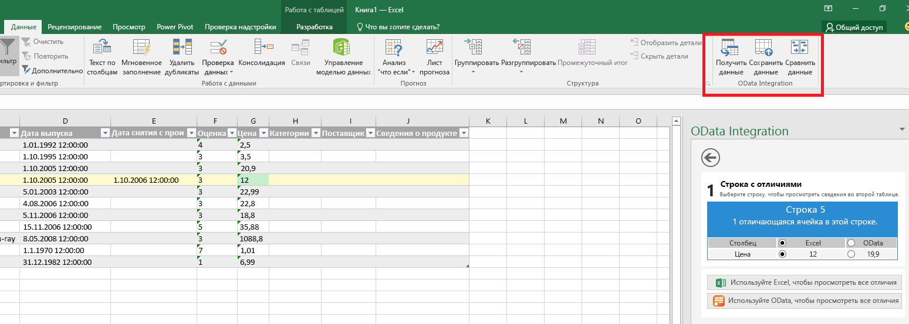
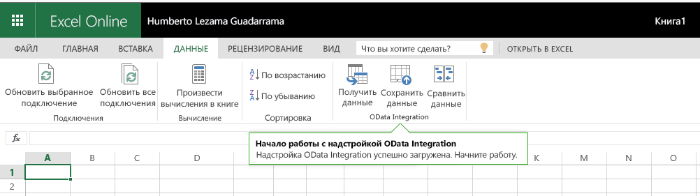

# Команды надстроек для Excel, Word и PowerPoint

Команды надстроек — это элементы, расширяющие пользовательский интерфейс Office и служащие для запуска действий в надстройках. Их можно добавлять в виде кнопок на ленте или элементов в контекстных меню. Выбирая команду надстройки, пользователь инициирует соответствующее действие, например запуск кода JavaScript или отображение страницы надстройки в области задач. Благодаря командам надстройки пользователи могут найти и использовать надстройку, что увеличивает ее популярность, частоту ее повторного использования и лояльность пользователей.

Обзор этой функции приведен в видео, посвященном [командам надстроек на ленте Office](https://channel9.msdn.com/events/Build/2016/P551).

**Надстройка с командами, работающая в классическом приложении Excel**

**Надстройка с командами, работающая в приложении Excel Online**

## Возможности команд
В настоящее время поддерживаются указанные ниже возможности команд.

**Точки расширения**

- Вкладки ленты: расширение возможностей встроенных вкладок или создание пользовательской вкладки.
- Контекстные меню: расширение возможностей выбранных контекстных меню. 

**Типы элементов управления**

- Простые кнопки: запускают определенные действия.
- Меню: содержат несколько кнопок, запускающих различные действия.

**Действия**

- ShowTaskpane отображает одну или несколько областей, в которые можно загрузить пользовательские HTML-страницы.
- ExecuteFunction загружает невидимую HTML-страницу, а затем выполняет содержащуюся в ней функцию JavaScript. Чтобы показать пользовательский интерфейс функции (например, для отображения ошибок и хода выполнения или вставки дополнительных входных данных), можно использовать API [displayDialog](http://dev.office.com/reference/add-ins/shared/officeui).  

## Поддерживаемые платформы
На данный момент команды надстроек поддерживаются на следующих платформах:

- Office 2016 для Windows Desktop (сборка 16.0.6769.0000 или более новая);
- Office Online с личными учетными записями;
- Office Online с рабочими или учебными учетными записями (предварительная версия).

В ближайшее время будут доступны и другие платформы.

## Начало работы с командами надстроек

Подробные сведения о том, как задать команды надстроек в манифесте, см. в статье [Определение команд надстройки в манифесте](http://dev.office.com/docs/add-ins/outlook/manifests/define-add-in-commands).

Чтобы начать использовать команды надстроек, воспользуйтесь [примерами команд надстроек Office](https://github.com/OfficeDev/Office-Add-in-Commands-Samples/) на сайте GitHub.

