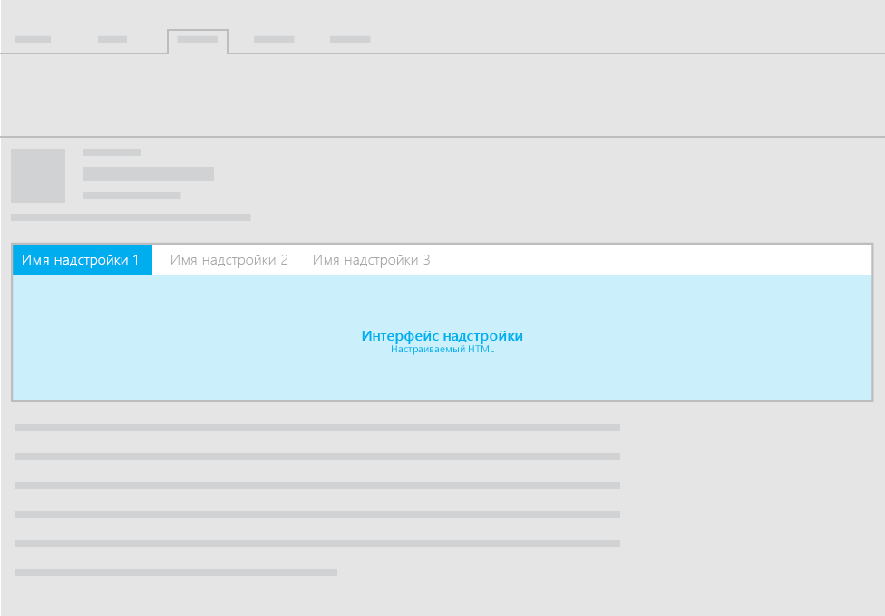
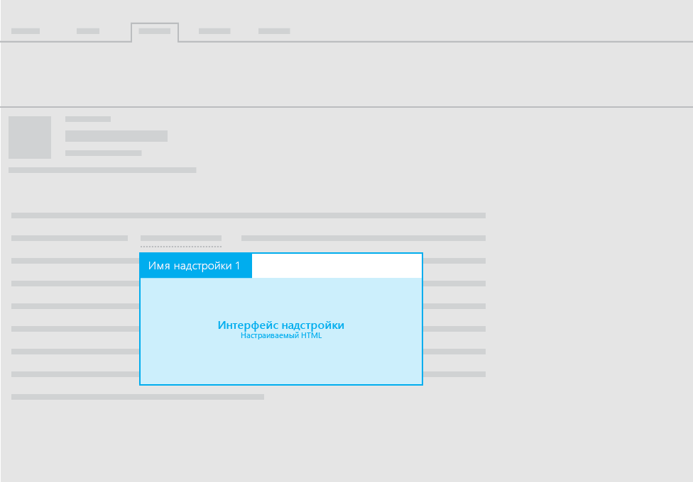

#Макеты для почтовых надстроек

Вы можете использовать любой из следующих макетов для почтовых надстроек:

- Приложения области задач
- Настраиваемая область (горизонтальная или контекстная)
- Функции с уведомлениями информационной панели

Рекомендации для текста пользовательского интерфейса надстроек см. в разделе [Стиль речи для Office](https://msdn.microsoft.com/en-us/library/office/mt484351.aspx).

##Приложения области задач
 Рекомендации по макетам области задач для почтовых надстроек см. в разделе [Макет для надстроек области задач](layout-for-task-pane-add-ins.md).

##Настраиваемая область

На следующем рисунке показан рекомендуемый макет для настраиваемой области в почтовой надстройке.

На следующем рисунке показан рекомендуемый макет для настраиваемой области в [контекстной почтовой надстройке](https://msdn.microsoft.com/EN-US/library/office/dn893542.aspx).

##Функции с уведомлениями информационной панели

Помимо использования области задач или настраиваемой панели для отображения настраиваемого HTML-интерфейса в почтовой надстройке, вы можете выполнять функции из команд. Показать текст пользовательского интерфейса в результате выполнения функции можно с помощью уведомлений информационной панели. Например, вам может потребоваться использовать уведомление информационной панели для отображения сообщений об ошибке или успешном выполнении. 

Дополнительные сведения см. в статье [Обзор команд надстроек для почты](https://msdn.microsoft.com/EN-US/library/office/mt267546.aspx). 

