# Конструктивные шаблоны пользовательского интерфейса надстроек Office 

[Проект конструктивных шаблонов пользовательского интерфейса для надстроек Office](https://github.com/OfficeDev/Office-Add-in-UX-Design-Patterns-Code "Проект конструктивных шаблонов пользовательского интерфейса для надстроек Office") включает файлы HTML, JavaScript и CSS, с помощью которых можно создать пользовательский интерфейс надстройки.   

С помощью проекта конструктивных шаблонов пользовательского интерфейса можно:

* применять решения в распространенных клиентских сценариях;
* следовать рекомендациям по оформлению;
* внедрять компоненты и стили [Office UI Fabric](https://dev.office.com/fabric/getting-started/);
* создавать надстройки, внешний вид которых согласован со стандартным пользовательским интерфейсом Office.  

## Использование конструктивных шаблонов пользовательского интерфейса

При создании пользовательского интерфейса вы можете взять за основу [спецификации конструктора](https://github.com/OfficeDev/Office-Add-in-Design-Patterns/blob/master/Patterns/Source%20Files) или добавить [исходный код](https://github.com/OfficeDev/Office-Add-in-UX-Design-Patterns-Code/tree/master/templates) непосредственно в свой проект.

Чтоб создать пользовательский интерфейс надстройки на основе спецификаций, сделайте следующее:

1. Скачайте [Конструктивные шаблоны пользовательского интерфейса](https://github.com/OfficeDev/Office-Add-in-UX-Design-Patterns).
2. Скопируйте точки расширения для настольных компьютеров или планшетов из шаблонов для [Word](https://github.com/OfficeDev/Office-Add-in-UX-Design-Patterns/blob/master/Helpful%20Templates/AddIn_Template_Word_Desktop_reference.pdf), [Excel](https://github.com/OfficeDev/Office-Add-in-UX-Design-Patterns/blob/master/Helpful%20Templates/AddIn_Template_Excel_Desktop_reference.pdf) или [PowerPoint](https://github.com/OfficeDev/Office-Add-in-UX-Design-Patterns/blob/master/Helpful%20Templates/AddIn_Template_PowerPoint_Desktop_reference.pdf).
3. Скопируйте и измените [конструктивные шаблоны пользовательского интерфейса](https://github.com/OfficeDev/Office-Add-in-UX-Design-Patterns/tree/master/Patterns) в соответствии с вашими конкретными требованиями.
4. С помощью этих шаблонов вы можете изучить [эталонный лист значков Office UI Fabric](https://github.com/OfficeDev/Office-Add-in-UX-Design-Patterns/blob/master/Helpful%20Templates/OfficeUIFabric_icon_mastersheet.pdf), просмотреть точки расширения Word, Excel и PowerPoint (например, [Excel для iPad](https://github.com/OfficeDev/Office-Add-in-UX-Design-Patterns/blob/master/Helpful%20Templates/AddIn_Template_Excel_iPad_reference.pdf) и [Excel для Windows Desktop](https://github.com/OfficeDev/Office-Add-in-UX-Design-Patterns/blob/master/Helpful%20Templates/AddIn_Template_Excel_Desktop_reference.pdf)) или [завершить создание значков для команд надстроек](https://github.com/OfficeDev/Office-Add-in-UX-Design-Patterns/blob/master/Helpful%20Templates/Icon_production.pdf).

Чтобы добавить исходный код, сделайте следующее:

1. Создайте копию [репозитория проекта конструктивных шаблонов пользовательского интерфейса для надстроек Office](https://github.com/OfficeDev/Office-Add-in-UX-Design-Patterns-Code "Проект конструктивных шаблонов пользовательского интерфейса для надстроек Office"). 
2. Скопируйте [папку с ресурсами](https://github.com/OfficeDev/Office-Add-in-UX-Design-Pattern-Code/tree/master/assets) и папку с кодом выбранного шаблона в проект надстройки.  
3. Внедрите шаблон в надстройку. Например:
    - Измените расположение исходного кода или URL-адрес команд надстройки в манифесте.
    - Используйте шаблон UX-дизайна в качестве шаблона для других страниц.
    - Создайте ссылки на конструктивный шаблон пользовательского интерфейса или из него.

## Типы конструктивных шаблонов пользовательского интерфейса
### Универсальные страницы

Универсальные шаблоны страниц можно применить к любой странице надстройки. У них нет особого назначения. Примером страницы особого назначения может служить любой из шаблонов первого запуска. В следующем списке описаны доступные универсальные страницы:

* **Целевая страница** — это стандартная страница надстройки, например страница, которая открывается при первом запуске или во время входа. 
    * [Спецификация целевой страницы](https://github.com/OfficeDev/Office-Add-in-Design-Patterns/blob/master/Helpful%20Templates/AddIn_Template_Standard_Layout.pdf "PDF")
    * [Код целевой страницы](https://github.com/OfficeDev/Office-Add-in-UX-Design-Patterns-Code/tree/master/templates/generic/landing-page)
* **Панель с фирменной символикой** — целевая страница с изображением, представляющим торговую марку, в нижнем колонтитуле. 
    * [Спецификация панели с фирменной символикой](https://github.com/OfficeDev/Office-Add-in-UX-Design-Patterns/blob/master/Patterns/Brand_Bar.md)
    * [Код панели с фирменной символикой](https://github.com/OfficeDev/Office-Add-in-UX-Design-Patterns-Code/tree/master/templates/generic/brand-bar)

<table>
 <tr><th>Целевая</th><th>Панель с фирменной символикой</th></tr>
 <tr><td><A href="https://github.com/OfficeDev/Office-Add-in-UX-Design-Patterns-Code/tree/master/templates/generic/landing-page">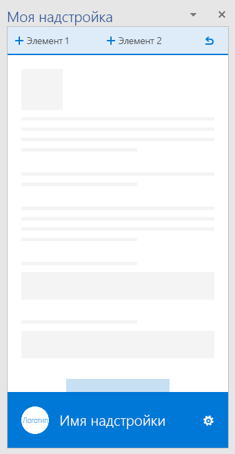</A></td>
<td><A href="https://github.com/OfficeDev/Office-Add-in-UX-Design-Patterns-Code/tree/master/templates/generic/brand-bar">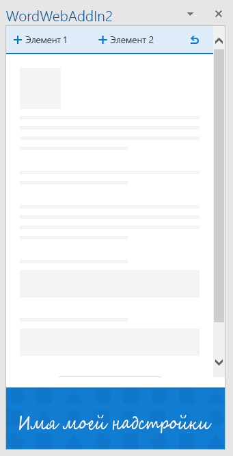</A></td></tr>
 </table>
 
### Интерфейс при первом запуске

Интерфейс при первом запуске — это интерфейс, отображаемый для пользователя, когда тот запускает надстройку в первый раз. Доступны следующие конструктивные шаблоны для первого запуска: 

* **Steps to start** (Действия, необходимые для запуска). Предоставляет пользователям упорядоченный список действий, которые необходимо выполнить, чтобы начать использовать надстройку. 
    * [Описание шаблона Steps to start](https://github.com/OfficeDev/Office-Add-in-Design-Patterns/blob/master/Patterns/FirstRun_StepsToStart.md)
    * [Код шаблона Steps to start](https://github.com/OfficeDev/Office-Add-in-UX-Design-Patterns-Code/tree/master/templates/first-run/instruction-step)
* **Value** (Решаемые задачи). Разъясняет, какие задачи можно решить с помощью надстройки.
    * [Описание шаблона Value](https://github.com/OfficeDev/Office-Add-in-Design-Patterns/blob/master/Patterns/FirstRun_ValuePlacemat.md)
    * [Код шаблона Value](https://github.com/OfficeDev/Office-Add-in-UX-Design-Patterns-Code/tree/master/templates/first-run/value-placemat)
* **Video** (Видео). Показывает пользователям видеоролик перед тем, как они начнут использовать вашу надстройку.
    * [Описание шаблона Video](https://github.com/OfficeDev/Office-Add-in-Design-Patterns/blob/master/Patterns/FirstRun_VideoPlacemat.md)
    * [Код шаблона Video](https://github.com/OfficeDev/Office-Add-in-UX-Design-Patterns-Code/tree/master/templates/first-run/video-placemat)
* **Walkthrough** (Пошаговое руководство). Рассказывает пользователям о ряде функций или предоставляет определенные сведения, прежде чем они начнут использовать надстройку.
    * [Описание шаблона Walkthrough](https://github.com/OfficeDev/Office-Add-in-Design-Patterns/blob/master/Patterns/FirstRun_PagingPanel.md)
    * [Код шаблона Walkthrough](https://github.com/OfficeDev/Office-Add-in-UX-Design-Patterns-Code/tree/master/templates/first-run/walkthrough)

В [Магазине Office](https://msdn.microsoft.com/en-us/library/office/jj220033.aspx) предусмотрена система управления пробными версиями надстроек, но если вам нужно управлять пользовательским интерфейсом такой пробной версии, используйте следующие шаблоны:

* **Trial** (Пробная версия). Показывает пользователям, как начать работу с пробной версией надстройки.
    * [Описание шаблона Trial](https://github.com/OfficeDev/Office-Add-in-Design-Patterns/blob/master/Patterns/FirstRun_TrialVersion.md)
    * [Код шаблона Trial](https://github.com/OfficeDev/Office-Add-in-UX-Design-Patterns-Code/tree/master/templates/first-run/trial-placemat)
* **Trial feature** (Пробная функция). Сообщает пользователю, что функция, которую он пытается использовать, недоступна в пробной версии надстройки. Кроме того, этот шаблон можно использовать, если надстройка предоставляется бесплатно, но в ней есть функция, для использования которой требуется подписка. С помощью этого шаблона вы также можете предоставлять ограниченную версию после окончания пробного периода.
    * [Описание шаблона Trial feature](https://github.com/OfficeDev/Office-Add-in-UX-Design-Patterns/blob/master/Patterns/FirstRun_TrialFeature.md)
    * [Код шаблона Trial feature](https://github.com/OfficeDev/Office-Add-in-UX-Design-Patterns-Code/tree/master/templates/first-run/trial-placemat-feature)

> **Важно!** Если вы решите самостоятельно управлять подпиской, не применяя для этого Магазин Office, добавьте тег **Может потребоваться дополнительная покупка** в примечания по тестированию на панели мониторинга продаж.

Решите, как часто необходимо применять интерфейс, используемый при первом запуске: один раз или много раз. Например, если пользователи используют надстройку периодически, они могут забыть, как ею пользоваться, поэтому интерфейс первого запуска может пригодиться более одного раза. 

 <table>
 <tr><th>Steps to Start</th><th>Value</th><th>Video</th></tr>
 <tr>
<td><A href="https://github.com/OfficeDev/Office-Add-in-UX-Design-Patterns-Code/tree/master/templates/first-run/instruction-step">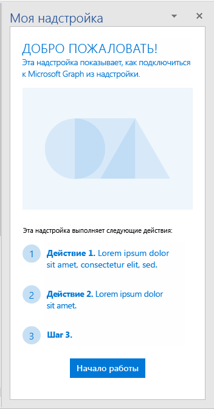</A></td>
<td><A href="https://github.com/OfficeDev/Office-Add-in-UX-Design-Patterns-Code/tree/master/templates/first-run/value-placemat">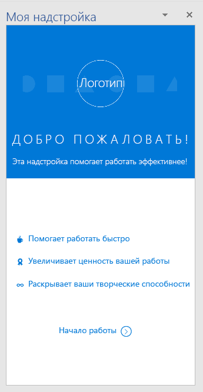</A></td>
<td><A href="https://github.com/OfficeDev/Office-Add-in-UX-Design-Patterns-Code/tree/master/templates/first-run/video-placemat">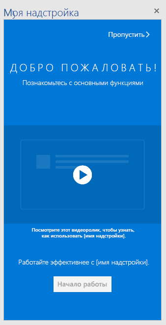</A></td></tr>
 </table>

 <table>
 <tr><th>Первая страница Walkthrough</th><th>Trial</th><th>Trial feature</th></tr>
 <tr>
<td><A href="https://github.com/OfficeDev/Office-Add-in-UX-Design-Patterns-Code/tree/master/templates/first-run/walkthrough">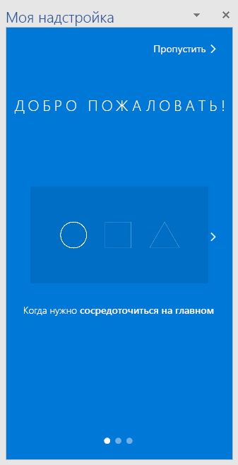</A></td>
<td><A href="https://github.com/OfficeDev/Office-Add-in-UX-Design-Patterns-Code/tree/master/templates/first-run/trial-placemat">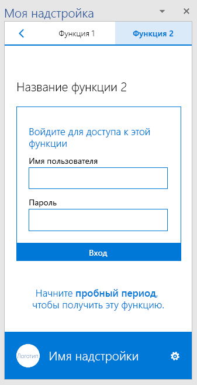</A></td>
<td></td></tr>
 </table> 

### Навигация

Пользователям нужно переключаться между разными страницами надстройки. В приведенных ниже шаблонах навигации показаны различные команды, позволяющие упорядочивать страницы и команды надстройки.

* **Back Button and Next Page** (Страница с кнопками "Назад" и "Вперед"). Показывает область задач с кнопками "Назад" и "Вперед". Этот шаблон поможет гарантировать, что пользователи следуют упорядоченной последовательности действий.
    * [Описание шаблона Back Button and Next Page](https://github.com/OfficeDev/Office-Add-in-UX-Design-Patterns/blob/master/Patterns/Back_Button.md)
    * [Код шаблона Back Button and Next Page](https://github.com/OfficeDev/Office-Add-in-UX-Design-Patterns-Code/tree/master/templates/navigation/back-button) 
* **Navigation** (Навигация). Показывает меню (т. н. меню "гамбургер") для перехода между страницами в области задач. 
    * [Описание шаблона Navigation](https://github.com/OfficeDev/Office-Add-in-UX-Design-Patterns/blob/master/Patterns/Navigation.md)
    * [Код шаблона Navigation](https://github.com/OfficeDev/Office-Add-in-UX-Design-Patterns-Code/tree/master/templates/navigation/navigation) 
* **Navigation with commands** (Навигация с командами). Показывает меню "гамбургер" с командными кнопками (или кнопками действий) в области задач. С помощью этого шаблона можно одновременно предоставлять параметры навигации и команды.  
    * [Описание шаблона Navigation with commands](https://github.com/OfficeDev/Office-Add-in-UX-Design-Patterns/blob/master/Patterns/Navigation_%26_Commands.md)
    * [Код шаблона Navigation with commands](https://github.com/OfficeDev/Office-Add-in-UX-Design-Patterns-Code/tree/master/templates/navigation/navigation-commands)
* **Pivot** (Сводка). Показывает сводную панель навигации в области задач. С помощью сводной панели навигации пользователи смогут переключаться между различным контентом.
    * [Описание шаблона Pivot](https://github.com/OfficeDev/Office-Add-in-UX-Design-Patterns/blob/master/Patterns/Pivot.md)
    * [Код шаблона Pivot](https://github.com/OfficeDev/Office-Add-in-UX-Design-Patterns-Code/tree/master/templates/navigation/pivot)
* **Tab bar** (Панель вкладок). Показывает панель навигации, используя кнопки с расположенными по вертикали текстом и значками. Панель вкладок обеспечивает навигацию с помощью вкладок с короткими и понятными названиями.
    * [Описание шаблона Tab bar](https://github.com/OfficeDev/Office-Add-in-UX-Design-Patterns/blob/master/Patterns/Tab_Bar.md)
    * [Код шаблона Tab bar](https://github.com/OfficeDev/Office-Add-in-UX-Design-Patterns-Code/tree/master/templates/navigation/tab-bar) 

<table>
<tr><th>Back Button and Next Page</th><th>Navigation</th><th>Navigation with commands</th></tr>
<tr>
    <td>
        <A href="https://github.com/OfficeDev/Office-Add-in-UX-Design-Patterns-Code/tree/master/templates/navigation/back-button">
        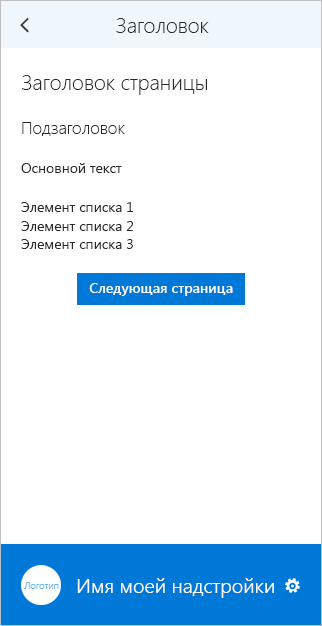</A>
    </td>
    <td>
        
    </td>
    <td>
        <A href="https://github.com/OfficeDev/Office-Add-in-UX-Design-Patterns-Code/tree/master/templates/navigation/navigation-commands">
        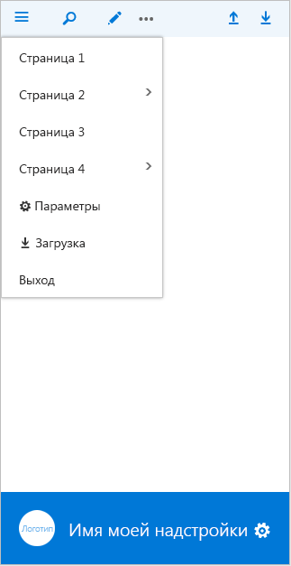</A>
    </td>
</tr>
 </table>

<table>
<tr><th>Pivot</th><th>Tab bar</th></tr>
<tr><td><A href="https://github.com/OfficeDev/Office-Add-in-UX-Design-Patterns-Code/tree/master/templates/navigation/pivot">
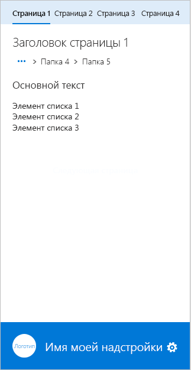</A></td>
<td><A href="https://github.com/OfficeDev/Office-Add-in-UX-Design-Patterns-Code/tree/master/templates/navigation/tab-bar">
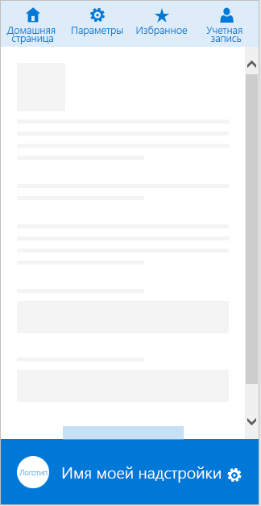</A></td>
</tr>
 </table>

### Уведомления

Надстройка может уведомлять пользователей о событиях, например ошибках, и о ходе выполнения множеством способов. Доступны следующие шаблоны уведомлений: 

* **Embedded dialog box** (Внедренное диалоговое окно) отображается в области задач и предоставляет сведения и (при необходимости) средства взаимодействия в виде кнопок и других элементов управления. Рекомендуется использовать диалоговое окно для подтверждения пользователем каких-либо действий. Шаблон Embedded dialog позволяет ограничить пользовательский интерфейс областью задач.
    * [Описание шаблона Embedded dialog](https://github.com/OfficeDev/Office-Add-in-Design-Patterns/blob/master/Patterns/Embedded_Dialog.md)
    * [Код шаблона Embedded dialog](https://github.com/OfficeDev/Office-Add-in-UX-Design-Patterns-Code/tree/master/templates/notifications/embedded-dialog)
* **Inline message** (Встроенное сообщение) отображает информацию об ошибках, успешном выполнении действий или другие сведения. Может отображаться в указанном расположении в области задач. Например, если пользователь вводит в текстовом поле электронный адрес с неправильным форматом, то под полем отобразится соответствующее сообщение об ошибке. 
    * [Описание Inline message](https://github.com/OfficeDev/Office-Add-in-Design-Patterns/blob/master/Patterns/Notification_Inline_Message.md)
    * [Код Inline message](https://github.com/OfficeDev/Office-Add-in-UX-Design-Patterns-Code/tree/master/templates/notifications/inline-message)
* **Message banner** (Баннер с сообщением) предоставляет сведения и (при необходимости) простые призывы к действиям в виде баннера, который можно свернуть в одну строку, развернуть на несколько строк или закрыть. Баннеры с сообщениями рекомендуется использовать для информирования об обновлениях служб или отображения полезных советов при запуске надстройки. 
    * [Описание Message banner](https://github.com/OfficeDev/Office-Add-in-UX-Design-Patterns/blob/master/Patterns/Notification_MessageBanner.md)
    * [Код Message banner](https://github.com/OfficeDev/Office-Add-in-UX-Design-Patterns-Code/tree/master/templates/notifications/message-banner)
* **Progress bar** (Индикатор выполнения) показывает ход выполнения длительных синхронных процессов, например задач по настройке, которые необходимо выполнить, прежде чем пользователь сможет перейти к дальнейшим действиям. Это отдельная промежуточная страница, на которой также используется фирменная символика надстройки. Используйте индикатор выполнения, если процесс может периодически отправлять сведения о том, сколько времени осталось до его завершения.
    * [Описание Progress bar](https://github.com/OfficeDev/Office-Add-in-UX-Design-Patterns/blob/master/Patterns/Notification_Progress.md)
    * [Код Progress bar](https://github.com/OfficeDev/Office-Add-in-UX-Design-Patterns-Code/tree/master/templates/notifications/progress-bar)
* **Spinner** (Индикатор работы) указывает на то, что выполняется длительный синхронный процесс, но не указывает, сколько времени осталось до его завершения. Это отдельная промежуточная страница, на которой также используется фирменная символика надстройки. Используйте индикатор работы, если надстройка не может достоверно сообщить, сколько времени необходимо для завершения процесса. 
    * [Описание Spinner](https://github.com/OfficeDev/Office-Add-in-UX-Design-Patterns/blob/master/Patterns/Notification_Progress.md)
    * [Код Spinner](https://github.com/OfficeDev/Office-Add-in-UX-Design-Patterns-Code/tree/master/templates/notifications/spinner)
* **Toast** (Всплывающее уведомление) содержит краткое сообщение, исчезающее через несколько секунд. Так как пользователь может и не увидеть такое сообщение, всплывающие уведомления используются для отображения несущественной информации. Это хороший способ уведомлять пользователей о событиях в удаленной системе, например о получении электронного письма.
    * [Описание Toast](https://github.com/OfficeDev/Office-Add-in-UX-Design-Patterns/blob/master/Patterns/Notification_Toast.md)
    * [Код Toast](https://github.com/OfficeDev/Office-Add-in-UX-Design-Patterns-Code/tree/master/templates/notifications/toast)

 <table>
 <tr><th>Embedded dialog</th><th>Inline message</th><th>Message banner</th></tr>
 <tr><td><A href="https://github.com/OfficeDev/Office-Add-in-UX-Design-Patterns-Code/tree/master/templates/notifications/embedded-dialog">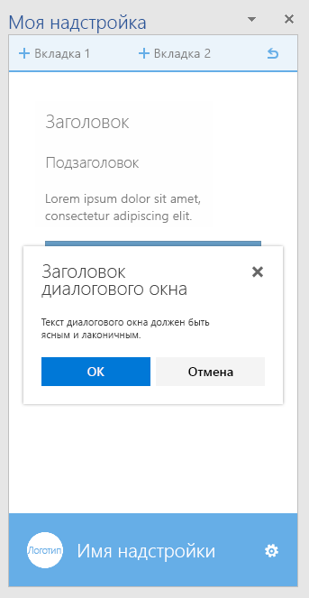</A></td>
<td><A href="https://github.com/OfficeDev/Office-Add-in-UX-Design-Patterns-Code/tree/master/templates/notifications/inline-message">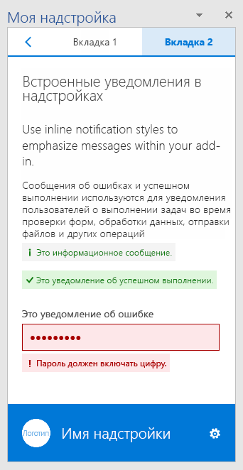</A></td>
<td><A href="https://github.com/OfficeDev/Office-Add-in-UX-Design-Patterns-Code/tree/master/templates/notifications/message-banner">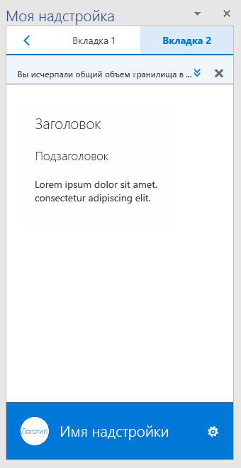</A></td></tr>
 </table>

 <table>
 <tr><th>Progress bar</th><th>Spinner</th><th>Toast</th></tr>
 <tr><td><A href="https://github.com/OfficeDev/Office-Add-in-UX-Design-Patterns-Code/tree/master/templates/notifications/progress-bar">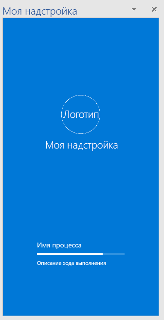</A></td>
<td><A href="https://github.com/OfficeDev/Office-Add-in-UX-Design-Patterns-Code/tree/master/templates/notifications/spinner">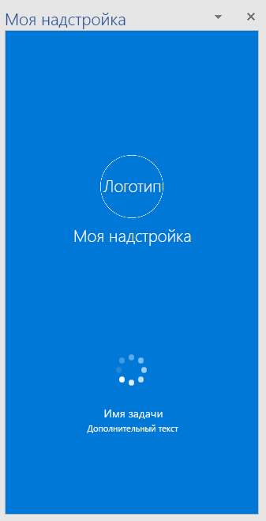</A></td>
<td><A href="https://github.com/OfficeDev/Office-Add-in-UX-Design-Patterns-Code/tree/master/templates/notifications/toast">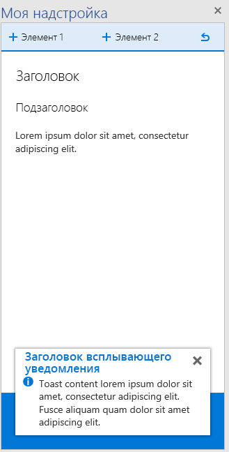</A></td></tr>
 </table>
 

### Общие компоненты

Ниже перечислены общие компоненты, которые можно использовать в надстройке для различных сценариев.  

#### Диалоговые окна клиентов

Диалоговые окна клиентов обеспечивают еще один способ работы пользователей с надстройкой за пределами области задач. Доступны следующие шаблоны диалоговых окон:

* **Typeramp dialog box** (Диалоговое окно с набором шрифтов) содержит текстовый контент. С помощью этого диалогового окна можно показывать пользователям подробные сведения. 
    * [Описание Typeramp dialog box](https://github.com/OfficeDev/Office-Add-in-UX-Design-Patterns/blob/master/Patterns/Client_Dialog.md)
    * [Код Typeramp dialog box](https://github.com/OfficeDev/Office-Add-in-UX-Design-Patterns-Code/tree/master/templates/dialog/typeramp)
* **Alert dialog box** (Диалоговое окно с оповещением) содержит важные сведения для пользователей, например ошибки или уведомления.  
    * [Описание Alert dialog box](https://github.com/OfficeDev/Office-Add-in-UX-Design-Patterns/blob/master/Patterns/Client_Dialog.md)
    * [Код Alert dialog box](https://github.com/OfficeDev/Office-Add-in-UX-Design-Patterns-Code/tree/master/templates/dialog/alert)
* **Navigation dialog box** (Диалоговое окно навигации) содержит элементы для навигации. С его помощью пользователи могут открывать различный контент. 
    * [Описание Navigation dialog box](https://github.com/OfficeDev/Office-Add-in-UX-Design-Patterns/blob/master/Patterns/Client_Dialog.md)
    * [Код Navigation dialog box](https://github.com/OfficeDev/Office-Add-in-UX-Design-Patterns-Code/tree/master/templates/dialog/navigation)

<table>
 <tr><th>Typeramp dialog</th><th>Alert dialog</th></tr>
<tr>
<td><A href="https://github.com/OfficeDev/Office-Add-in-UX-Design-Patterns-Code/tree/master/templates/dialog/typeramp">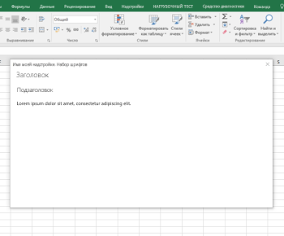</A></td>
<td><A href="https://github.com/OfficeDev/Office-Add-in-UX-Design-Patterns-Code/tree/master/templates/dialog/alert">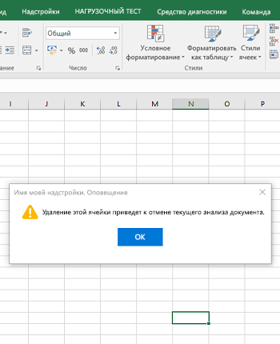</A></td>
</tr></tr>
 </table>
 
 <table>
 <tr><th>Navigation dialog</th></tr>
<tr><td><A href="https://github.com/OfficeDev/Office-Add-in-UX-Design-Patterns-Code/tree/master/templates/dialog/navigation">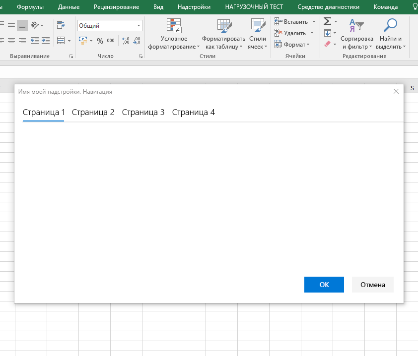</A></td></tr>
</tr>
 </table>

#### Feedback and Ratings (Отзывы и оценки)

Чтобы сделать надстройку более заметной и популярной, полезно предоставить пользователям возможность оценивать и рецензировать надстройку в Магазине Office. В этом шаблоне показано два способа предоставления отзывов и оценок из надстройки:

- Отзыв, инициированный пользователем, — пользователь отправляет отзыв с помощью меню навигации (например, ссылки **Отправить отзыв**) или значка в нижнем колонтитуле.
- Отзыв, инициированный системой, — после трех запусков надстройки появляется баннер с сообщением, в котором пользователю предлагается оставить отзыв.

Независимо от способа открывается диалоговое окно со страницей надстройки в Магазине Office.

* [Описание Feedback and Ratings](https://github.com/OfficeDev/Office-Add-in-UX-Design-Patterns/blob/master/Patterns/Notification_Feedback.md)
* [Код Feedback and Ratings](https://github.com/OfficeDev/Office-Add-in-UX-Design-Patterns-Code/tree/master/templates/feedback/office-store)

>**Важно!** В настоящее время этот шаблон указывает на главную страницу Магазина Office. Обязательно замените эту ссылку на URL-адрес страницы вашей надстройки в Магазине Office.

 <table>
 <tr><th>Feedback and Ratings</th></tr>
<tr><td><A href="https://github.com/OfficeDev/Office-Add-in-UX-Design-Patterns-Code/tree/master/templates/feedback/office-store">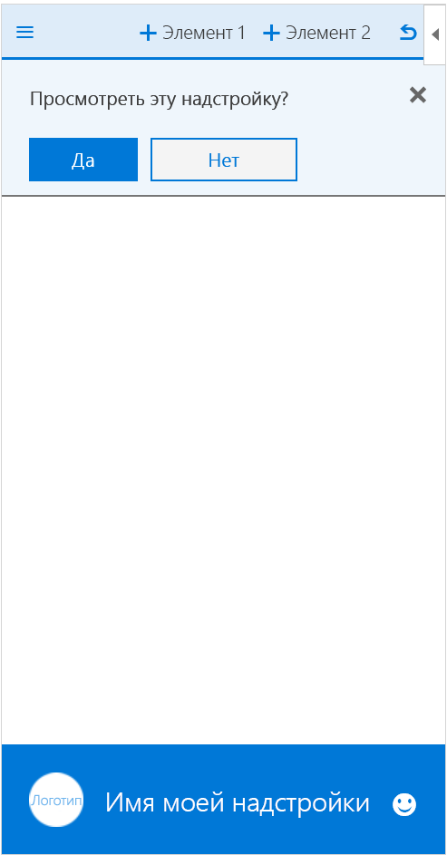</A></td></tr>
</tr>
 </table>

#### Параметры и конфиденциальность

В надстройке может потребоваться страница параметров, где пользователи смогут настраивать параметры, контролирующие работу надстройки. Кроме того, вы можете сообщить пользователям о политиках конфиденциальности, соблюдаемых вашей надстройкой. 

* **Settings** (Параметры). Показывает область задач с компонентами конфигурации, которая контролирует работу надстройки. На странице параметров пользователи могут выбрать нужные настройки.
    * [Описание Settings](https://github.com/OfficeDev/Office-Add-in-UX-Design-Patterns/blob/master/Patterns/Settings.md)
    * [Код Settings](https://github.com/OfficeDev/Office-Add-in-UX-Design-Patterns-Code/tree/master/templates/settings)
* **Privacy Policy** (Политика конфиденциальности). Показывает область задач с важными сведениями и политиках конфиденциальности. 
    * [Описание Privacy Policy](https://github.com/OfficeDev/Office-Add-in-UX-Design-Patterns/blob/master/Patterns/Settings.md)
    * [Код Privacy Policy](https://github.com/OfficeDev/Office-Add-in-UX-Design-Patterns-Code/tree/master/templates/settings)

<table>
 <tr><th>Settings</th><th>Privacy Policy</th></tr>
<tr>
<td><A href="https://github.com/OfficeDev/Office-Add-in-UX-Design-Patterns-Code/tree/master/templates/settings">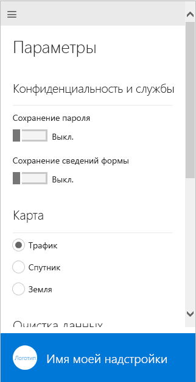</A></td>
<td><A href="https://github.com/OfficeDev/Office-Add-in-UX-Design-Patterns-Code/tree/master/templates/settings">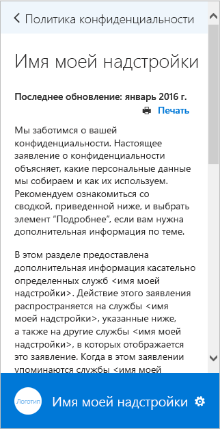</A></td>
</tr></tr>
 </table>

## Дополнительные ресурсы

* [Рекомендации по разработке надстроек Office](https://dev.office.com/docs/add-ins/overview/add-in-development-best-practices)
* [Office UI Fabric](http://dev.office.com/fabric/)
