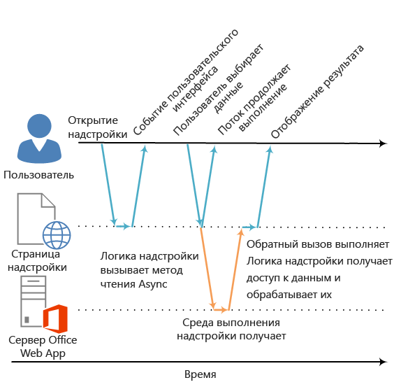

# Асинхронное программирование в надстройках для Office

Почему в API Надстройки Office используется асинхронное программирование? JavaScript — это язык однопотокового программирования, поэтому если скрипт вызывает продолжительный синхронный процесс, исполнение всех последующих скриптов будет заблокировано до завершения этого процесса. Поскольку определенные операции с веб-клиентами Office (а также и с полнофункциональными клиентами) могут быть заблокированы при синхронном выполнении, большинство методов в API JavaScript для Office спроектированы для асинхронного выполнения. Это дает гарантию, что Надстройки Office будут отвечать и работать с высокой производительностью. При работе с асинхронными методами зачастую требуется создавать функции обратного вызова.

Имена всех асинхронных методов в API, например [Document.getSelectedDataAsync](../../reference/shared/document.getselecteddataasync.md), [Binding.getDataAsync](../../reference/shared/binding.getdataasync.md) или [Item.loadCustomPropertiesAsync](../../reference/outlook/Office.context.mailbox.item.md), заканчиваются на "Async". При вызове асинхронного метода он выполняется немедленно и все дополнительные скрипты могут продолжать работу. Необязательная функция обратного вызова, передаваемая в асинхронный метод, выполняется тогда, когда готовы данные или запрашиваемая операция. Обычно это происходит быстро, но иногда возможен возврат с небольшой задержкой.

На следующей схеме показан поток выполнения для вызова асинхронного метода, который считывает данные, выделенные пользователем в документе, открытом в серверном веб-приложении Word Online или Excel Online. На момент вызова асинхронного метода поток выполнения JavaScript свободен для выполнения любой дополнительной обработки на стороне клиента, хотя это и не показано на схеме. Когда асинхронный метод возвращается, обратный вызов возобновляет выполнение в потоке, и надстройка может получать доступ к данным, проводить операции над ними и отображать результат. Такой же шаблон асинхронного выполнения используется при работе с ведущими приложениями полнофункционального клиента Office, например с Word 2013 или Excel 2013.

**Рис. 1. Поток выполнения при асинхронном программировании**




Поддержка этой асинхронной конструкции как в полнофункциональных, так и в веб-клиентах, — это часть стратегии проектирования "однократное написание — запуск на нескольких платформах" модели разработки Надстройки Office. Например, вы можете создать контентную надстройку или надстройку области задач на единой базе кода, которая будет работать и в Excel 2013, и в Excel Online.

## Написание функции обратного вызова для асинхронного метода


Функция обратного вызова, передаваемая в асинхронный метод в качестве аргумента _callback_, должна объявлять единственный параметр, который всегда будет использоваться средой выполнения надстройки для предоставления доступа к объекту [AsyncResult](../../reference/shared/asyncresult.md) при выполнении этой функции. Например:


- Анонимная функция, которая должна быть написана и передана непосредственно в вызове асинхронного метода в качестве параметра _callback_ асинхронного метода.
    
- Именованная функция, передающая свое имя в качестве параметра _callback_ асинхронного метода.
    
Анонимную функцию удобно использовать, если код такой функции будет использован всего один раз (так как у нее нет имени, вы не сможете сослаться на нее в другой части кода). Именованные функции применяются, если необходимо многократно использовать функцию обратного вызова для нескольких асинхронных методов.


### Написание анонимной функции обратного вызова

Следующая анонимная функция обратного вызова объявляет единственный параметр с именем `result`, который получает данные из свойства [AsyncResult.value](../../reference/shared/asyncresult.status.md) при возврате обратного вызова.


```js
function (result) {
        write('Selected data: ' + result.value);
}
```

В следующем примере показано, как передать анонимную функцию обратного вызова в полном вызове асинхронного метода **Document.getSelectedDataAsync**.


- Первый аргумент _coercionType_, `Office.CoercionType.Text`, указывает, что необходимо возвратить выделенные данные в виде строки текста.
    
- Второй аргумент _callback_ — это анонимная функция, передаваемая в метод. В процессе выполнения она использует параметр _result_ для доступа к свойству **value** объекта **AsyncResult**, чтобы отобразить данные, выделенные пользователем в документе.
    


```js
Office.context.document.getSelectedDataAsync(Office.CoercionType.Text, 
    function (result) {
        write('Selected data: ' + result.value);
    }
});

// Function that writes to a div with id='message' on the page.
function write(message){
    document.getElementById('message').innerText += message; 
}
```

Вы также можете использовать параметр функции обратного вызова для получения доступа к другим свойствам объекта **AsyncResult**. Используйте свойство [AsyncResult.status](../../reference/shared/asyncresult.error.md), чтобы определить, успешно ли был выполнен вызов. Если не удалось выполнить вызов, можно использовать свойство [AsyncResult.error](../../reference/shared/asyncresult.context.md), чтобы получить доступ к объекту [Error](../../reference/shared/error.md) и получить сведения об ошибке.

Дополнительные сведения об использовании метода **getSelectedDataAsync** см. в статье "Считывание и запись данных в активное выделение документа или таблицы" ([Считывание и запись данных в активное выделение документа или таблицы](../../docs/develop/read-and-write-data-to-the-active-selection-in-a-document-or-spreadsheet.md)). 


### Написание именованной функции обратного вызова

Кроме того, вы можете написать именованную функцию и передать ее имя параметру _callback_ асинхронного метода. Например, предыдущий пример можно изменить так, чтобы передавать функцию с именем `writeDataCallback` в качестве параметра _callback_.


```js
Office.context.document.getSelectedDataAsync(Office.CoercionType.Text, 
    writeDataCallback);

// Callback to write the selected data to the add-in UI.
function writeDataCallback(result) {
    write('Selected data: ' + result.value);
}

// Function that writes to a div with id='message' on the page.
function write(message){
    document.getElementById('message').innerText += message; 
}
```


## Что возвращается в свойство AsyncResult.value?


Свойства **asyncContext**, **status** и **error** объекта **AsyncResult** возвращают одни и те же виды сведений в функцию обратного вызова, передаваемую в любые асинхронные методы. Однако то, что будет возвращено в свойство **AsyncResult.value**, зависит от функциональных возможностей асинхронного метода.

Например, методы **addHandlerAsync** (для объектов [Binding](../../reference/shared/binding.md), [CustomXmlPart](../../reference/shared/customxmlpart.customxmlpart.md), [Document](../../reference/shared/document.md), [RoamingSettings](../../reference/outlook/RoamingSettings.md) и [Settings](../../reference/shared/settings.md)) позволяют добавить функции обработчиков событий в элементы, представленные этими объектами. Вы можете получить доступ к свойству **AsyncResult.value** из функции обратного вызова, передаваемой в любой из методов **addHandlerAsync**. Но так как при добавлении обработчика событий не происходит доступа к данным или объектам, то при попытке доступа к нему свойство **value** всегда возвращает значение **undefined**.

С другой стороны, при вызове метода **Document.getSelectedDataAsync** он возвращает данные, выделенные пользователем в документе, в свойство **AsyncResult.value** в обратном вызове. Если вызвать метод [Bindings.getAllAsync](../../reference/shared/bindings.getallasync.md), он возвратит массив всех объектов **Binding** в документе. И, наконец, если вызвать метод [Bindings.getByIdAsync](../../reference/shared/bindings.getbyidasync.md), он возвратит один объект **Binding**.

Описание того, что возвращается в свойство **AsyncResult.value** асинхронного метода, см. в разделе "Значение обратного вызова" справочной статьи для этого метода. Сводку всех объектов, имеющих асинхронные методы, см. в таблице в конце статьи об объекте [AsyncResult](../../reference/shared/asyncresult.md).


## Шаблоны асинхронного программирования


API JavaScript для Office поддерживает два вида шаблонов асинхронного программирования.


- С использованием вложенных обратных вызовов
    
- С использованием шаблона promise
    
При асинхронном программировании с использованием функций обратного вызова зачастую требуется вкладывать возвращаемый результат одного обратного вызова в один или несколько других обратных вызовов. В этом случае вы можете использовать вложенные обратные вызовы асинхронных методов API.

Использование вложенных обратных вызовов — это шаблон программирования, знакомый большинству разработчиков на языке JavaScript, но код с глубоко вложенными обратными вызовами может быть труден для чтения и понимания. В качестве альтернативы вложенным обратным вызовам API JavaScript для Office также поддерживает реализацию шаблона promise. Однако в текущей версии API JavaScript для Office шаблон promise работает только с кодом для привязок [в электронных таблицах Excel и документах Word](../../docs/develop/bind-to-regions-in-a-document-or-spreadsheet.md).

<a name="AsyncProgramming_NestedCallbacks" />
### Асинхронное программирование с использованием вложенных функций обратного вызова


Зачастую для какой-либо задачи необходимо выполнять несколько асинхронных операций. Для этого можно вкладывать один асинхронный вызов в другой. 

В следующем примере кода показано, как вложить два асинхронных вызова. 


- Сначала вызывается метод [Bindings.getByIdAsync](../../reference/shared/bindings.getbyidasync.md) для получения доступа к привязке в документе с именем "MyBinding". Объект **AsyncResult**, возвращаемый в параметр `result` этого обратного вызова, обеспечивает доступ к указанному объекту привязки из свойства **AsyncResult.value**.
    
- Затем объект привязки, к которому получен доступ из первого параметра `result`, используется для вызова метода [Binding.getDataAsync](../../reference/shared/binding.getdataasync.md).
    
- И, наконец, параметр `result2` обратного вызова, передаваемый в метод **Binding.getDataAsync**, используется для отображения данных в привязке.
    


```js
function readData() {
    Office.context.document.bindings.getByIdAsync("MyBinding", function (result) {
        result.value.getDataAsync({ coercionType: 'text' }, function (result2) {
            write(result2.value);
        });
    });
}

// Function that writes to a div with id='message' on the page.
function write(message){
    document.getElementById('message').innerText += message; 
}
```

Этот базовый шаблон вложенного обратного вызова можно использовать для всех асинхронных методов в API JavaScript для Office.

В следующих разделах показано, как использовать анонимные или именованные функции для вложенных обратных вызовов в асинхронных методах.


#### Использование анонимных функций для вложенных обратных вызовов

В следующем примере показано, как объявить две встроенные анонимные функции и передать их в методы **getByIdAsync** и **getDataAsync** в качестве вложенных обратных вызовов. Поскольку это простые и встроенные функции, их назначение сразу же становится понятным.


```js
Office.context.document.bindings.getByIdAsync('myBinding', function (bindingResult) {
    bindingResult.value.getDataAsync(function (getResult) {
        if (getResult.status == Office.AsyncResultStatus.Failed) {
            write('Action failed. Error: ' + asyncResult.error.message);
        } else {
            write('Data has been read successfully.');
        }
    });
});

// Function that writes to a div with id='message' on the page.
function write(message){
    document.getElementById('message').innerText += message; 
}
```


#### Использование именованных функций для вложенных обратных вызовов

В сложных реализациях может оказаться полезным использовать именованные функции для упрощения чтения, поддержки и повторного использования. В следующем примере две анонимные функции из примера предыдущего раздела были переписаны как функции `deleteAllData` и `showResult`. Эти именованные функции затем передаются в методы **getByIdAsync** и **deleteAllDataValuesAsync** в виде обратных вызовов по имени.


```js
Office.context.document.bindings.getByIdAsync('myBinding', deleteAllData);

function deleteAllData(asyncResult) {
    asyncResult.value.deleteAllDataValuesAsync(showResult);
}

function showResult(asyncResult) {
    if (asyncResult.status == Office.AsyncResultStatus.Failed) {
        write('Action failed. Error: ' + asyncResult.error.message);
    } else {
        write('Data has been deleted successfully.');
    }
}

// Function that writes to a div with id='message' on the page.
function write(message){
    document.getElementById('message').innerText += message; 
}
```


### Асинхронное программирование с использованием шаблона promise для получения доступа к данным в привязках


Вместо того чтобы передавать функцию обратного вызова и перед продолжением выполнения ждать, пока она будет возвращена, шаблон программирования promise немедленно возвращает объект promise, который представляет ее нужный результат. Однако, в отличие от истинно синхронного программирования, выполнение результата promise на самом деле задерживается до тех пор, пока среда выполнения Надстройки Office не сможет завершить запрос. Если выполнить запрос не удается, используется обработчик _onError_.

API JavaScript для Office предоставляет метод [Office.select](../../reference/shared/office.select.md), которые поддерживает использование шаблона promise для работы с существующими объектами привязки. Объект promise, возвращаемый в метод **Office.select**, поддерживает только четыре метода, к которым можно получить доступ непосредственно из объекта [Binding](../../reference/shared/binding.md): [getDataAsync](../../reference/shared/binding.getdataasync.md), [setDataAsync](../../reference/shared/binding.setdataasync.md), [addHandlerAsync](../../reference/shared/asyncresult.value.md) или [removeHandlerAsync](../../reference/shared/binding.removehandlerasync.md).

Шаблон promise для работы с привязками принимает такую форму:

 **Office.select(**_selectorExpression_,  _onError_**).**_BindingObjectAsyncMethod_

Параметр _selectorExpression_ принимает форму `"bindings#bindingId"`, где _bindingId_ — это имя (**id**) привязки, созданной ранее в документе или электронной таблице (с использованием одного из методов "addFrom" коллекции **Bindings**: **addFromNamedItemAsync**, **addFromPromptAsync** или **addFromSelectionAsync**). Например, выражение отбора `bindings#cities` указывает, что необходимо получить доступ к привязке с **id** городов.

Параметр _onError_ — эта функция обработки ошибки, принимающая единственный параметр типа **AsyncResult**, который можно использовать для получения доступа к объекту **Error**, если методу **select** не удается получить доступ к указанной привязке. В следующем примере показана базовая функция обработки ошибки, которую можно передать в параметр _onError_.


```js
function onError(result){
    var err = result.error;
    write(err.name + ": " + err.message);
}
// Function that writes to a div with id='message' on the page.
function write(message){
    document.getElementById('message').innerText += message; 
}
```

Замените заполнитель _BindingObjectAsyncMethod_ вызовом методов любого из четырех объектов **Binding**, поддерживаемых объектом promise: **getDataAsync**, **setDataAsync**, **addHandlerAsync** или **removeHandlerAsync**. Вызовы этих методов не поддерживают дополнительные шаблоны promise. Их нужно вызывать с помощью [шаблона функции вложенного обратного вызова](../../docs/develop/asynchronous-programming-in-office-add-ins.md#AsyncProgramming_NestedCallbacks).

После выполнения promise объекта **Binding** его можно повторно использовать в вызове последующего метода, как если бы он был привязкой (среда выполнения надстройки не будет повторно пытаться асинхронно выполнить promise). Если promise объекта **Binding** невозможно выполнить, среда выполнения надстройки снова попытается получить доступ к объекту привязки в следующий раз, когда будет вызван один из ее асинхронных методов.

В следующем примере кода используется метод **select**, чтобы получить привязку с **id** "`cities`" из коллекции **Bindings**, а затем вызвать метод [addHandlerAsync](../../reference/shared/asyncresult.value.md) для добавления обработчика событий для события [dataChanged](../../reference/shared/binding.bindingdatachangedevent.md) привязки.


```js
function addBindingDataChangedEventHandler() {
    Office.select("bindings#cities", function onError(){/* error handling code */}).addHandlerAsync(Office.EventType.BindingDataChanged,
    function (eventArgs) {
        doSomethingWithBinding(eventArgs.binding);
    });
}

```


 >**Важно!** Promise объекта **Binding**, возвращаемый методом **Office.select**, обеспечивает доступ только к четырем методам объекта **Binding**. Чтобы получить доступ к любым другим компонентам объекта **Binding**, используйте свойство **Document.bindings** и методы **Bindings.getByIdAsync** или **Bindings.getAllAsync** для получения объекта **Binding**. Например, если необходимо получить доступ к каким-либо свойствам объекта **Binding** (свойства **document**, **id** или **type**) или к свойствам объектов [MatrixBinding](../../reference/shared/binding.matrixbinding.md) или [TableBinding](../../reference/shared/binding.tablebinding.md), необходимо использовать методы **getByIdAsync** или **getAllAsync**, чтобы получить объект **Binding**.


## Передача дополнительных параметров в асинхронные методы


Общий синтаксис методов "Async" следует следующему шаблону:

 _AsyncMethod_ `(`_RequiredParameters_`, [`_OptionalParameters_`],`_CallbackFunction_`);`

Все асинхронные методы поддерживают дополнительные параметры, которые передаются в виде объекта JSON, содержащего один или несколько дополнительных параметров. Объект JSON, содержащий дополнительные параметры, является неупорядоченной коллекцией пар "ключ-значение" с разделителем ":". Каждая пара в объекте разделяется точкой с запятой, а весь набор пар заключен в скобки. Ключом является имя параметра, а значением — значение, которое следует передать этому параметру.

Можно создать объект JSON, содержащий дополнительные встроенные параметры, как встроенный объект, а можно создать объект `options` и передать его в качестве параметра _options_.


### Передача дополнительных параметров в качестве встроенных

Например, синтаксис вызова метода [Document.setSelectedDataAsync](../../reference/shared/document.getselecteddataasync.md) с необязательными параметрами в качестве встроенных выглядит следующим образом:

```js
 Office.context.document.setSelectedDataAsync(data, {coercionType: 'coercionType', asyncContext:' asyncContext},callback);

```

При таком раскладе два дополнительных параметра в синтаксисе вызова _coercionType_ и _asyncContext_ определяются как объект JSON внутри скобок.

В приведенном ниже примере показано, как вызывать метод **Document.setSelectedDataAsync**указав дополнительные встроенные параметры.


```js
Office.context.document.setSelectedDataAsync(
    "<html><body>hello world</body></html>",
    {coercionType: "html", asyncContext: 42},
    function(asyncResult) {
        write(asyncResult.status + " " + asyncResult.asyncContext);
    }
)

// Function that writes to a div with id='message' on the page.
function write(message){
    document.getElementById('message').innerText += message; 
}
```


> **Примечание.**  Дополнительные параметры можно задавать в объекте JSON в любом порядке, если их имена указываются правильно.


### Передача дополнительных параметров в объекте options

Кроме того, можно создать объект с именем `options`, который определяет дополнительные параметры отдельно от метода вызова, а затем передает объект `options` в качестве аргумента _options_.

В следующем примере демонстрируется один из способов создания объекта `options`, где `parameter1`, `value1` и т. п. являются заполнителями для фактических имен и значений параметров.


```js
var options = {
    parameter1: value1,
    parameter2: value2,
    ...
    parameterN: valueN
};

```

Это выглядит как следующий пример, когда используется для указания параметров [ValueFormat](../../reference/shared/valueformat-enumeration.md) и [FilterType](../../reference/shared/filtertype-enumeration.md).


```js
var options = {
    valueFormat: "unformatted",
    filterType: "all"
};
```

Вот еще один способ создания объекта `options`.


```js
var options = {};
options[parameter1] = value1;
options[parameter2] = value2;
...
options[parameterN] = valueN;
```

Это выглядит как следующий пример, когда используется для указания параметров **ValueFormat** и **FilterType**.


```js
var options = {};
options["ValueFormat"] = "unformatted";
options["FilterType"] = "all";
```


 >**Примечание.** При использовании любого метода создания объекта `options` можно задавать дополнительные параметры в любом порядке, если их имена указываются правильно.

В следующем примере показано, как вызывать метод **Document.setSelectedDataAsync** путем указания дополнительных параметров в объекте `options`.


```js
var options = {
   coercionType: "html",
   asyncContext: 42
};

document.setSelectedDataAsync(
    "<html><body>hello world</body></html>",
    options,
    function(asyncResult) {
        write(asyncResult.status + " " + asyncResult.asyncContext);
    }
)

// Function that writes to a div with id='message' on the page.
function write(message){
    document.getElementById('message').innerText += message; 
}
```


В обоих примерах с необязательными параметрами _callback_ указывается как последний параметр (следует за необязательными встроенными параметрами или за объектом аргумента _options_). Кроме того, параметр _callback_ можно указать либо во встроенном объекте JSON, либо в объекте `options`. Однако параметр _callback_ можно передать только одним из способов: или в объекте _options_ (встроенном или созданном внешне), или в качестве последнего параметра.


## Дополнительные ресурсы


- [Общие сведения об интерфейсе JavaScript API для Office](../../docs/develop/understanding-the-javascript-api-for-office.md)
    
- [API JavaScript для Office](../../reference/javascript-api-for-office.md)
     
