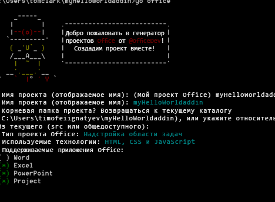

# Создание надстройки Office с помощью любого редактора

Надстройка Office — это веб-приложение, размещаемое в приложении Office. В этой статье описывается создание основы проекта и управление сборками с помощью генератора Yeoman. Файл `manifest.xml` сообщает приложению Office, где находится надстройка и как она должна отображаться. Приложение Office занимается ее размещением.

 >**Примечание.** Инструкции включают действия с использованием командной строки Windows, но одинаково применимы и для других оболочек. 


## Необходимые условия для генератора Yeoman

Для запуска генератора Yeoman в Office вам потребуется следующее:


- [Git](https://git-scm.com/downloads)
    
- [npm](https://www.nodejs.org/en/download)
    
- [Bower](http://bower.io/)
    
- [Генератор Yeoman для Office](https://www.npmjs.com/package/generator-office)
    
- [Gulp](http://gulpjs.com/)
    
- [TSD](http://definitelytyped.org/tsd/)
    
Отдельная установка требуется только для Git и npm. Остальные компоненты можно установить с помощью npm.

При установке Git используйте настройки по умолчанию, но выберите следующие параметры: 


- Использовать Git из командной строки Windows
    
- Использовать окно консоли Windows по умолчанию
    
Установите npm с параметрами по умолчанию. Затем откройте командную строку от имени администратора и установите другие программы для всех пользователей. Это можно сделать следующим образом:


```
npm install -g bower yo generator-office gulp tsd
```


## Создание стандартных файлов для надстройки

Перед созданием надстройки Office необходимо создать папку для проекта и запустить генератор оттуда. Генератор Yeoman выполняется в том каталоге, где нужно создать шаблон проекта. 

В командной строке перейдите к родительской папке, где нужно создать проект. Затем с помощью приведенных ниже команд создайте папку под названием _myHelloWorldaddin_ и сделайте его текущим каталогом:


```
mkdir myHelloWorldaddin
cd myHelloWorldaddin
```

Создайте с помощью генератора Yeoman надстройку Office по вашему выбору: надстройку Outlook, области задач или контентную надстройку. В этой статье описывается создание надстройки области задач. Чтобы запустить генератор, введите следующую команду:


```
yo office
```

Генератор предложит указать следующее: 


- имя надстройки (введите _myHelloWorldaddin_);
    
- корневую папку проекта (используйте _текущую папку_);
    
- тип надстройки (выберите _надстройку области задач_);
    
- технологию создания надстройки (укажите _HTML, CSS и JavaScript_).
    
- Поддерживаемое приложение Office — вы можете выбрать любое приложение
    

**Входные данные генератора Yeoman для надстройки**



Это необходимо для создания структуры и основных файлов надстройки.


## Размещение надстройки Office

Надстройки Office должны обслуживаться по протоколу HTTPS. Приложение Office не будет загружать веб-приложение как надстройку, если используется протокол HTTP. Для создания, отладки и размещения надстройки на локальном компьютере необходим способ создания и обслуживания веб-приложения по протоколу HTTPS. Вы можете создать сайт HTTPS с размещением у заказчика с помощью модуля gulp (описанного в следующем разделе) или использовать Azure. 


### Использование сайта HTTPS с размещением у заказчика

Подключаемый модуль gulp-webserver создает сайт HTTPS с размещением у заказчика. Генератор Office добавит следующий код в файл gulpfile.js в качестве задания под названием serve-static для создаваемого проекта. Запустите веб-сервер с размещением у заказчика с помощью следующего оператора: 


```
gulp serve-static
```

Будет запущен HTTPS-сервер по адресу https://localhost:8443.


## Разработка надстройки Office

Чтобы создать файлы для своей надстройки Office, вы можете использовать любой текстовый редактор.


### Поддержка проектов JavaScript

При создании проекта генератор Office создаст файл jsconfig.json. Этот файл позволяет определить все файлы JavaScript в проекте и избавляет вас от необходимости добавлять повторяющиеся блоки кода "/// <reference path="../App.js" />".

Дополнительные сведения о файле jsconfig.json представлены на странице [Язык JavaScript](https://code.visualstudio.com/docs/languages/javascript#_javascript-projects-jsconfigjson).


### Поддержка IntelliSense в JavaScript

Кроме того, даже при написании кода на чистом JavaScript вы можете использовать файлы определения типов TypeScript (`*.d.ts`), чтобы предоставить дополнительную поддержку IntelliSense. Генератор Office добавляет файл `tsd.json` к созданным файлам со ссылками на все сторонние библиотеки, используемые выбранным типом проекта.

Все, что остается сделать после создания проекта с помощью генератора Yeoman для Office, — выполнить следующую команду, чтобы скачать файлы определений типов:


```
tsd install
```


### Создание надстройки Office "Hello World"


Для нашего примеры мы создадим надстройку "Hello World". Пользовательский интерфейс надстройки описывается в HTML-файле, который также может предоставлять логику программирования JavaScript. 


### Создание файлов надстройки "Hello World"


- В папке проекта перейдите к папке _[папка проекта]/app/home_ (в нашем примере это myHelloWorldaddin/app/home), откройте файл home.html и замените имеющийся код следующим кодом, который содержит минимальный набор тегов HTML для отображения интерфейса надстройки:
    
```HTML
        <!DOCTYPE html>  
      <html> 
        <head> 
           <meta charset="UTF-8" /> 
           <meta http-equiv="X-UA-Compatible" content="IE=Edge"/> 
           <link rel="stylesheet" type="text/css" href="program.css" />
         </head> 
   
        <body> 
           <p>Hello World!</p> 
        </body> 
      
       </html> 
```

  
    
- Затем в той же папке откройте файл home.css и добавьте следующий код CSS.
    
```css
     body 
   { 
        position:relative; 
   } 
   li :hover 
   { 
        text-decoration: underline; 
        cursor:pointer; 
   } 
   h1,h3,h4,p,a,li 
   { 
        font-family: "Segoe UI Light","Segoe UI",Tahoma,sans-serif; 
        text-decoration-color:#4ec724; 
   } 
```
    
- Вернитесь к родительской папке проекта и убедитесь, что XML-файл под названием manifest-myHelloWorldaddin.xml содержит указанный ниже XML-код.
    
     >**Важно**. Значение в теге `<id>` — это GUID, созданный генератором Yeoman при создании проекта. Не меняйте GUID, созданный генератором Yeoman для надстройки. Если ведущим приложением является Azure, значением `SourceLocation` будет URL-адрес, похожий на _https:// [название-веб-приложения].azurewebsites.net/[путь-к-надстройке]_. Если используется параметр автономного размещения, как в примере, URL-адрес будет выглядеть как _https://localhost:8443/[путь-к-надстройке]_.

```XML
     <?xml version="1.0" encoding="utf-8"?> 
   <OfficeApp xmlns="http://schemas.microsoft.com/office/appforoffice/1.1" 
              xmlns:xsi="http://www.w3.org/2001/XMLSchema-instance" 
              xsi:type="TaskPaneApp"> 
   <Id>[GUID-for-your-add-in]</Id> 
   <Version>1.0</Version> 
   <ProviderName>Microsoft</ProviderName> 
   <DefaultLocale>EN-US</DefaultLocale> 
   <DisplayName DefaultValue="myHelloWorldaddin"/> 
   <Description DefaultValue="My first app."/> 
    
   <Hosts> 
     <Host Name="Document"/> 
     <Host Name="Workbook"/> 
   </Hosts>
    
   <DefaultSettings> 
     <SourceLocation DefaultValue="https://localhost:8443/app/home/home.html"/> 
   </DefaultSettings> 
   
   <Permissions>ReadWriteDocument</Permissions>
    
   </OfficeApp> 
```


### Запуск надстройки на локальном компьютере


Для локального тестирования надстройки откройте браузер и введите URL-адрес файла home.html. Он может указывать либо на веб-сервер, либо на размещаемый у заказчика сайт HTTPS. Если он размещен локально, просто введите URL-адрес в браузере. В нашем примере это `https://localhost:8443/app/home/home.html`. 

Появится сообщение об ошибке "Возникла проблема с сертификатом безопасности этого веб-сайта". Нажмите "Продолжить открытие этого веб-сайта…", после чего появится текст "Hello World!"


 >**Примечание.** К созданной надстройки прилагаются самозаверяющий сертификат и ключ. Добавьте их в список доверенных, чтобы браузер не выдавал предупреждения о сертификате. Если вы хотите использовать свой самозаверяющий сертификат, ознакомьтесь с документацией по [gulp-webserver](https://www.npmjs.com/package/gulp-webserver). Сведения о том, как доверять сертификату в OS X Yosemite, см. в [статье базы знаний KB #PH18677](https://support.apple.com/kb/PH18677?locale=en_US).


## Установка надстройки для тестирования

С помощью загрузки неопубликованной надстройки вы можете установить ее для тестирования:


- [Загрузка неопубликованных надстроек Office для тестирования](../testing/sideload-an-office-add-in-on-ipad-and-mac.md)
    
- [Загрузка неопубликованных надстроек Outlook для тестирования](../outlook/testing-and-tips.md)
    
Кроме того, вы можете опубликовать надстройку в каталоге или сетевой папке и установить ее как обычно. Подробные сведения см. в статье [Создание каталога общих папок для надстроек области задач и контентных надстроек](https://technet.microsoft.com/en-us/browser/fp123503(v=office.14)).


## Отладка надстройки Office

Отлаживать надстройки можно несколькими способами:


- Вы можете использовать веб-клиенты Office, открыть средства разработчика в браузере и выполнять отладку надстройки, как в любом клиентском приложении JavaScript. 
    
- Если вы используете классическое приложение Office в Windows 10, вы можете [Отладка надстроек с помощью средств разработчика F12 в Windows 10](../testing/debug-add-ins-using-f12-developer-tools-on-windows-10.md).
    


## Дополнительные ресурсы


- [Создание и отладка надстроек Office в Visual Studio](../../docs/get-started/create-and-debug-office-add-ins-in-visual-studio.md)
    
