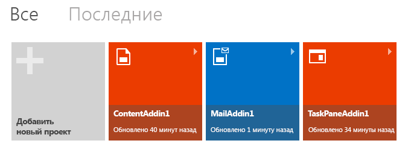
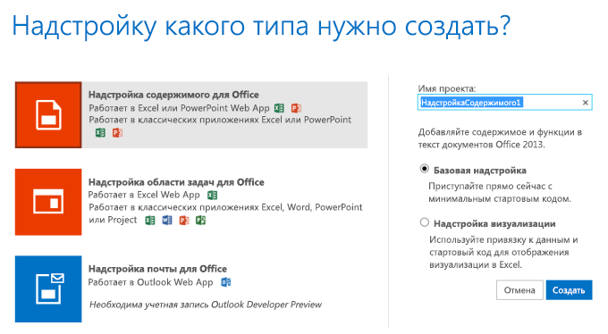

# Создание надстройки Office с помощью Napa

[Надстройка Office](../../docs/overview/office-add-ins.md) — это веб-приложение, размещаемое в элементе управления веб-браузера или плавающем фрейме (iframe), запущенном в контексте приложения Office. С помощью Надстройки можно получить доступ к данным текущего документа или почтового элемента и подключиться к веб-службам и другим веб-ресурсам. Для разработки надстройки используются стандартные веб-технологии, такие как HTML5, JavaScript, CSS3, XML, а также интерфейсы REST API. надстройка не устанавливается на компьютере, на котором запущено ведущее приложение Office. Приложение запускается на веб-сервере, где его будет несложно поддерживать и обновлять.

Вы можете создать простое приложение Надстройка Office с помощью Napa.

Вот что для этого понадобится:

- [учетная запись Майкрософт](http://www.microsoft.com/en-us/account/default.aspx);
    
- URL-адрес веб-приложения [Napa](https://www.napacloudapp.com/ ).
    

## Создание базовой надстройки

1. Откройте [Napa](https://www.napacloudapp.com/ ) в браузере.
    
2. Выберите плитку **Добавить новый проект**.
    
     **Примечание**. Плитка **Добавить новый проект** появляется, только если вы уже создали другие проекты. Если это ваш первый проект, перейдите к следующему действию.
    
    

3. Выберите тип надстройки, которую вы хотите создать, назовите проект и нажмите кнопку **Создать**.
    
    

    Откроется редактор кода с веб-страницей по умолчанию, содержащей пример кода, который можно запустить без внесения изменений.
    
4. Нажмите кнопку запуска () на краю страницы.
    
    После этого откроется приложение Office, связанное с выбранным типом надстройки, и появится пример надстройки. Теперь вы можете поэкспериментировать с возможностями надстройки.
    

## Дополнительные ресурсы

- [Общие сведения о надстройках Office](../../docs/overview/office-add-ins.md)
    
- [Предоставление отзыва о платформе разработки для Office](http://officespdev.uservoice.com/)
    
- [Публикация вопроса на форуме, посвященном надстройкам Office](http://social.msdn.microsoft.com/Forums/officeapps/en-US/home?forum=appsforoffice%2Cofficestore&amp;filter=alltypes&amp;sort=lastpostdesc)
    
