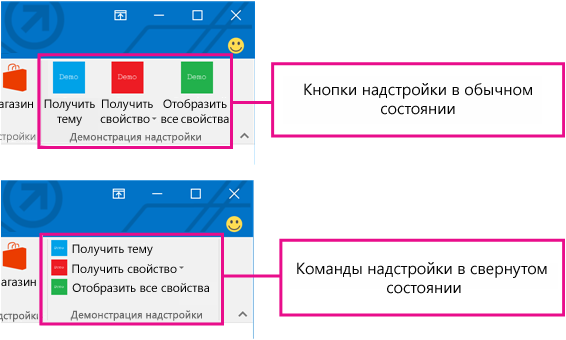
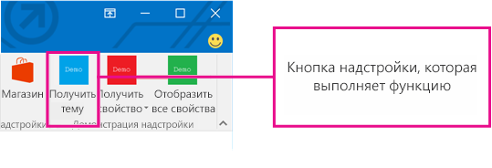
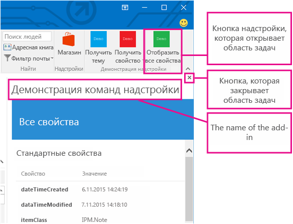
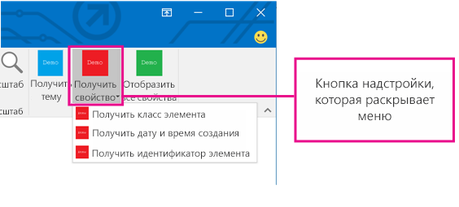

# Команды надстроек Outlook

Команды надстроек Outlook позволяют вызывать определенные действия надстроек с ленты путем добавления кнопок или раскрывающихся меню. Благодаря этому пользователи могут легко получать доступ к надстройкам простым и интуитивно понятным способом. Так как команды надстроек предлагают удобные расширенные функции, с их помощью вы можете создавать более интересные решения.

> **Примечание**. Команды надстроек доступны только в Outlook 2016 и Outlook 2013 для Windows. Для поддержки команд надстроек необходимо [обновление для системы безопасности от 8 мая 2016 г.](https://support.microsoft.com/en-us/kb/3114829)

Команды надстроек доступны только для контекстных надстроек, не использующих [правила temHasAttachment, ItemHasKnownEntity и ItemHasRegularExpressionMatch](manifests/activation-rules.md), и это ограничивает типы элементов, активирующих надстройки. Контекстные надстройки могут отображать разные команды в зависимости от того, какой элемент выбран (сообщение или встреча), и работать в режимах просмотра и создания. [Рекомендуем](../../docs/overview/add-in-development-best-practices.md) использовать команды надстроек по мере возможности.

## Создание команды надстройки

Команды надстроек объявляются в манифесте в элементе **VersionOverrides**. Этот элемент является дополнением к схеме манифестов версии 1.1, которая обеспечивает обратную совместимость. В клиенте, который не поддерживает узел **VersionOverrides**, имеющиеся надстройки продолжат работать так же, как и без команд надстроек.

В записях манифеста **VersionOverrides** указывается множество свойств надстройки, например ведущее приложение, типы элементов управления, добавляемых на ленту, текст, значки и соответствующие функции. Дополнительные сведения см. в статье [Определение команд надстройки Outlook в манифесте](../outlook/manifests/define-add-in-commands.md). 

Если надстройка должна предоставлять сведения о состоянии, например индикаторы хода выполнения или сообщения об ошибках, это необходимо сделать с помощью [API-интерфейсов уведомлений](../../reference/outlook/NotificationMessages.md). Обработка уведомлений также должна быть определена в отдельном HTML-файле, указанном в узле **FunctionFile** манифеста.

Разработчикам следует определить значки всех необходимых размеров, чтобы команды надстройки плавно изменялись при изменении размера ленты. Размеры значка: 80 x 80 пикселей, 32 x 32 пикселя и 16 x 16 пикселей.

## Отображение команд надстройки

Команда надстройки отображается на ленте в виде кнопки. Когда пользователь устанавливает надстройку, ее команды отображаются в пользовательском интерфейсе как группа кнопок с именем надстройки. Они могут отображаться либо на вкладке ленты по умолчанию, либо на пользовательской вкладке. Для сообщений по умолчанию используется вкладка **Главная** или **Сообщение**. Для календаря стандартной является вкладка **Сообщение**, **Экземпляр собрания**, **Ряд собраний** или **Встреча**. Для расширений модуля стандартной является пользовательская вкладка. На вкладке по умолчанию у каждой надстройки может быть одна группа ленты, включающая до 6 команд. Пользовательские вкладки могут включать до 10 групп, по 6 команд в каждой. У надстройки может быть только одна пользовательская вкладка.

Команды надстройки упорядочиваются соответствующим образом (сворачиваются) по мере заполнения ленты элементами. Во всех случаях команды надстройки группируются.

При добавлении команды в надстройку имя надстройки удаляется из панели приложения, если в надстройке отсутствует [пользовательская панель](../outlook/custom-pane-outlook-add-ins.md). Остается только командная кнопка надстройки на ленте.

## Оформление команд надстройки в пользовательском интерфейсе

Оформление пользовательского интерфейса для команды надстройки представляет собой вкладку ленты с кнопками, которые могут выполнять различные функции. В настоящий момент поддерживаются три варианта оформления пользовательского интерфейса:

- Кнопка, выполняющая функцию JavaScript
        
- Кнопка, которая выводит раскрывающееся меню с одной или несколькими кнопками остальных двух типов

Кроме того, контекстные надстройки поддерживают следующее: 
- Кнопка, запускающая область задач

### Выполнение функции JavaScript

Командные кнопки, выполняющие функцию JavaScript, используются для тех случаев, когда пользователю не требуется выбирать дополнительные параметры действия. Это могут быть такие действия, как отслеживание, напоминание или печать. Их также можно использовать для получения более подробных сведений от службы. 

В расширениях модуля кнопка команды надстройки может выполнять функции JavaScript, взаимодействующие с содержимым в основном пользовательском интерфейсе.

### Запуск области задач

Командные кнопки надстроек, запускающие область задач, используются в тех случаях, когда пользователю нужно работать с надстройкой длительное время. Например, надстройке может потребоваться изменить параметры или заполнить множество полей. 

По умолчанию ширина вертикальной области задач составляет 300 точек. Размер области задач можно изменить как в проводнике Outlook, так и в инспекторе. Изменить размеры области можно будет точно так же, как и размеры панели списка дел и представления списка.

На этом снимке экрана представлен пример вертикальной области задач. Область открывается с названием команды надстройки в левом верхнем углу. С помощью кнопки **X** в правом верхнем углу области пользователь может закрыть надстройку по завершении работы с ней. Эта область не будет отображаться для всех сообщений. Все элементы интерфейса, отрисованные в области задач, кроме названия приложения и кнопки закрытия, предоставляются надстройкой.

Если пользователь выбирает другую команду надстройки, которая открывает область задач, то область задач заменяется выбранной командой. Когда пользователь нажимает командную кнопку, которая выполняет функцию, или раскрывающееся меню при открытой области задач, действие будет выполнено, а область задач останется открытой.

### Раскрывающееся меню

Команда надстройки с раскрывающимся меню определяет статический список кнопок. Меню может содержать любой набор кнопок, которые выполняют функцию или открывают область задач. Подменю не поддерживаются.

## Отображение команд надстройки в пользовательском интерфейсе

Команды надстроек поддерживаются для четырех сценариев:

### Просмотр сообщения

Когда пользователь просматривает сообщение, команды надстройки, добавленные на вкладку по умолчанию, отображаются на вкладке **Главная** при просмотре сообщения в области чтения и на вкладке **Сообщение** для всплывающей формы чтения.

### Создание сообщения

Когда пользователь создает сообщение, команды надстройки, добавленные на вкладку по умолчанию, отображаются на вкладке **Сообщение**.

### Создание или просмотр встречи или собрания организатором

Когда организатор создает или просматривает встречу или собрание, команды надстройки, добавленные на вкладку по умолчанию, отображаются на вкладках **Собрание**, **Экземпляр собрания**, **Ряд собраний** или **Встреча** во всплывающих формах. Тем не менее, если пользователь выберет элемент календаря, но не откроет всплывающее окно, группа надстройки не будет отображаться на ленте.

### Просмотр собрания участником

Когда участник просматривает собрание, команды надстройки, добавленные на вкладку по умолчанию, отображаются на вкладках **Собрание**, **Экземпляр собрания** или **Ряд собраний** всплывающих форм. Тем не менее, если пользователь выберет элемент календаря, не открывая всплывающее окно, группа надстройки не будет отображаться на ленте.

### Использование расширения модуля

Если используется расширение модуля, команды надстройки отображаются на пользовательской вкладке расширения.

## Дополнительные ресурсы

- [Определение команд надстройки Outlook в манифесте](../outlook/manifests/define-add-in-commands.md)
    
- [Пример команд надстройки Outlook](https://github.com/jasonjoh/command-demo)
    
