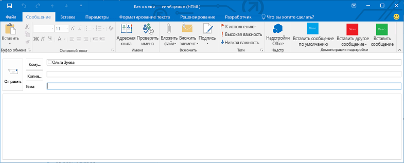
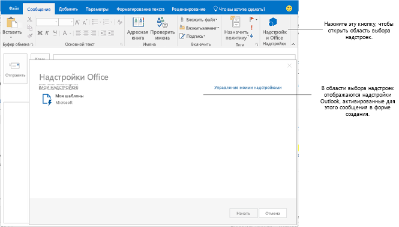

# Создание надстроек Outlook для форм создания

Начиная со схемы манифестов 1.1 для надстроек Office и файла office.js 1.1, вы можете разрабатывать надстройки создания — надстройки Outlook, которые активируются в формах создания. В отличие от надстроек чтения (надстроек Outlook, которые активируются в режиме чтения, когда пользователь просматривает сообщение или сведения о встрече), надстройки создания доступны в следующих сценариях:

- Создание сообщения, приглашения на собрание или встречи в отдельной форме.
    
- Просмотр или редактирование существующих встречи или собрания, организованных пользователем.
    
     >**Примечание**. Если пользователь использует выпуски Outlook 2013 RTM и Exchange 2013 RTM и просматривает встречу, организованную пользователем, он может найти доступные надстройки чтения. Начиная с выпуска Office 2013 с пакетом обновления 1 (SP1), только надстройки создания могут активироваться и быть доступными.
- Создание ответного сообщения, встроенного в текст исходного или отображающегося в отдельной форме.
    
- Изменение ответа (**Принять**, **Под вопросом** или **Отклонить**) на приглашение на собрание или элемент собрания.
    
- Предложение нового времени для элемента собрания.
    
- Пересылка или ответ на приглашение на собрание или элемент собрания.
    
В каждом из этих сценариев отображаются все определенные кнопки команд надстройки. В старых надстройках, в которых не реализованы команды, пользователи могут выбрать элемент **Надстройки Office** на ленте, чтобы открыть область выбора надстроек, а затем выбрать и запустить надстройку создания. На рисунке ниже показаны команды надстройки в форме создания.

На рисунке ниже показана область выбора надстроек, включающая две надстройки создания, в которых не реализованы команды. Она активируется при создании встроенного ответа в Outlook.

## Типы надстроек, доступные в режиме создания

Надстройки создания реализованы в виде [Команды надстроек Outlook](../outlook/add-in-commands-for-outlook.md).

## Функции API, доступные надстройкам создания

- Сведения об активации надстроек в формах создания см. в таблице 1 статьи [Указание правил активации в манифесте](../outlook/manifests/activation-rules.md#specify-activation-rules-in-a-manifest).
    
- [Добавление и удаление вложений в форме создания элементов Outlook](../outlook/add-and-remove-attachments-to-an-item-in-a-compose-form.md)
    
- [Считывание и запись данных элемента в форме создания элементов Outlook](../outlook/get-and-set-item-data-in-a-compose-form.md)
    
- [Чтение, запись и добавление получателей при создании встречи или сообщения в Outlook](../outlook/get-set-or-add-recipients.md)
    
- [Считывание и запись темы при создании встречи или сообщения в Outlook](../outlook/get-or-set-the-subject.md)
    
- [Вставка данных в основной текст при создании встречи или сообщения в Outlook](../outlook/insert-data-in-the-body.md)
    
- [Считывание и запись расположения при создании встречи в Outlook](../outlook/get-or-set-the-location-of-an-appointment.md)
    
- [Считывание и запись времени при создании встречи в Outlook](../outlook/get-or-set-the-time-of-an-appointment.md)
    
- [Outlook-Power-Hour_Code-Samples](https://github.com/OfficeDev/Outlook-Power-Hour-Code-Samples): `ComposeAppDemo`
    

## Дополнительные ресурсы

- [Начало работы с надстройками Outlook для Office 365](https://dev.outlook.com/MailAppsGettingStarted/GetStarted)
    
- [Надстройки Outlook](../outlook/outlook-add-ins.md)
    
