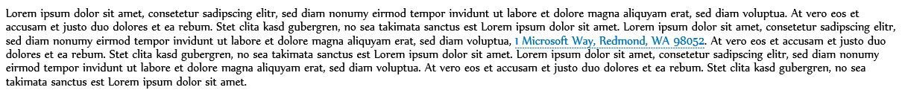
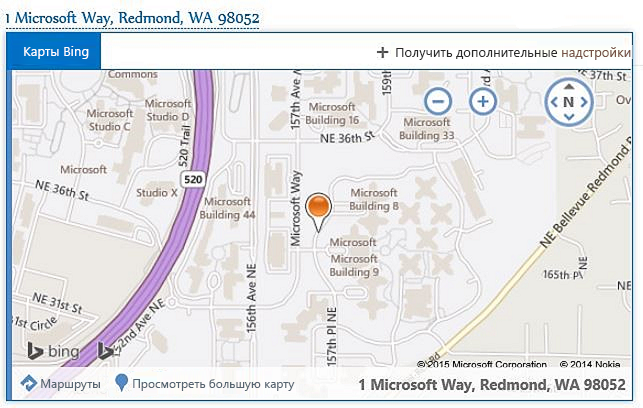
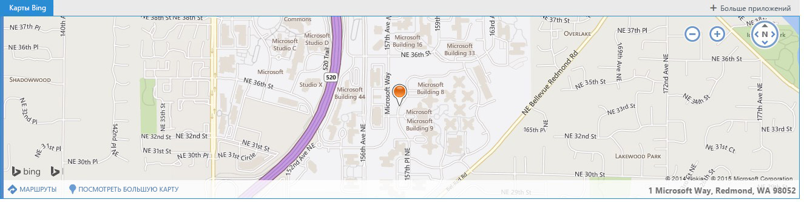

# Контекстно-зависимые надстройки Outlook

Контекстные надстройки — это надстройки Outlook, которые активируются при наличии определенного текста в сообщении или сведениях о встрече. С помощью контекстных надстроек пользователь может выполнять связанные с сообщением действия, не закрывая окно сообщения, что упрощает работу и расширяет возможности пользователя.

Контекстные надстройки отличаются от надстроек с вложениями или надстроек, специфичных для определенных типов сообщений. Ниже приведены примеры контекстных надстроек:


- Чтобы открыть карту расположения, нужно выбрать адрес.
    
- Чтобы открыть надстройку с предложенными собраниями, нужно щелкнуть соответствующую строку.
    
- Чтобы добавить в контакты, нужно щелкнуть номер телефона.
    
На данный момент из контекстных надстроек доступно только Outlook Web App.

## Создание контекстной надстройки

Для создания контекстной надстройки необходимо, чтобы в манифесте надстройки были указаны сущность или регулярное выражение, которые могут его активировать. Сущность может быть одним из свойств в объекте [Entities](../../reference/outlook/simple-types.md). Таким образом, манифест надстройки должен содержать правило типа **ItemHasKnownEntity** или **ItemHasRegularExpressionMatch**. В примере ниже показано, как указать сущность, которая является номером телефона:


```XML
<Rule xsi:type="ItemHasKnownEntity" EntityType="PhoneNumber"/>

```

После связывания контекстной надстройки с учетной записью эта надстройка будет запускаться автоматически, когда пользователь выберет выделенную сущность или регулярное выражение. Дополнительные сведения о регулярных выражениях для надстроек Outlook см. в статье [Использование правил активации регулярных выражений для отображения надстройки Outlook](../outlook/use-regular-expressions-to-show-an-outlook-add-in.md).

Контекстные надстройки имеют несколько ограничений:


- Контекстная надстройка может существовать только в надстройках чтения (не надстройках создания).
    
- Указывать цвет выделенной сущности невозможно.
    
- Невыделенная сущность не запускает надстройку на карточке.
    
- Размер карточки составляет 140–450 пикселей (рекомендованный предел — 300 пикселей) в высоту и 570 пикселей в ширину.
    
- Невозможно определять, где будет отображаться надстройка: на карточке или на панели надстроек.
    

## Запуск контекстной надстройки

Контекстная надстройка запускается в тексте (с помощью известной сущности или регулярного выражения разработчика) или на панели надстроек. Обычно пользователь определяет контекстную надстройку по выделенной сущности. В приведенном ниже примере показано, как подобное выделение выглядит в сообщении. В этом случае сущность (адрес) выделена синим цветом и подчеркнута синей пунктирной линией. Чтобы запустить надстройку, нужно щелкнуть выделенную сущность. 


**Пример текста с выделенной сущностью (адресом)**



Хотя контекстные надстройки лучше всего определяются с помощью выделения, иногда они появляются на панели надстроек. Это происходит в следующих случаях:

- Когда сущность — это URL-адрес или адрес электронной почты.
    
- Когда манифест надстройки имеет правило типа "ItemHasRegularExpressionMatch" с "BodyAsHTML" или "SenderSMTPAddress" в качестве атрибута PropertyName.
    
- Если манифест надстройки содержит правило активации типа "ItemIs" с itemType="Appointment" или "Message" и второе правило типа "ItemHasKnownEntity" или "ItemHasRegularExpressionMatch"
    
- Если сложность текста сообщения электронной почты влияет на почтовый клиент.
    
Когда сообщение содержит несколько сущностей или контекстных надстроек, действует несколько правил взаимодействия:


- Если имеется несколько сущностей, нужно щелкнуть другую сущность, чтобы запустить связанную с ней надстройку.
    
- Если сущность активирует несколько надстроек, каждая надстройка открывает новую вкладку. Для перехода от одной надстройки к другой нужно открыть соответствующую вкладку. Например, при выборе имени и адреса могут запускаться надстройка телефона и карта.
    
- Если строка содержит несколько сущностей, которые активируют несколько надстроек, выделяется вся строка. Щелкнув строку, пользователь увидит все соответствующие надстройки на отдельных вкладках. Например, строка с описанием встречи в ресторане может активировать надстройку с предложениями, касающимися собраний, и надстройку с оценкой ресторана.
    

## Отображение контекстной надстройки

Активированная контекстная надстройка отображается в одном из следующих мест:


- На карточке — отдельном окне рядом с сущностью.
    
- На панели надстроек — строке между отправителем и текстом сообщения.
    
Карточка обычно отображается под сущностью, относительно которой она максимально отцентрована. Если под сущностью недостаточно места, карточка помещается над ней. На приведенном ниже снимке экрана показаны выделенная сущность, а под ней — активированная надстройка (Карты Bing) на карточке.


**Пример надстройки, отображаемой на карточке**



Внимание!

- Вкладка "Карты Bing" отображается в виде белого текста на синем фоне. При выборе новой надстройки текст вкладки становится синим, а фон — белым.
    
- Дополнительные вкладки надстроек (если они имеются) будут отображаться справа от вкладки "Карты Bing". Они будут иметь синий текст на белом фоне. При выборе вкладки загружается новая надстройка, а текст становится белым на синем фоне.
    
- Кнопка "+ Получить другие надстройки" открывает Магазин Office.
    
- Если имя надстройки не помещается в отведенном для него пространстве, оно заменяется значком многоточия "…" слева от кнопки "+ Получить другие надстройки". При выборе этого значка раскрывается список надстроек, которые не помещаются в области.
    
- Чтобы закрыть карточку и завершить работу надстройки, щелкните в любом месте за пределами карточки.
    
На приведенном ниже снимке экрана показано, как одна и та же надстройка (в данном случае "Карты Bing") выглядит на панели, если текст не может быть выделен (например, если он был внутри гиперссылки).


**Пример панели надстроек и надстройки в элементе iframe**



Внимание!

- На этом снимке экрана изображена панель надстроек с именем запущенной надстройки и кнопкой "+ Получить другие надстройки" над элементом iframe. Если есть другие надстройки (контекстные или нет), которые запускаются с панели надстроек, они также отображаются.
    
- Надстройка отображается в элементе iframe. Высота элемента iframe задается разработчиком, а его ширина имеет фиксированное значение. Та же самая высота используется для панели надстроек на карточке. Разработчику не нужно указывать две разные высоты.
    

## Отображение контекстных надстроек на различных устройствах

На настольном компьютере контекстная надстройка обычно отображается на карточке, а несколько надстроек — на отдельной вкладке. На планшетах одна и та же надстройка отображается на обратной стороне страницы, а несколько надстроек — на вкладках. На телефонах надстройка отображается на гиперкарте. При наличии нескольких надстроек, активированных с помощью сущности, в верхнем правом углу отображается значок "…", который позволяет пользователям переходить к различным надстройкам этой сущности.


## Текущие контекстные надстройки

Для пользователей надстроек Outlook по умолчанию устанавливаются следующие контекстные надстройки:


- Карты Bing 
    
- Приложение с предложениями, касающимися собраний
    
Кроме того, в Магазине Office доступна контекстная надстройка [Package Tracker](https://store.office.com/package-tracker-WA104162083.aspx?assetid=WA104162083.aspx).


## Дополнительные ресурсы


- [Начало работы с надстройками Outlook для Office 365](https://dev.outlook.com/MailAppsGettingStarted/GetStarted.aspx)
    
- [Использование регулярных правил активации выражений для отображения надстройки Outlook](../outlook/use-regular-expressions-to-show-an-outlook-add-in.md)

- [Объект Entities](../../reference/outlook/simple-types.md)
    
