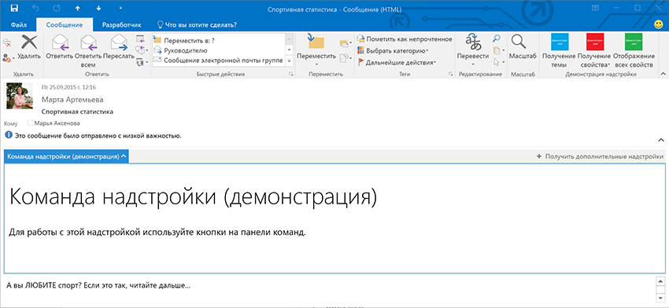

# Настраиваемые надстройки Outlook

Настраиваемая область — это точка расширения надстройки, которая активируется при выполнении определенных условий в текущем элементе. Она определяется в элементе **VersionOverrides** манифеста вместе с командами надстройки. Дополнительные сведения см. в статье [Определение команд надстройки в манифесте надстройки Outlook](../outlook/manifests/define-add-in-commands.md). Настраиваемая область может отображаться только в представлениях просмотра сообщения и участника встречи. Соответствующая команда отображается в панели надстройки. Когда пользователь выбирает эту команду, настраиваемая область отображается с горизонтальной ориентацией над телом элемента. Она выглядит и работает так же, как и в надстройках режима чтения, в которых не реализованы команды надстроек.

**Надстройка и пользовательская панель в режиме чтения**



В примере ниже показано, как определить настраиваемую область для элементов, представляющих собой сообщения, либо для элементов, имеющих вложения или в которых указан адрес. 


```
<ExtensionPoint xsi:type="CustomPane">
  <RequestedHeight>100< /RequestedHeight> 
  <SourceLocation resid="residReadTaskpaneUrl"/>
  <Rule xsi:type="RuleCollection" Mode="Or">
    <Rule xsi:type="ItemIs" ItemType="Message"/>
    <Rule xsi:type="ItemHasAttachment"/>
    <Rule xsi:type="ItemHasKnownEntity" EntityType="Address"/>
  </Rule>
</ExtensionPoint>
```


-  Элемент **RequestedHeight** задает высоту почтовой надстройки (в пикселях) при запуске на настольном компьютере. В других случаях он пропускается. Это может быть значение от 32 до 450. Если этот элемент не задан, по умолчанию используется значение 350 пикселей. Необязательный.
    
-  Элемент **SourceLocation** задает HTML-страницу, которая предоставляет пользовательский интерфейс настраиваемой области. Для атрибута **resid** задается значение атрибута **id** элемента **Url** в элементе **Resources**. Обязательный.
    
-  Элемент **Rule** задает правило или коллекцию правил, которые определяют, когда активируется надстройка. Он аналогичен элементу, описанному в статье [Манифесты надстроек Outlook](../outlook/manifests/manifests.md), но в правиле [ItemIs](http://msdn.microsoft.com/en-us/library/f7dac4a3-1574-9671-1eda-47f092390669%28Office.15%29.aspx) сделаны следующие изменения: элемент **ItemType** имеет значение "Message" или "AppointmentAttendee", а атрибут **FormType** отсутствует. Дополнительные сведения см. в статье [Правила активации надстроек Outlook](../outlook/manifests/activation-rules.md).
    

## Дополнительные ресурсы


- [Начало работы с надстройками Outlook для Office 365](https://dev.outlook.com/MailAppsGettingStarted)
    
- [Правила активации для надстроек Outlook](../outlook/manifests/activation-rules.md)
    
- [Манифесты надстроек Outlook](../outlook/manifests/manifests.md)
    
- [Определение команд надстройки Outlook в манифесте](../outlook/manifests/define-add-in-commands.md)
    
