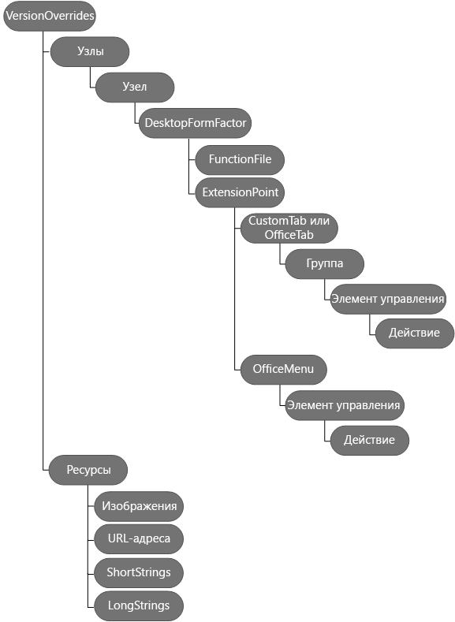

# Определение команд надстройки в манифесте

С помощью команд надстроек можно с легкостью настроить стандартный пользовательский интерфейс Office, добавив элементы, выполняющие действия. Например, вы можете добавить на ленту собственные кнопки. Чтобы создать команды, можно добавить узел **[VersionOverrides](../../../reference/manifest/versionoverrides.md)** в уже созданный манифест надстройки области задач. 

Если манифест содержит элемент **VersionOverrides**, то версии Word, Excel, Outlook и PowerPoint, поддерживающие команды надстроек, будут использовать данные из этого элемента для загрузки надстройки. В более ранних версиях Office, не поддерживающих команды надстроек, этот элемент игнорируется.

Когда клиентские приложения обнаруживают узел **VersionOverrides**, имя надстройки появляется на ленте, а не в области задач, просмотра или создания. Надстройка не будет отображаться на ленте и в соответствующей области одновременно.
 

## Узел VersionOverrides

[VersionOverrides](../../../reference/manifest/versionoverrides.md) — корневой элемент, который содержит сведения о командах надстройки. Он поддерживается в схеме манифеста версий 1.1 и более поздних, но определен в схеме VersionOverrides версии 1.0. 

Элемент VersionOverrides включает следующие дочерние элементы:

- [Description;](../../../reference/manifest/description.md)
- [Requirements;](../../../reference/manifest/requirements.md)
- [Hosts;](../../../reference/manifest/hosts.md)
- [Resources.](../../../reference/manifest/resources.md)

На приведенной ниже схеме показана иерархия элементов, используемых для определения команд надстроек. 

## Изменения правил для команд надстроек Outlook

Ниже указаны изменения, которые влияют на правила в манифесте.

- Правила активации теперь находятся в каждой точке входа.
    
- Изменен атрибут **ItemIs** элемента [Rule](../../../reference/manifest/rule.md). Атрибут **ItemType** может иметь тип Message или AppointmentAttendee. Удален атрибут **FormType**.
    
- Атрибут **ItemHasKnownEntity** элемента [Rule](../../../reference/manifest/rule.md) изменен для поддержки типа string в качестве EntityType.
    

## Примеры манифестов

Пример манифеста, в котором реализуются команды надстройки для Word, Excel и PowerPoint, представлен на странице [Простой пример команд надстроек](https://github.com/OfficeDev/Office-Add-in-Commands-Samples/tree/master/Simple).

Пример манифеста, в котором реализуются команды надстройки для Outlook, представлен на странице [Пример файла манифеста для надстройки Outlook](https://gist.github.com/mlafleur/95b7ac030bb7a7ae742527e85a36b095).

## Дополнительные ресурсы

- [Команды надстроек Outlook](../../outlook/add-in-commands-for-outlook.md)
    
- [Манифесты надстроек Outlook](../../outlook/manifests/manifests.md)
    
- [Пример команды надстройки Outlook (демонстрация)](https://github.com/jasonjoh/command-demo)
