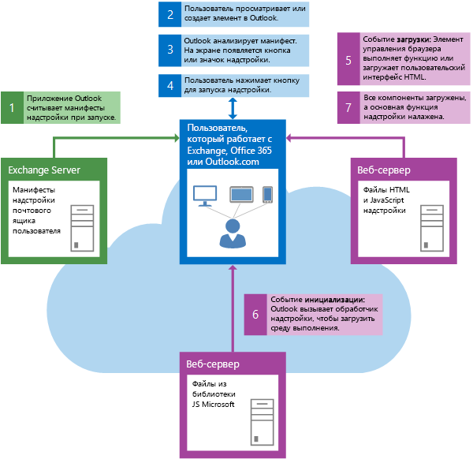

# Обзор архитектуры и функций надстроек Outlook

Надстройка Outlook состоит из XML-манифеста и кода (JavaScript и HTML). В манифесте приведено имя и описание надстройки, а также способ ее интеграции с Outlook. С помощью этого манифеста разработчики могут размещать кнопки на панелях команд, отменять совпадения регулярных выражений и выполнять другие действия. Манифест также определяет URL-адрес кода JavaScript и HTML для надстройки.

Когда пользователь или администратор приобретает надстройку, ее манифест сохраняется в почтовом ящике пользователя или в организации. При запуске Outlook загружаются и обрабатываются все манифесты, установленные пользователем, а также настраиваются все точки расширения для надстройки (например, отображение кнопок на панелях команд, запуск регулярных выражений для выбранного сообщения и т. д.). Теперь пользователь может использовать надстройку.

Когда пользователь работает с надстройкой, файлы JavaScript и HTML загружаются из расположения, указанного в манифесте.

Надстройки используют API Office.js для доступа к API надстроек Outlook и взаимодействия с Outlook.

**Взаимодействие типичных компонентов при запуске Outlook**

### Управление версиями

По мере того как мы развиваем клиенты Outlook и платформу надстроек, а также добавляем новые способы интеграции надстроек, иногда нам не удается реализовать функцию одновременно во всех клиентах (Mac, Windows, веб-клиентах, мобильных приложениях). Чтобы справиться с этой проблемой, мы назначаем версии как манифестам, так и API-интерфейсам. Таким образом, платформа всегда имеет обратную совместимость, а разработчики могут создать надстройку, которая работает с ограниченными возможностями в устаревших клиентах, но также позволяет воспользоваться преимуществами новых функций в новых клиентах. Дополнительные сведения об управлении версиями см. в статье [Манифесты надстроек Outlook](manifests/manifests.md).

## Функции надстроек Outlook

Надстройки Outlook предлагают богатые возможности, которые можно использовать в различных сценариях.

|**Функция**|**Описание**|
|:-----|:-----|
|Контекстная активация|Контекстные надстройки Outlook могут активироваться:<ul><li>(по умолчанию) для всех элементов в почтовом ящике или календаре;</li><li>для элементов определенного типа (электронных сообщений, приглашений на собрание или сведений о встрече);</li><li>для класса сообщений "элемент";</li><li>для определенных объектов в сообщении или встречи (см. статью [Контекстные надстройки Outlook](contextual-outlook-add-ins.md));</li><li>на основе правил или регулярных выражений (см. статьи [Правила активации для надстроек Outlook](manifests/activation-rules.md) и [Использование регулярных правил активации выражений для отображения надстройки Outlook](use-regular-expressions-to-show-an-outlook-add-in.md));</li><li>для свойств, которые соответствуют строкам (см. статью [Сопоставление строк в элементе Outlook как известных сущностей](match-strings-in-an-item-as-well-known-entities.md)).</li></ul>|
|Расширения модулей|Расширение модуля Outlook интегрирует надстройку с панелью навигации Outlook. [Подробнее…](../outlook/extension-module-outlook-add-ins.md) Расширения модулей доступны только в Outlook 2016 для Windows.|
|Команды надстроек|Команды надстроек Outlook позволяют выполнять определенные действия с ленты. Они доступны только для расширений модулей и надстроек, которые применяются ко всем сообщениям или событиям. [Подробнее…](../outlook/add-in-commands-for-outlook.md) |
|Параметры перемещения|Надстройка Outlook может сохранять данные, связанные с почтовым ящиком пользователя, для доступа при последующем сеансе Outlook. Дополнительные сведения см. в статье [Получение и задние метаданных для надстройки Outlook](../outlook/metadata-for-an-outlook-add-in.md). |
|Настраиваемые свойства|Надстройка Outlook может сохранять данные, связанные с элементом в почтовом ящике пользователя, для доступа при последующем сеансе Outlook. Дополнительные сведения см. в статье [Получение и задние метаданных для надстройки Outlook](../outlook/metadata-for-an-outlook-add-in.md).|
|Получение вложений или всего выбранного элемента|Контекстная надстройка Outlook может получить доступ ко вложениям и всему выбранному элементу на стороне сервера. См. следующие разделы:<ul><li>Вложения — см. статьи [Получение вложений элемента Outlook с сервера](get-attachments-of-an-outlook-item.md) и [Добавление и удаление вложений в форме создания элементов Outlook]add-and-remove-attachments-to-an-item-in-a-compose-form.md)</li><li>Весь выбранный элемент — аналогично получению вложений с помощью токена обратного вызова. См. следующие разделы:<ul><li>Метод **mailbox.getCallbackTokenAsync** в [Office.context.mailbox](../../reference/outlook/Office.context.mailbox.md) предоставляет токен обратного вызова для определения серверного кода надстройки для Exchange Server.</li><li>Свойство **item.itemId** в [Office.context.mailbox](../../reference/outlook/Office.context.mailbox.item.md) определяет элемент, который читает пользователь и получает серверный код.</li><li>Свойство **mailbox.ewsUrl** в [Office.context.mailbox](../../reference/outlook/Office.context.mailbox.md) предоставляет URL-адрес конечной точки EWS, который серверный код может использовать для доступа к операции EWS [GetItem](http://msdn.microsoft.com/en-us/library/e3590b8b-c2a7-4dad-a014-6360197b68e4(Office.15).aspx) вместе с идентификатором элемента и токеном обратного вызова, чтобы получить весь элемент.</li></ul></li></ul>|
|Профиль пользователя|Почтовая надстройка может получить доступ к отображаемому имени, адресу электронной почты и часовому поясу профиля пользователя. Дополнительные сведения см. в статье, посвященной объекту [UserProfile](../../reference/outlook/Office.context.mailbox.userProfile.md).|

## Знакомство с разработкой надстроек Outlook

Чтобы начать создавать надстройки Outlook, см. статью [Начало работы с надстройками Outlook для Office 365](https://dev.outlook.com/MailAppsGettingStarted/GetStarted) или [Интеграция надстройки Outlook с панелью навигации Outlook](../outlook/extension-module-outlook-add-ins.md).

## Дополнительные ресурсы

Сведения об общих концепциях, применимых при разработке надстроек Office, см. по ссылкам ниже.

- [Рекомендации по проектированию надстроек Office](../../docs/design/add-in-design.md)

- [Рекомендации по разработке надстроек Office](../../docs/design/add-in-development-best-practices.md)

- [Лицензирование надстроек Office и SharePoint](http://msdn.microsoft.com/library/3e0e8ff6-66d6-44ff-b0c2-59108ebd9181%28Office.15%29.aspx)

- [Отправка надстроек Office и SharePoint, а также веб-приложений для Office 365 в Магазин Office](http://msdn.microsoft.com/library/ff075782-1303-4517-91cc-b3d730e9b9ae%28Office.15%29.aspx)

- [API JavaScript для Office](../../reference/javascript-api-for-office.md)

- [Манифесты надстроек Outlook](../outlook/manifests/manifests.md)

