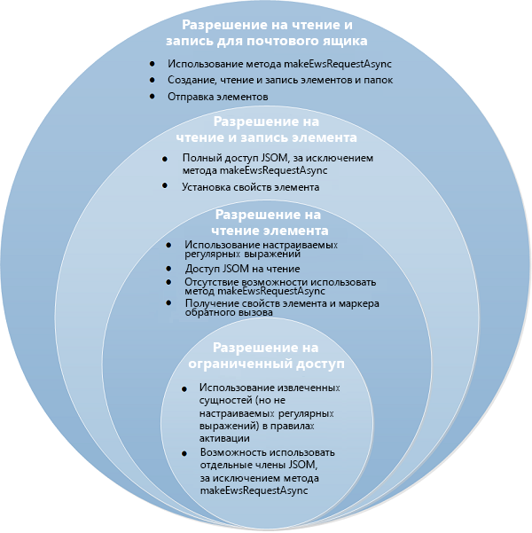


# Конфиденциальность, разрешения и безопасность для надстроек Outlook
Пользователи, разработчики и администраторы могут использовать уровни разрешений модели безопасности для надстроек Outlook, чтобы управлять конфиденциальностью и производительностью.


В этой статье описаны разрешения, которые могут запрашивать надстройки Outlook, и рассматривается модель безопасности с различных точек зрения:

- Магазин Office: целостность надстройки;
    
- пользователи: вопросы, связанные с конфиденциальностью и производительностью;
    
- разработчики: варианты разрешений и ограничения на использование ресурсов;
    
- администраторы: разрешения на определение пороговых значений производительности.
    

## Модель разрешений


От того, насколько клиенты доверяют безопасности надстройки, зависит ее принятие. Безопасность надстройки Outlook опирается на уровневую модель разрешений. Надстройка Outlook открывает необходимый уровень разрешений, определяя возможный доступ и действия, которые она может выполнять с данными почтового ящика пользователя. 

Схема манифеста версии 1.1 включает четыре уровня разрешений. 


**Таблица 1. Уровни разрешений для надстройки**


|**Уровень разрешений**|**Значение в манифесте надстройки Outlook**|
|:-----|:-----|
|Ограниченный доступ|Restricted|
|Чтение элемента|ReadItem|
|Чтение и запись элемента|ReadWriteItem|
|Чтение и запись почтового ящика|ReadWriteMailbox|
Четыре уровня разрешений можно определить как накопительные: разрешение на **чтение и запись в почтовом ящике** включает разрешения на **чтение и запись элемента**, **чтение элемента** и **ограниченное** разрешение. Разрешение на **чтение и запись элемента** включает разрешение на **чтение элемента** и **ограниченное** разрешение, а разрешение на **чтение элемента** включает **ограниченное** разрешение. На рис. 1 показаны четыре уровня разрешений и описаны возможности, доступные пользователям, разработчикам и администраторам на каждом уровне. Дополнительные сведения об этих разрешениях см. в разделах [Пользователи: вопросы, связанные с конфиденциальностью и производительностью](#Пользователи-вопросы-связанные-с-конфиденциальностью-и-производительностью), [Разработчики — варианты разрешений и ограничения на использование ресурсов](#Разработчики-варианты-разрешений-и-ограничения-на-использование-ресурсов) и статье [Указание разрешений для доступа надстройки Outlook к почтовому ящику пользователя](../outlook/understanding-outlook-add-in-permissions.md). 


**Рис. 1. Сопоставление четырехуровневой модели разрешений с пользователями, разработчиками и администраторами**




## Магазин Office: целостность надстройки


Магазин Office содержит надстройки, которые могут установить пользователи и администраторы. Магазин Office применяет указанные ниже меры для поддержки целостности надстроек Outlook.


- Требуется постоянное использование сервером, на котором размещена надстройка, протокола SSL для связи.
    
- Разработчику требуется предоставить доказательство подлинности, контрактное соглашение и соответствующую требованиям политику конфиденциальности для отправки надстроек. 
    
- Архивация надстроек осуществляется только в режиме для чтения.
    
- Поддерживается система рецензий пользователей для доступных надстроек, чтобы стимулировать формирование саморегулирующегося сообщества.
    

## Пользователи: вопросы, связанные с конфиденциальностью и производительностью


Модель безопасности адресует вопросы пользователей, связанные с безопасностью, конфиденциальностью и производительностью, следующим образом.


- Пользовательские сообщения, защищенные с помощью IRM в Outlook, не взаимодействуют с надстройками Outlook.
    
- Перед установкой надстройки, добавленной в Магазин Office, пользователям видны сведения о доступе и действиях, которые надстройка может выполнять с их данными, и для продолжения установки необходимо явно подтвердить свое согласие. Ни одна надстройка Outlook не устанавливается на клиентский компьютер без получения непосредственного согласия от пользователя или администратора.
    
- Разрешение **ограниченное** позволяет ограничить доступ надстройки Outlook только к текущему элементу. Разрешение **чтение элемента** позволяет надстройке получить доступ к личным сведениям, например именам и электронным адресам отправителя и получателя, но только для текущего элемента.
    
- Пользователь может установить надстройку Outlook только для себя. Установку надстроек Outlook на уровне всей организации выполняют администраторы.
    
- Пользователи могут устанавливать надстройки Outlook, которые задействуют сценарии, зависимые от контекста, что очень привлекательно для самих пользователей, но при этом также снижает риски, связанные с безопасностью.
    
- Защита файлов манифестов установленных надстроек Outlook обеспечивается в учетной записи электронной почты пользователя.
    
- Данные, которыми приложения обмениваются с серверами, на которых установлены Надстройки Office, всегда шифруются в соответствии с протоколом SSL.
    
- Применимо только к полнофункциональным клиентам Outlook, которые отслеживают производительность установленных надстроек Outlook, контролируют их и отключают те приложения, которые превышают ограничения по ряду следующих факторов:
    
      - Response time to activate
    
  - Количество сбоев при активации или повторной активации
    
  - Использование памяти
    
  - Использование процессора
    

    Такой контроль предотвращает атаки по принципу отказа в обслуживании и поддерживает производительность надстройки на допустимом уровне. В бизнес-строке пользователи получают уведомления о тех надстройках Outlook, которые полнофункциональный клиент Outlook отключил, руководствуясь изложенными выше принципами.
    
- В любой момент пользователи могут проверить разрешения, запрашиваемые установленными надстройками Outlook, отключить, а затем включить любую надстройку Outlook в Центре администрирования Exchange.
    

## Разработчики — варианты разрешений и ограничения на использование ресурсов


Модель безопасности предоставляет пользователям возможность детальной настройки разрешений, а также строгие правила производительности, которых следует придерживаться.


### Уровневая модель разрешений повышает прозрачность

Разработчикам рекомендуется следовать многоуровневой модели разрешений, чтобы обеспечить прозрачность и развеять сомнения пользователей по поводу доступа надстроек к их данным и почтовым ящикам, что косвенно повысит популярность надстройки:


- Разработчики запрашивают подходящий уровень разрешений для надстройки Outlook с учетом способа ее активации, а также необходимости чтения или записи определенных свойств элемента или создания и отправки элемента.
    
- Разработчики запрашивают разрешение с помощью элемента [Permissions](http://msdn.microsoft.com/en-us/library/c20cdf29-74b0-564c-e178-b75d148b36d1%28Office.15%29.aspx) в манифесте надстройки Outlook, назначая значение **Restricted**, **ReadItem**, **ReadWriteItem** или **ReadWriteMailbox**. 
    
     >**Примечание.** Помните, что разрешение **ReadWriteItem** стало доступным только в схеме манифестов версии 1.1.

    В приведенном ниже примере запрашивается разрешение на **чтение элемента**.
    


```XML
  <Permissions>ReadItem</Permissions>
```

- Разработчики могут запрашивать **ограниченное** разрешение, если надстройка Outlook задействуется только для определенного типа элементов Outlook (встреча или сообщение) или для определенных извлеченных сущностей (телефонный номер, адрес, URL-адрес) в теме или основном тексте элемента. Например, следующее правило активирует надстройку Outlook, если хотя бы одна из трех сущностей (телефонный номер, почтовый адрес или URL-адрес) найдена в теме или основном тексте текущего сообщения.
    
```XML
  <Permissions>Restricted</Permissions>
    <Rule xsi:type="RuleCollection" Mode="And">
    <Rule xsi:type="ItemIs" FormType="Read" ItemType="Message" />
    <Rule xsi:type="RuleCollection" Mode="Or">
        <Rule xsi:type="ItemHasKnownEntity" EntityType="PhoneNumber" />
        <Rule xsi:type="ItemHasKnownEntity" EntityType="Address" />
        <Rule xsi:type="ItemHasKnownEntity" EntityType="Url" />
    </Rule>
</Rule>
```

- Разработчикам рекомендуется запрашивать разрешение на **чтение элемента**, если надстройка Outlook должна считывать свойства текущего элемента, который не входит в извлеченные сущности по умолчанию, или записывать пользовательские свойства, определяемые надстройкой для текущего элемента, но не требует чтения или записи других элементов либо создания и отправки сообщения в пользовательском почтовом ящике. Например, разработчик должен запросить разрешение на **чтение элемента**, если надстройка должна искать такие сущности, как приглашение на собрание, предложение задачи, электронный адрес или имя контакта в теме или основном тексте элемента, или если для активации надстройки требуется регулярное выражение.
    
- Разработчикам следует запрашивать разрешение на **чтение и запись элемента**, если надстройка Outlook должна записывать свойства созданного элемента, например имена, электронные адреса, основной текст и тему, или добавлять и удалять вложения.
    
- Разработчики запрашивают разрешение **чтение и запись в почтовом ящике**, только если надстройка Outlook должна выполнять одно или несколько из приведенных ниже действий с помощью метода [mailbox.makeEWSRequestAsync](../../reference/outlook/Office.context.mailbox.md).
    
      - Read or write to properties of items in the mailbox.
    
  - Создание, чтение, запись и отправка элементов в почтовом ящике.
    
  - Создание, чтение папок почтового ящика и запись в них.
    

### Регулирование использования ресурсов

Разработчики должны знать пределы использования ресурсов для активации и учитывать необходимость оптимальной настройки производительности в рабочем процессе разработки, чтобы снизить вероятность отказа в обслуживании из-за низкой производительности надстройки. Рекомендуем следовать инструкциям по разработке правил активации, представленным в статье [Ограничения для активации и API JavaScript для надстроек Outlook](../outlook/limits-for-activation-and-javascript-api-for-outlook-add-ins.md). Если надстройка Outlook должна работать в полнофункциональном клиенте Outlook, разработчикам стоит убедиться, что она правильно работает при ограниченном использовании ресурсов.


### Другие меры повышения безопасности пользователей

Разработчики также должны знать и учитывать следующее:


- Разработчики не могут использовать элементы управления ActiveX в своих надстройках, так как эти элементы не поддерживаются.
    
- Разработчики должны выполнить указанные ниже действия при отправке надстройки Outlook в Магазин Office.
    
      - Produce an Extended Validation (EV) SSL certificate as a proof of identity.
    
  - Разместить предоставляемую надстройку на веб-сервере, поддерживающем SSL.
    
  - Создать соответствующую нормам политику конфиденциальности.
    
  - Быть готовыми подписать договорное соглашение при предоставлении надстройки.
    

## Администраторы: привилегии


Модель разработки предоставляет администраторам следующие права и обязанности.


- Возможность запретить пользователям устанавливать какие-либо надстройки Outlook, в том числе надстройки из Магазин Office.
    
- Возможность отключать или включать любую надстройку Outlook в Центре администрирования Exchange.
    
- Применимо только к Outlook для Windows: можно переопределить параметры пороговых значений производительности с помощью параметров реестра в объекте глобальной политики.
    


## Дополнительные ресурсы


- [Надстройки Outlook](../outlook/outlook-add-ins.md)
    
- [Конфиденциальность и безопасность надстроек для Office](../../docs/develop/privacy-and-security.md)
    
- [API-интерфейсы Outlook](../outlook/apis.md)
    
- [Запрашивание разрешений на использование API в надстройках панели задач и контентных надстройках](../../docs/develop/requesting-permissions-for-api-use-in-content-and-task-pane-add-ins.md)
    
- [Ограничения активации и API JavaScript для надстроек Outlook](../outlook/limits-for-activation-and-javascript-api-for-outlook-add-ins.md)
    
