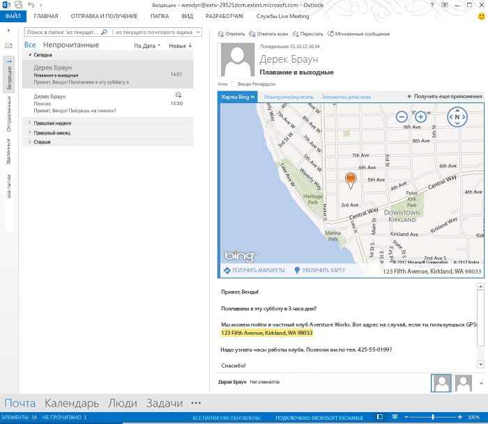

# Создание надстроек Outlook для форм чтения

Надстройки чтения — это надстройки Outlook, которые активируются в области чтения или инспекторе в Outlook. В отличие от надстроек создания, которые активируются, когда пользователь создает сообщение или встречу, надстройки чтения доступны, когда пользователь:

- просматривает сообщение электронной почты, приглашение на собрание, ответ на приглашение или уведомление об отмене собрания;*
    
- просматривает собрание в роли участника;
    
- просматривает данные о собрании в роли организатора (только выпуск RTM Outlook 2013 и Exchange 2013).
    
     >**Примечание.** Начиная с выпуска Office 2013 с пакетом обновления 1 (SP1), если пользователь просматривает данные об организованном им собрании, доступны только надстройки создания. Надстройки чтения больше не доступны в этом сценарии.
* Outlook не активирует надстройки в форме чтения для некоторых типов сообщений, в том числе элементов, являющихся вложениями в других сообщениях, элементов в папке "Черновики" или "Нежелательная почта", а также других зашифрованных или защищенных элементов.

В каждом из этих сценариев чтения Outlook активирует надстройки при выполнении заданных условий, а пользователи могут открыть активные надстройки в области надстроек в инспекторе или области чтения. На рис. 1 показана надстройка  **Карты Bing**, которая активируется, когда пользователь читает сообщение, содержащее географический адрес.

**Рис. 1. Область надстройки с надстройкой "Карты Bing" для выбранного сообщения Outlook, содержащего адрес**

## Типы надстроек, доступные в режиме чтения

Надстройки чтения могут быть любым сочетанием следующих типов.

- [Команды надстроек Outlook](../outlook/add-in-commands-for-outlook.md)
    
- [Контекстные надстройки Outlook](../outlook/contextual-outlook-add-ins.md)
    
- [Настраиваемые надстройки Outlook](../outlook/custom-pane-outlook-add-ins.md)
    

## Функции API, доступные надстройкам чтения

Список функций, предоставляемых API JavaScript для Office надстройкам Outlook в формах чтения, см. в таблицах 1 и 2 в статье [Функции почтовых приложений, доступные в разных версиях](http://msdn.microsoft.com/library/f34e2f44-8c9d-4e90-b1d7-3f29506adb92%28Office.15%29.aspx). 

См. также:

- Активация надстроек в формах чтения: см. таблицу 1 в разделе [Указание правил активации в манифесте](../outlook/manifests/activation-rules.md#specify-activation-rules-in-a-manifest).
    
- [Использование регулярных правил активации выражений для отображения надстройки Outlook](../outlook/use-regular-expressions-to-show-an-outlook-add-in.md)
    
- [Сопоставление строк в элементе Outlook как известных сущностей](../outlook/match-strings-in-an-item-as-well-known-entities.md)
    
- [Извлечение строк сущности из элемента Outlook](../outlook/extract-entity-strings-from-an-item.md)
    
- [Получение вложений элемента Outlook с сервера](../outlook/get-attachments-of-an-outlook-item.md)
    

## Дополнительные ресурсы

- [Начало работы с надстройками Outlook для Office 365](https://dev.outlook.com/MailAppsGettingStarted/GetStarted.aspx)
    
- [Надстройки Outlook](../outlook/outlook-add-ins.md)
    
