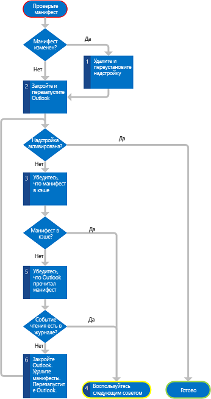


# Устранение неполадок активации надстроек Outlook


Активация надстройки Outlook зависит от контекста и основана на правилах активации, указанных в манифесте надстройки. Если условия для выбранного в текущий момент элемента соответствуют правилам активации для надстройки, ведущее приложение активируется и отображает кнопку надстройки в пользовательском интерфейсе Outlook (в области выбора надстроек для надстроек создания или в панели надстроек для надстроек чтения). Если надстройка не активируется должным образом, возможные причины могут быть связаны с указанными ниже факторами.

<a name="troubleshootingmailapps"></a>
## Размещен ли почтовый ящик пользователя в Exchange Server версии не ниже Exchange 2013?


В первую очередь убедитесь, что тестируемая учетная запись пользователя находится в Exchange Server версии не ниже Exchange 2013. Если вы используете какие-либо функции, выпущенные после Exchange 2013, убедитесь, что учетная запись пользователя размещена в соответствующей версии Exchange.

Версию Exchange 2013 можно проверить одним из указанных ниже способов.


- Уточнить у администратора Exchange Server.
    
- Если вы тестируете надстройку в Outlook Web App или Outlook Web App для устройств, в отладчике сценариев (например, в отладчике JScript Debugger, который поставляется с Internet Explorer) найдите атрибут **src** тега **script**, указывающий расположение, из которого выполняется загрузка сценариев. Этот путь должен содержать подстроку **owa/15.0.516.x/owa2/...**, где **15.0.516.x** — это версия Exchange Server, например **15.0.516.2**.
    
- Кроме того, вы можете проверить версию с помощью свойства [Office.context.mailbox.diagnostics.hostVersion](../../reference/outlook/Office.context.mailbox.diagnostics.md). В Outlook Web App и Outlook Web App для устройств это свойство возвращает сведения о версии Exchange Server.
    
- Если у вас есть возможность тестировать надстройку в Outlook, то вы можете применить указанный ниже простой способ отладки, в котором используются объектная модель Outlook и редактор Visual Basic.
    
      1. Прежде всего включите поддержку макросов в Outlook. Для этого последовательно выберите пункты **Файл**, **Параметры**, **Центр управления безопасностью**, **Параметры центра управления безопасностью** и **Параметры макросов**. В центре управления безопасностью установите флажок **Уведомления для всех макросов**. Во время запуска Outlook также должен быть установлен флажок **Включить макросы**.
    
      2. На ленте на вкладке **Разработчик** выберите пункт **Visual Basic**.
    
     >
  **Note**  Not seeing the  **Developer** tab? See [How to: Show the Developer Tab on the Ribbon](http://msdn.microsoft.com/en-us/library/ce7cb641-44f2-4a40-867e-a7d88f8e98a9%28Office.15%29.aspx) to turn it on. 3. В редакторе Visual Basic последовательно выберите пункты **Вид** и **Окно интерпретации**.
    
      4. Для отображения версии Exchange Server ввести в окне интерпретации следующее (основной номер версии в возвращаемом значении должен быть не ниже 15).
    
        - Если в профиле пользователя имеется только одна учетная запись Exchange:
        
            
            ?Session.ExchangeMailboxServerVersion
            
        
        - Если в одном и том же профиле пользователя имеется несколько учетных записей Exchange:
        
            
            ?Session.Accounts.Item(emailAddress).ExchangeMailboxServerVersion
         
        
        - Заполнитель emailAddress представляет строку, которая содержит основной SMTP-адрес пользователя. Например, если основной SMTP-адрес пользователя — randy@contoso.com, введите следующее:
        
            
            ?Session.Accounts.Item("randy@contoso.com").ExchangeMailboxServerVersion
        


## Не отключена ли надстройка?


Любой из полнофункциональных клиентов Outlook может отключать надстройку в целях повышения производительности, учитывая превышение порога использования ядра ЦП или памяти, устойчивость при сбоях и продолжительность обработки всех регулярных выражений для надстройки. Когда это происходит, полнофункциональный клиент Outlook выводит уведомление, что надстройка отключается. 


 >**Примечание.** Только полнофункциональные клиенты Outlook отслеживают использование ресурсов. При отключении надстройки в полнофункциональном клиенте Outlook она также отключается в Outlook Web App и в Outlook Web App для устройств.

Чтобы проверить, не отключена ли надстройка, используйте один из следующих способов. 


- В Outlook Web App войдите непосредственно в учетную запись почты, щелкните значок "Параметры" и выберите элемент **Управление надстройками**, чтобы перейти в Центр администрирования Exchange и проверить, включена ли эта надстройка.
    
- В Outlook перейдите в представление Backstage и выберите **Управление надстройками**. Войдите в Центр администрирования Exchange и проверьте, включена ли надстройка.
    
- В Outlook для Mac выберите пункт **Управление надстройками** на панели надстройки. Войдите в Центр администрирования Exchange и проверьте, включена ли надстройка.
    

## Поддерживает ли тестируемый элемент надстройки Outlook? Предоставлен ли выбранный элемент Exchange Server версии не ниже Exchange 2013?


Если ваша надстройка Outlook является надстройкой чтения, которая должна активироваться, когда пользователь просматривает сообщение (включая письма, приглашения на собрания, а также ответы и отмены) или встречу, хотя в целом эти элементы поддерживают надстройки, существуют исключения, если к выбранному элементу относится одна из следующих характеристик.


- Элемент защищен управлением правами на доступ к данным (IRM).
    
- Элемент находится в формате S/MIME или зашифрован другими способами в целях защиты.
    
- Элемент является черновиком (не имеет назначенного отправителя) или находится в папке черновиков Outlook.
    
- Элемент находится в папке нежелательной почты.
    
- Отчет или уведомление о доставке имеет класс сообщения IPM.Report.*, включая отчеты о доставке, о недоставке, а также уведомления о прочтении, о непрочтении и о задержке.
    
- MSG-файл, присоединенный к другому сообщению или открытый в файловой системе.
    
Кроме того, поскольку встречи всегда сохраняются в формате RTF, правило [ItemHasRegularExpressionMatch](http://msdn.microsoft.com/en-us/library/bfb726cd-81b0-a8d5-644f-2ca90a5273fc%28Office.15%29.aspx), которое задает значение **PropertyName** для **BodyAsHTML**, не будет активировать надстройку для встреч или сообщений, сохраненных в виде обычного текста или в формате RTF.

Даже если почтовый элемент не относится к одному из указанных выше типов, при недоставке этого элемента Exchange Server не ниже версии Exchange 2013 известные сущности и свойства, например SMTP-адрес отправителя, не будут идентифицированы в этом элементе. Все правила активации, которые зависят от этих сущностей или свойств, не будут удовлетворены, и надстройка не будет активирована.

Если ваша надстройка является надстройкой создания, которая должна активироваться, когда пользователь создает сообщение или приглашение на собрание, убедитесь, что элемент не защищен с помощью IRM.


## Установлен ли манифест надстройки должным образом, и есть ли Outlook кэшированная копия?


Этот сценарий применим только к Outlook для Windows. Обычно при установке надстройки Outlook для почтового ящика Exchange Server копирует манифест надстройки из указанного вами расположения в почтовый ящик в Exchange Server. При каждом запуске Outlook считывает все манифесты, установленные для этого почтового ящика, во временный кэш в следующей папке: 

%LocalAppData%\Microsoft\Office\15.0\WEF 

Например, для пользователя John кэш может находиться в папке C:\Users\john\AppData\Local\Microsoft\Office\15.0\WEF.

Если надстройка не активируется для каких-либо элементов, возможно, манифест неправильно установлен в Exchange Server или Outlook не прочитал этот манифест должным образом при запуске. С помощью Центра администрирования Exchange убедитесь, что надстройка установлена и включена для этого почтового ящика, и при необходимости перезагрузите Exchange Server.

На рисунке 1 показана сводка действий по проверке, имеет ли Outlook правильную версию манифеста. 


**Рис. 1. Блок-схема действий по проверке правильности кэширования манифеста в Outlook**

В следующей процедуре подробно описываются эти действия.


1. Если вы изменили манифест при открытом Outlook и для разработки надстройки не используете Napa, Visual Studio 2012 или более поздней версии, то следует удалить надстройку и установить ее еще раз с помощью Центра администрирования Exchange. 
    
2. Перезапустите Outlook и проверьте, активирует ли Outlook надстройку теперь.
    
3. Если Outlook не активирует надстройку, проверьте, есть ли у Outlook кэшированная копия манифеста надстройки. Поищите ее по следующему пути:
    
    %LocalAppData%\Microsoft\Office\15.0\WEF
    
    Манифест можно найти в следующей вложенной папке:
```
    \<insert your guid>\<insert base 64 hash>\Manifests\<ManifestID>_<ManifestVersion>
```
    
     >**Note**  The following is an example of a path to a manifest installed for a mailbox for the user John:
    
    C:\Users\john\appdata\Local\Microsoft\Office\15.0\WEF\{8D8445A4-80E4-4D6B-B7AC-D4E6AF594E73}\GoRshCWa7vW8+jhKmyiDhA==\Manifests\b3d7d9d5-6f57-437d-9830-94e2aaccef16_1.2
    
    Verify whether the manifest of the add-in you're testing is among the cached manifests.
    
4. Если манифест находится в кэше, то пропустите остальную часть данного раздела и перейдите к другим возможным причинам, которые излагаются далее.
    
5. Если манифест в кэше отсутствует, проверьте, действительно ли Outlook успешно считал этот манифест в Exchange Server. Для этого воспользуйтесь средством просмотра событий Windows.
    
      1. В разделе **Журналы Windows** выберите **Приложение**.
    
      2. Найдите достаточно недавнее событие, идентификатор которого равен 63, что представляет загрузку Outlook манифеста из Exchange Server.
    
      3. Если Outlook успешно считал манифест, то событие в журнале должно иметь следующее описание.
    
         **Запрос GetAppManifests веб-службы Exchange успешно выполнен.**
    
        Пропустите остальную часть данного раздела и перейдите к другим возможным причинам, которые излагаются далее.
    

    Сведения о том, как открыть "Просмотр событий" в Windows 7, см. в разделе [Открытие компонента "Просмотр событий"](http://windows.microsoft.com/en-US/windows7/Open-Event-Viewer).
    
6. Если вам не удается найти успешное событие, закройте Outlook и удалите все манифесты по следующему пути:
```
    %LocalAppData%\Microsoft\Office\15.0\WEF\<insert your guid>\<insert base 64 hash>\Manifests\
```
    Start Outlook and test whether Outlook now activates the add-in.
    
7. Если Outlook по-прежнему не активирует надстройку, вернитесь к действию 3 и еще раз проверьте, правильно ли Outlook прочитал манифест.
    

## Используются ли необходимые правила активации?


Начиная со схемы манифеста для надстроек Office версии 1.1, вы можете создавать надстройки, которые активируются, когда пользователь работает в форме создания (надстройке создания) или форме чтения (надстройке чтения). Обязательно укажите необходимые правила активации для каждого типа формы, в котором должна активироваться надстройка. Например, надстройки создания можно активировать только с помощью правил [ItemIs](http://msdn.microsoft.com/en-us/library/f7dac4a3-1574-9671-1eda-47f092390669%28Office.15%29.aspx), в которых атрибут **FormType** которых имеет значение **Edit** или **ReadOrEdit**. При этом вам не удастся использовать другие типы правил, например [ItemHasKnownEntity](http://msdn.microsoft.com/en-us/library/87e10fd2-eab4-c8aa-bec3-dff92d004d39%28Office.15%29.aspx) и [ItemHasRegularExpressionMatch](http://msdn.microsoft.com/en-us/library/bfb726cd-81b0-a8d5-644f-2ca90a5273fc%28Office.15%29.aspx) для надстроек создания. Дополнительные сведения см. в статье [Правила активации для надстроек Outlook](../outlook/manifests/activation-rules.md).


## Если используется регулярное выражение, указано ли оно должным образом?


Поскольку регулярные выражения в правилах активации являются частью XML-файла манифеста надстройки чтения, при использовании в регулярных выражениях определенных символов убедитесь, что используется соответствующая escape-последовательность, которую поддерживают XML-процессоры. В таблице 1 приведены эти особые символы. 


**Таблица 1. Escape-последовательности для регулярных выражений**


|**Знак**|**Описание**|**Используемая escape-последовательность**|
|:-----|:-----|:-----|
|"|Двойная кавычка|&amp;quot;|
|&amp;|Амперсанд|&amp;amp;|
|'|Апостроф|&amp;apos;|
|<|Знак "меньше"|&amp;lt;|
|>|Знак "больше"|&amp;gt;|

## Если вы используете регулярное выражение, активируется ли надстройка чтения в Outlook Web App или Outlook Web App для устройств, но при это она не активируется ни в одном из полнофункциональных клиентов Outlook?


В полнофункциональных клиентах Outlook используется модуль регулярных выражений, отличный от модуля, используемого в Outlook Web App и Outlook Web App для устройств. В полнофункциональных клиентах Outlook используется обработчик регулярных выражений, написанный на языке C++. Он предоставляется в составе библиотеки стандартных шаблонов Visual Studio. Этот обработчик выполняет компиляцию в соответствии со стандартами ECMAScript 5. В Outlook Web App и Outlook Web App для устройств используется функция оценки регулярных выражений, входящая в состав JavaScript, предоставляемая браузером и поддерживающая расширенный набор стандартов ECMAScript 5. 

Несмотря на то, что в большинстве случаев эти ведущие приложения обнаруживают в правиле активации одинаковые соответствия для одного и того же регулярного выражения, имеются исключения. Например, если регулярное выражение содержит пользовательский класс символов на основе предопределенного класса символов, то полнофункциональный клиент Outlook может возвращать результаты, отличные от того, что возвращают Outlook Web App и Outlook Web App для устройств. Например, классы символов, содержащие классы стенографических символов `[\d\w]`, будут возвращать разные результаты. В этом случае во избежание получения различных результатов в различных ведущих приложениях используйте `(\d|\w)`.

Тщательно проверьте регулярное выражение. Если оно возвращает разные результаты, то переделайте его, чтобы оно было совместимо с обоими модулями. Чтобы проверить результаты оценки в полнофункциональном клиенте Outlook, напишите небольшую программу на C++, которая применяет регулярное выражение к образцу текста, в котором вы пытаетесь найти соответствие. При запуске в Visual Studio эта тестовая программа на языке C++ будет использовать стандартную библиотеку шаблонов, имитируя поведение полнофункционального клиента Outlook при выполнении того же регулярного выражения. Чтобы проверить результаты оценки в Outlook Web App или в Outlook Web App для устройств, используйте удобное для вас средство тестирования регулярных выражений JavaScript.


## Если используется правило ItemIs, ItemHasAttachment или ItemHasRegularExpressionMatch, проверено ли соответствующее свойство элемента?


Если вы используете правило активации **ItemHasRegularExpressionMatch**, проверьте, соответствует ли значение атрибута **PropertyName** предполагаемому значению для выбранного элемента. Ниже приведены несколько советов по отладке соответствующих свойств.


- Если выбранный элемент представляет собой сообщение, и в атрибуте **PropertyName** вы указываете значение **BodyAsHTML**, откройте это сообщение и выберите **Просмотреть код**, чтобы проверить текст сообщения в HTML-представлении этого элемента.
    
- Если выбранный элемент представляет собой встречу или если правило активации задает **BodyAsPlaintext** в атрибуте **PropertyName**, то вы можете использовать объектную модель Outlook и редактор Visual Basic в Outlook для Windows.
    
      1. Убедитесь, что макросы включены, и вкладка **Разработчик** отображается на ленте в Outlook. Сведения о том, как это сделать, см. в действиях 1 и 2 раздела [Размещен ли почтовый ящик пользователя в Exchange Server версии не ниже Exchange 2013?](#Размещен-ли-почтовый-ящик-пользователя-в-exchange-server-версии-не-ниже-exchange-2013)
    
      2. В редакторе Visual Basic последовательно выберите пункты **Вид** и **Окно интерпретации**.
    
      3. Для отображения разных свойств в зависимости от сценария введите следующее.
    
      - Для HTML-текста элемента сообщения или встречи, выбранного в обозревателе Outlook:
    
            
              ?ActiveExplorer.Selection.Item(1).HTMLBody
        


     - Для простого текста элемента сообщения или встречи, выбранного в обозревателе Outlook:
    
            
              ?ActiveExplorer.Selection.Item(1).Body
            


      - Для HTML-текста элемента сообщения или встречи, выбранного в инспекторе Outlook:
    
            
              ?ActiveInspector.CurrentItem.HTMLBody
        
      - Для простого текста элемента сообщения или встречи, выбранного в инспекторе Outlook:
    
            
              ?ActiveInspector.CurrentItem.Body
            

Если правило активации **ItemHasRegularExpressionMatch** указывает **Subject** либо **SenderSMTPAddress** или если вы используете правило **ItemIs** либо **ItemHasAttachment**, и вы умеете работать с MAPI или хотите его использовать, то для проверки значения в таблице 2, от которого зависит ваше правило, можно воспользоваться [MFCMAPI](http://mfcmapi.codeplex.com/).


**Таблица 2. Правила активации и соответствующие свойства MAPI**


|**Тип правила**|**Свойство MAPI для проверки**|
|:-----|:-----|
|Правило **ItemHasRegularExpressionMatch** с **Subject**|[PidTagSubject](http://msdn.microsoft.com/en-us/library/aa7ba4d9-c5e0-4ce7-a34e-65f675223bc9%28Office.15%29.aspx)|
|Правило **ItemHasRegularExpressionMatch** с **SenderSMTPAddress**|
  [PidTagSenderSmtpAddress](http://msdn.microsoft.com/en-us/library/321cde5a-05db-498b-a9b8-cb54c8a14e34%28Office.15%29.aspx) и [PidTagSentRepresentingSmtpAddress](http://msdn.microsoft.com/en-us/library/5ed122a2-0967-4de3-a2ee-69f81ae77b16%28Office.15%29.aspx)|
|**ItemIs**|[PidTagMessageClass](http://msdn.microsoft.com/en-us/library/1e704023-1992-4b43-857e-0a7da7bc8e87%28Office.15%29.aspx)|
|**ItemHasAttachment**|[PidTagHasAttachments](http://msdn.microsoft.com/en-us/library/fd236d74-2868-46a8-bb3d-17f8365931b6%28Office.15%29.aspx)|
После проверки значения свойства можно с помощью средства оценки регулярных выражений проверить, находит ли регулярное выражение соответствие в этом значении.


## Применяет ли ведущее приложение все регулярные выражения к той части элемента, к которой следует?


Этот раздел относится ко всем правилам активации, в которых используются регулярные выражения, в частности, к тем правилам, которые применяются к основному тексту элемента, который может иметь большой размер и для которого может потребоваться больше времени на оценку соответствий. Необходимо помнить, что даже если свойство элемента, от которого зависит правило активации, имеет то значение, которое вы ожидали, ведущее приложение может быть неспособно оценить все регулярные выражения во всем значении свойства элемента. Для обеспечения приемлемого уровня производительности и для предотвращения избыточного потребления ресурсов надстройкой чтения в Outlook, Outlook Web App и Outlook Web App для устройств при обработке регулярных выражений в правилах активации во время выполнения используются указанные ниже ограничения.


- Размер основного текста элемента, в котором выполняется оценка. Существуют ограничения для части основного текста элемента, в которой ведущее приложение выполняет оценку регулярного выражения. Эти ограничения зависят от ведущего приложения, форм-фактора и формата основного текста элемента. Подробные сведения см. в таблице 2 статьи [Ограничения для активации и API JavaScript для надстроек Outlook](../outlook/limits-for-activation-and-javascript-api-for-outlook-add-ins.md).
    
- Количество соответствий регулярному выражению. Полнофункциональный клиент Outlook, Outlook Web App и Outlook Web App для устройств возвращают не более 50 соответствий регулярному выражению каждый. Это уникальные соответствия, повторяющиеся соответствия не учитываются в данном ограничении. Не следует предполагать, что возвращаемые соответствия будут каким-либо образом упорядочены. Кроме того, возвращаемые соответствия необязательно будут одинаково упорядочены в полнофункциональном клиенте Outlook, Outlook Web App и Outlook Web App для устройств. Если вы ожидаете, что в правилах активации будет много соответствий регулярным выражениям, но при этом какое-либо соответствие отсутствует, то, возможно, вы превысили это ограничение.
    
- Длина соответствия регулярному выражению. Существуют ограничения на длину соответствия регулярному выражению, возвращаемого ведущим приложением. Ведущее приложение не включает соответствия, превышающие это ограничение, и при этом не отображает никакого предупреждающего сообщения. Вы можете проверить регулярное выражение с помощью других средств оценки регулярных выражений или отдельной тестовой программы на языке C++, чтобы узнать, имеются ли соответствия, превышающие ограничения. В таблице 3 приведена сводка этих ограничений. Дополнительные сведения см. в таблице 3 статьи [Ограничения для активации и API JavaScript для надстроек Outlook](../outlook/limits-for-activation-and-javascript-api-for-outlook-add-ins.md).
    
    **Таблица 3. Ограничения длины для результатов, соответствующих регулярным выражениям**


|**Ограничение длины для результата, соответствующего регулярному выражению**|**Полнофункциональные клиенты Outlook**|**Outlook Web App или OWA для устройств**|
|:-----|:-----|:-----|
|Основной текст элемента в виде простого текста|1,5 КБ|3 КБ|
|Основной текст элемента в виде HTML-кода|3 КБ|3 КБ|
- Время, затрачиваемое на оценку всех регулярных выражений в надстройке чтения — для расширенного клиента Outlook. По умолчанию для каждой почтовой надстройки для Outlook должен завершить оценку всех регулярных выражений в правилах активации за 1 секунду. В противном случае Outlook повторяет попытку до трех раз и отключает приложение, если не может завершить оценку. Outlook отображает в панели уведомлений сообщение, что надстройка отключается. Количество времени на оценку регулярных выражений можно изменить в групповой политике или в разделе реестра. 
    
     >**Примечание.** Обратите внимание, что если полнофункциональный клиент Outlook отключит надстройку чтения, то эта надстройка станет недоступна для использования с данным почтовым ящиком в полнофункциональном клиенте Outlook, Outlook Web App и OWA для устройств.

## Дополнительные ресурсы


- [Развертывание и установка надстроек Outlook для тестирования](../outlook/testing-and-tips.md)
    
- [Правила активации для надстроек Outlook](../outlook/manifests/activation-rules.md)
    
- [Использование регулярных правил активации выражений для отображения надстройки Outlook](../outlook/use-regular-expressions-to-show-an-outlook-add-in.md)
    
- [Ограничения активации и API JavaScript для надстроек Outlook](../outlook/limits-for-activation-and-javascript-api-for-outlook-add-ins.md)
    
- [Открытие средства "Просмотр событий"](http://windows.microsoft.com/en-US/windows7/Open-Event-Viewer)
    
- [ItemHasAttachment complexType](http://msdn.microsoft.com/en-us/library/031db7be-8a25-5185-a9c3-93987e10c6c2%28Office.15%29.aspx)
    
- [ItemHasRegularExpressionMatch complexType](http://msdn.microsoft.com/en-us/library/bfb726cd-81b0-a8d5-644f-2ca90a5273fc%28Office.15%29.aspx)
    
- [ItemIs complexType](http://msdn.microsoft.com/en-us/library/926249ab-2d2f-39f5-1d73-fab1c989966f%28Office.15%29.aspx)
    
- [MailApp complexType](http://msdn.microsoft.com/en-us/library/696b9fcf-cd10-3f20-4d49-86d3690c887a%28Office.15%29.aspx)
    
