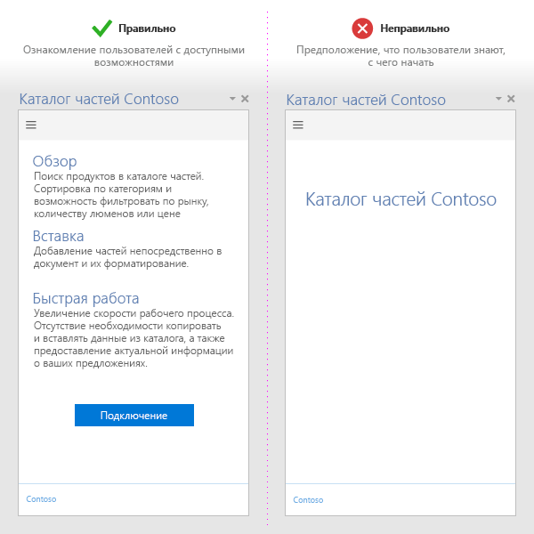
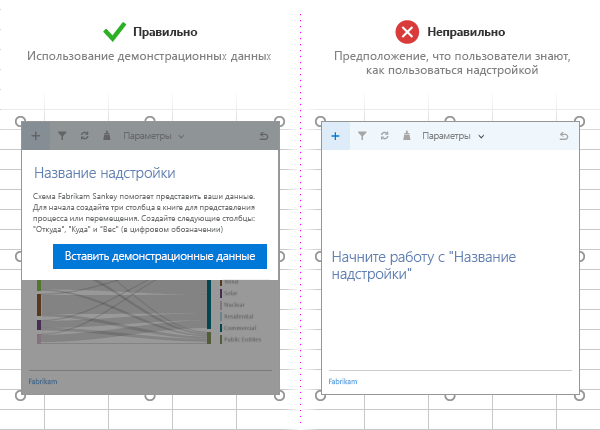
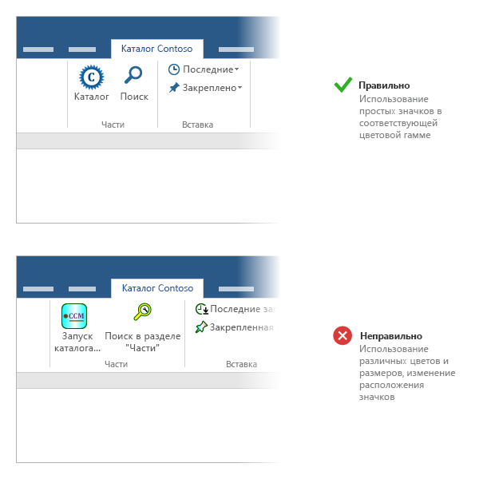
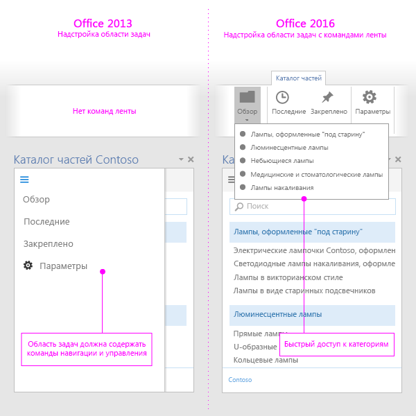


# Рекомендации по разработке надстроек Office

Эффективные надстройки предоставляют уникальные и удобные функции, которые расширяют приложения Office, придавая им привлекательный внешний вид. Чтобы создать хорошую надстройку, сделайте работу пользователей удобной с первого запуска, разработайте первоклассный пользовательский интерфейс и оптимизируйте производительность надстройки. Применяя методики, описанные в этой статье, вы сможете создавать надстройки, которые помогают пользователям выполнять свои задачи быстро и эффективно.

## Очевидные преимущества

- Создавайте надстройки, которые помогают пользователям выполнять свои задачи быстро и эффективно. Основное внимание следует уделить сценариям, применимым для приложений Office. Например:
 - обеспечьте более быстрое и простое выполнение основных задач разработки с меньшим количеством прерываний;
 - добавьте в Office новые сценарии;
 - внедрите в ведущие приложения Office дополнительные службы;
 - сделайте работу в Office более удобной, чтобы повысить производительность.
- Чтобы ваша надстройка быстро заинтересовала пользователей, обеспечьте [демонстрацию ее преимуществ уже при первом использовании](#демонстрацию-ее-преимуществ-уже-при-первом-использовании).
- Создайте [привлекательное описание надстройки в Магазине Office](http://msdn.microsoft.com/library/c66a6e6b-2e96-458f-8f8c-2a499fe942c9%28Office.15%29.aspx). Сделайте преимущества вашей надстройки очевидными из названия и описания. Не полагайтесь на то, что по вашей торговой марке будет понятно, для чего предназначена надстройка.

## Удобство работы с первого запуска

- Привлекайте новых пользователей удобным и интуитивно понятным интерфейсом. Помните, что пользователи все еще решают, использовать вашу надстройку или забросить ее после загрузки из магазина.

 - Сделайте очевидными действия, необходимые для вызова вашей надстройки. Используйте видеоролики, указатели, панели разбиения на страницы и другие ресурсы, чтобы привлечь пользователей.

 - Если пользователям необходимо войти, чтобы использовать надстройку, следует донести до них ценность этой надстройки уже при ее запуске, а не просто просить их выполнить вход.

 - Разработайте обучающий интерфейс, чтобы помочь пользователям и персонализировать среду.

    

  - Если ваша контентная надстройка привязывается к данным в документе, включите пример данных или шаблон, чтобы показать пользователям рекомендуемый формат данных.

    

- Предлагайте [бесплатные пробные версии](http://msdn.microsoft.com/library/145d9466-3c3d-4294-aa23-82068a8e7ae9.aspx%28Office.15%29.aspx#sectionSection1). Если для вашей надстройки требуется подписка, сделайте некоторые функции доступными без нее.

- Упростите регистрацию. Используйте автоматическое заполнение сведений (адрес электронной почты, отображаемое имя) и пропустите проверку электронной почты.

- Избегайте всплывающих окон. Если вам необходимо их использовать, помогите пользователю включить всплывающее окно.

- Используйте [проверку подлинности с единым входом (SSO)](../outlook/authenticate-a-user-with-an-identity-token.md).

Шаблоны, иллюстрирующие методы, которые можно применять при разработке интерфейса для первого запуска, представлены в статье [Конструктивные шаблоны пользовательского интерфейса для надстроек Office](https://github.com/OfficeDev/Office-Add-in-UX-Design-Patterns-Code).

## Команды надстроек

- Предоставьте удобные точки входа для надстройки с помощью [команд надстроек](../design/add-in-commands.md).

- Каждая команда должна представлять определенное действие с очевидным и конкретным исходом для пользователей. Не совмещайте несколько действий в одной кнопке.

- Предоставляйте точные действия, которые делают выполнение распространенных задач в надстройке более эффективным. Максимально сократите количество шагов, необходимых для выполнения действия.

- Для надстроек, которые расширяют ленту Office:
    - Помещайте команды на имеющиеся вкладки ("Вставка", "Рецензирование" и т. д.), если соответствующая функция подходит для них. Например, если надстройка позволяет вставлять файлы мультимедиа, добавьте группу на вкладку "Вставка". Обратите внимание, что некоторые вкладки доступны не во всех версиях Office. Дополнительные сведения см. в статье [XML-манифест надстроек Office](../overview/add-in-manifests.md). 
    - Добавляйте команды на вкладку "Главная", если соответствующие функции не относятся к другим вкладкам и надстройка содержит менее шести команд верхнего уровня. Вы также можете добавлять команды на вкладку "Главная", если надстройка должна работать в разных версиях Office (например, классических приложениях Office и Office Online), а нужная вкладка доступна не во всех версиях (например, вкладка "Конструктор" отсутствует в Office Online).  
    - Добавляйте команды на пользовательскую вкладку, если надстройка содержит более шести команд верхнего уровня. 
  - Название группы должно соответствовать названию надстройки. Если у вас есть несколько групп, их имена должны быть связаны с функциями, которые выполняют команды из этих групп.
  - Не добавляйте лишних кнопок, чтобы надстройка занимала больше места.

     >
  **Примечание**. Надстройка, которая занимает слишком много места, может не пройти [проверку в Магазине Office](https://msdn.microsoft.com/library/cd90836a-523e-42f5-ab02-5123cdf9fefe(Office.15).aspx).

- Для всех значков:
    - Предоставьте понятные значки и [метки](http://msdn.microsoft.com/library/8cef4fce-e6a1-459b-951f-47ac03ec95a6%28Office.15%29.aspx)для кнопок, которые ясно определяют выполняемое пользователем действие.

 - используйте формат PNG с прозрачным фоном;

 - включайте [все восемь поддерживаемых размеров](https://msdn.microsoft.com/EN-US/library/mt267547.aspx#bk_resources). При этом обеспечивается лучшее представление для всех поддерживаемых разрешений.

  - Внешний вид надстройки должен соответствовать стилю Office. Для этого следуйте таким рекомендациям.

    - Используйте простые формы и избегайте излишнего разнообразия цветов. Сложные графические изображения плохо различимы при небольшом размере и низком разрешении.

    - Не используйте одинаковое визуальное представление для разных команд. Использование одного значка для различных действий приведет к путанице.

    - Сделайте подписи кнопок понятными и лаконичными. Используйте сочетание визуальной и текстовой информации, чтобы передать то или иное значение.

    - Проверьте отображение значков в светлой и темной темах Office и при настроенной высокой контрастности. Обратите внимание, что значки могут быть хуже различимы на темном фоне или в режиме высокой контрастности.

    - Используйте значки с согласованным размером и положением для их визуального выравнивания на ленте.

    

- Предоставьте версию надстройки, которая работает в ведущих приложениях, не поддерживающих команды. Один манифест надстройки может работать в ведущих приложениях независимо от того, поддерживают ли они команды.

    

## Принципы разработки пользовательского интерфейса

- Убедитесь, что внешний вид и поведение вашей надстройки согласованы с интерфейсом Office. Используйте [Office UI Fabric](https://dev.office.com/fabric).

- Больше содержимого, меньше хрома. Избегайте лишних элементов интерфейса, которые не представляют ценности для пользователя.

- Пользователь должен быть главным. Убедитесь, что пользователи понимают важные решения и могут с легкостью отменять действия, выполняемые надстройкой.

- Используйте фирменную символику как повод для доверия и ориентир. Она не должна слишком бросаться в глаза или служить рекламой.

- Избегайте прокрутки. Оптимизируйте надстройку для разрешения 1366 x 768.

- Не включайте нелицензированные изображения.

- Используйте [понятный и простой язык](http://msdn.microsoft.com/library/8cef4fce-e6a1-459b-951f-47ac03ec95a6%28Office.15%29.aspx) в надстройке.

- Учитывайте [специальные возможности](http://msdn.microsoft.com/library/3be1abbb-237a-48ec-8e17-72caa25a3cb2%28Office.15%29.aspx) — обеспечьте удобство работы для всех пользователей и поддержку таких специальных возможностей, как экранный диктор.

- Обеспечьте поддержку всех платформ и методов ввода, включая мышь, клавиатуру и [сенсорное управление](#сенсорное-управление). Убедитесь, что ваш пользовательский интерфейс поддерживает различные форм-факторы.

Шаблоны с применением принципов разработки, которые вы можете использовать и модифицировать при разработке надстройки, представлены в статье [Конструктивные шаблоны пользовательского интерфейса для надстроек Office](https://github.com/OfficeDev/Office-Add-in-UX-Design-Patterns-Code).

### Оптимизация для сенсорного управления

- Используйте свойство [Context.touchEnabled](../../reference/shared/office.context.touchenabled.md), чтобы определить, поддерживается ли сенсорное управление ведущим приложением, в котором работает надстройка.

     >**Примечание**. Это свойство не поддерживается в Outlook.
- Убедитесь, что размер всех элементов интерфейса удобен для сенсорного управления. Например, кнопки имеют достаточно большие размеры, а в полях ввода будет удобно вводить данные.

- Не рассчитывайте, что можно будет обойтись другими способами ввода, например наведением указателя или щелчком правой кнопкой мыши.

- Убедитесь, что надстройка работает как в книжной, так и в альбомной ориентации. Помните, что на сенсорных устройствах часть надстройки может быть закрыта экранной клавиатурой.

- Протестируйте надстройку на настоящем устройстве, используя [загрузку неопубликованных приложений](../testing/sideload-an-office-add-in-on-ipad-and-mac.md).

 >**Примечание.** Если для элементов интерфейса используется [Office UI Fabric](https://github.com/OfficeDev/Office-UI-Fabric), то многие из этих элементов уже настроены.

## Оптимизация и отслеживание производительности приложения

- Создайте ощущение быстрой реакции пользовательского интерфейса. Надстройка должна загружаться за 500 мс или меньше.

- Убедитесь, что все команды пользователя выполняются менее, чем за одну секунду.

-  Добавьте индикаторы загрузки для продолжительных операций.

- Используйте CDN для размещения изображений, ресурсов и общих библиотек. Загружайте как можно больше компонентов из одного источника.

- Соблюдайте стандартные методики для оптимизации веб-страницы. В производственной версии используйте только компактные версии библиотек. Загружайте только необходимые ресурсы и оптимизируйте их загрузку.

- Если для выполнения операций требуется время, сообщайте об этом пользователям. Учитывайте пороговые значения, перечисленные в следующей таблице. См. также: [Ограничения ресурсов и оптимизация производительности надстроек Office](../../docs/develop/resource-limits-and-performance-optimization.md)

|**Класс взаимодействия**|**Цель**|**Верхняя граница**|**Человеческое восприятие**|
|:-----|:-----|:-----|:-----|
|Мгновенная реакция|<=50 мс|100 мс|Без заметной задержки.|
|Быстро|50–100 мс|200 мс|Минимально заметная задержка. Нет необходимости в информативном сопровождении.|
|Нормальное|100–300 мс|500 мс|Достаточная скорость, но не более того. Нет необходимости в информативном сопровождении.|
|Оперативно|300–500 мс|1 секунда|Не быстро, но надстройка реагирует хорошо. Нет необходимости в информативном сопровождении.|
|Продолжительно|>500 мс|5 секунд|Среднее время ожидания, надстройка реагирует не так хорошо. Может потребоваться информативное сопровождение.|
|Длительно|>500 мс|10 секунд|Длительная задержка, но не настолько, чтобы пользователь занялся чем-то другим. Может потребоваться информативное сопровождение.|
|Долго|>500 мс|Более 10 секунд|Длительная задержка, при которой пользователь может заняться чем-то другим. Может потребоваться информативное сопровождение.|
|Слишком долго|>5 мс|>1 минуты|Пользователи наверняка будут заниматься чем-то другим.|
- Отслеживайте работоспособность службы и используйте телеметрию для отслеживания успешной работы пользователя.

## Маркетинг

- Опубликуйте надстройку в [Магазине Office](http://msdn.microsoft.com/library/ff075782-1303-4517-91cc-b3d730e9b9ae%28Office.15%29.aspx) и [рекламируйте ее](http://msdn.microsoft.com/library/b19e21f8-76f5-44e1-9971-bef79cad4c71%28Office.15%29.aspx) на своем сайте. Создайте [эффективное описание для Магазина Office](http://msdn.microsoft.com/library/c66a6e6b-2e96-458f-8f8c-2a499fe942c9%28Office.15%29.aspx).

- Давайте надстройкам лаконичные и информативные названия. Их длина не должна превышать 128 символов.

- Составьте краткие и привлекательные описания надстройки. Дайте ответ на вопрос "Какую проблему решает эта надстройка?"

- Опишите преимущества надстройки в названии и описании. Не полагайтесь на свою торговую марку.

- Создайте веб-сайт, который поможет пользователям найти и использовать вашу надстройку.

