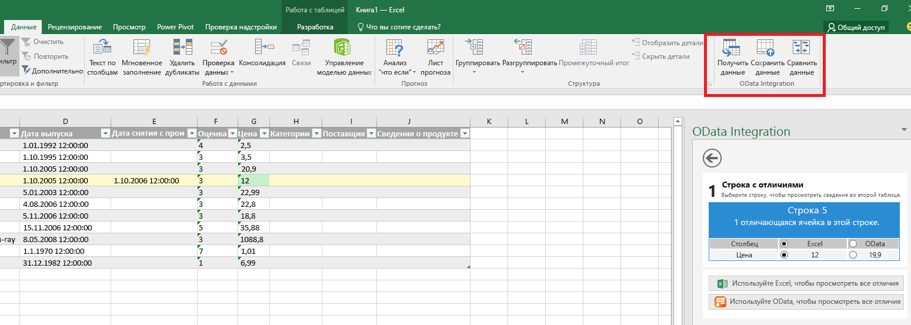

# Обзор платформы надстроек Office

Надстройки Office позволяют расширить возможности клиентов Office, например Word, Excel, PowerPoint и Outlook, с помощью таких веб-технологий, как HTML, CSS и JavaScript. 

С помощью надстроек Office можно выполнять указанные ниже задачи. 

-  **Добавлять новые функции в клиенты Office.** Например, надстройки могут расширять возможности Word, Excel, PowerPoint и Outlook, взаимодействуя с документами Office и почтовыми элементами, получая внешние данные в Office, обрабатывая документы Office, добавляя функции сторонних разработчиков в клиенты Office и делая многое другое. 
    
-  **Создавать оснащенные различными функциями интерактивные объекты, которые можно внедрить в документы Office.** Например, это могут быть карты, диаграммы и интерактивные визуализации, которые пользователи могут добавлять в электронные таблицы Excel и презентации PowerPoint.
    
**Запускать надстройки Office в различных версиях Office**, включая Office для рабочего стола Windows, Office Online, Office для Mac и Office для iPad.

>**Примечание.** Общие сведения о том, в каких продуктах на данный момент поддерживаются надстройки Office, см. на странице [Доступность ведущих приложений и платформ для надстроек Office](http://dev.office.com/add-in-availability). 

## Что может делать надстройка Office?

Надстройка для Office может делать почти все, что может делать веб-страница в браузере, например:

- расширять возможности пользовательского интерфейса Office, создавая пользовательские кнопки и вкладки на ленте;

- предоставлять интерактивный пользовательский интерфейс и пользовательскую логику посредством HTML и JavaScript;
    
- использовать платформы JavaScript, например jQuery, Angular и многие другие.
    
- Подключаться к конечным точкам REST и веб-службам через HTTP и AJAX.
    
- Запускать код или логику на стороне сервера, если страница создана с использованием языка сценариев на стороне сервера, такого как ASP или PHP.
    

Кроме того, надстройки для Office могут взаимодействовать с приложением Office и с содержимым надстроек пользователя с помощью [API JavaScript](../../docs/develop/understanding-the-javascript-api-for-office.md), предоставляемого инфраструктурой надстроек для Office. 

## Типы надстроек Office

Вы можете создавать надстройки Office указанных ниже типов.
 
- Надстройки Word, Excel и PowerPoint, расширяющие функциональность этих продуктов.
- Надстройки Excel и PowerPoint, создающие объекты.
- Надстройки Outlook, расширяющие функциональность продукта.

### Надстройки Word, Excel и PowerPoint, расширяющие функциональность этих продуктов. 
Чтобы **добавить новые функции** в Word, Excel или PowerPoint, вы можете зарегистрировать свою надстройку с помощью [манифеста надстройки, размещаемой в области задач](../design/add-in-commands.md). Этот манифест поддерживает **два указанных ниже режима интеграции**.

- Команды надстроек
- Вставляемые области задач

####Команды надстроек
Вы можете использовать команды надстройки для расширения возможностей пользовательского интерфейса Office для рабочего стола Windows и Office Online. Например, вы можете добавить **кнопки для надстройки на ленту** или отдельные контекстные меню и тем самым обеспечить пользователям простой доступ к надстройкам в Office. С помощью кнопок можно запускать различные действия, например **отображать одну или несколько областей с пользовательским HTML** или **выполнить функцию JavaScript**. Чтобы лучше разобраться в этой функции, [посмотрите видео Channel9](https://channel9.msdn.com/events/Build/2016/P551).

**Надстройка с командами, работающая в классическом приложении Excel**

**Надстройка с командами, работающая в Excel Online**

Вы можете определить команды в манифесте надстройки с помощью **VersionOverrides**. Платформа Office интерпретирует эти команды в собственный пользовательский интерфейс. Чтобы начать работу, просмотрите [примеры на GitHub](https://github.com/OfficeDev/Office-Add-in-Commands-Samples/) и прочитайте статью [Команды надстроек для Excel, Word и PowerPoint](../design/add-in-commands.md).

####Вставляемые области задач
Клиенты, которые еще не поддерживают команды надстроек (Office 2013, Office для Mac и Office для iPad), будут выполнять вашу надстройку как **область задач**, используя параметр **DefaultUrl**, указанный в манифесте. Затем можно запустить надстройку в меню **Мои надстройки** на вкладке "Вставка". 

>**Важно!** В одном манифесте может быть и надстройка области задач, запускаемая в клиентах, которые не поддерживают команды, и версия, которая работает с командами. Это позволяет использовать одну надстройку, работающую во всех клиентах, поддерживающих надстройки Office.
 
###Надстройки Excel и PowerPoint, создающие объекты. 

Для интеграции **веб-объектов, которые можно внедрить в документы**, используйте манифест контентной надстройки. Контентные надстройки позволяют интегрировать полнофункциональные веб-визуализации данных, внедренное мультимедиа (например, видеопроигрыватель YouTube или галерею рисунков) и другой внешний контент.

**Контентная надстройка**

Чтобы попробовать контентную надстройку в работе в Excel 2013 или Excel Online, установите надстройку [Bing Maps](https://store.office.com/bing-maps-WA102957661.aspx?assetid=WA102957661).

### Надстройки Outlook, расширяющие функциональность продукта.

Надстройки Outlook могут расширять функциональность ленты Office и в зависимости от контекста отображаться рядом с просматриваемым или создаваемым элементом Outlook. Они могут работать с письмами, приглашениями на собрания, ответами на приглашения на собрания, сообщениями об отмене собраний или встречами в сценариях чтения (пользователь просматривает полученный элемент) или в сценариях создания (пользователь отвечает или создает элемент). 

Надстройки Outlook могут получать доступ к зависящей от контекста информации, предоставляемой элементом, например к адресу или идентификатору для отслеживания, а затем использовать эти данные для доступа к дополнительным сведениям на сервере и в веб-службах для повышения удобства работы пользователей. В большинстве случаев надстройка для Outlook может без изменений работать в различных поддерживающих ее ведущих приложениях, например в Outlook, Outlook для Mac, Outlook Web App и Outlook Web App для устройств, и обеспечивать единый интерфейс на компьютерах, в интернет-версиях, на планшетах и мобильных устройствах.

Дополнительные сведения см. в статье [Надстройки Outlook](../outlook/outlook-add-ins.md).

 >**Примечание.** Для работы надстроек Outlook необходимо, чтобы почтовый ящик пользователя был размещен в Exchange 2013 или более поздней версии или в Exchange Online. Учетные записи почты POP и IMAP не поддерживаются.

**Надстройка с кнопками на ленте**

**Контекстно-зависимая надстройка для Outlook**

Чтобы испытать надстройку Outlook в Outlook, Outlook для Mac или Outlook Web App, установите надстройку [Package Tracker](https://store.office.com/package-tracker-WA104162083.aspx?assetid=WA104162083).

## Структура надстройки Office

Основные компоненты надстройки Office — это XML-файл манифеста и веб-приложение. Манифест определяет различные параметры, включая способ интеграции надстройки с клиентами Office. Веб-приложение должно быть размещено на веб-сервере или в службе веб-хостинга, например в [Microsoft Azure](../publish/host-an-office-add-in-on-microsoft-azure.md).

**Манифест + веб-страница = надстройка Office**

###Манифест

Манифест определяет следующие параметры и возможности надстройки:
    
- отображаемое имя, описание, идентификатор, версию и языковой стандарт;
    
- способ интеграции с Office: - для надстроек, которые расширяют возможности Word, Excel, PowerPoint или Outlook: встроенные точки расширения, которые надстройка использует для предоставления доступа к функциям, например к кнопкам на ленте; 
      - для надстроек, которые создают внедряемые объекты: URL-адрес страницы по умолчанию, который загружается для объекта;
       
    
- уровень разрешений и требования для доступа к данным надстройки.
    
Дополнительные сведения см. в статье [XML-манифест надстроек Office](../../docs/overview/add-in-manifests.md).

###Веб-приложение

Минимальная версия совместимого веб-приложения — это веб-страница со статическим HTML-кодом. Такую страницу можно разместить на любом веб-сервере или в любой службе веб-хостинга, например в [Microsoft Azure](../publish/host-an-office-add-in-on-microsoft-azure.md). Вы можете разместить веб-приложение в выбранной вами службе.  

Самая простая надстройка Office состоит из статической HTML-страницы, отображаемой в приложении Office, но не взаимодействующей ни с документом Office, ни с каким-либо источником в Интернете. Тем не менее так как она представляет собой веб-приложение, вы можете использовать любые технологии (как на стороне клиента, так и на стороне сервера), поддерживаемые вашим поставщиком услуг размещения (например, ASP.net, PHP или Node.js). Для взаимодействия с клиентами и документами Office вы можете использовать предоставляемый нами [API JavaScript](../../docs/develop/understanding-the-javascript-api-for-office.md) office.js. 

**Компоненты надстройки Hello World для Office**

### API JavaScript

API JavaScript в Word и Excel предоставляют объектные модели, которые зависят от ведущего приложения и которые можно использовать в надстройке Office. Эти API предоставляют доступ к известным объектам, например к абзацам и книгам, что упрощает создание надстройки для Word или Excel. Дополнительные сведения об этих API см. в статьях [Надстройки Word](../word/word-add-ins-programming-overview.md) и [Надстройки Excel](../excel/excel-add-ins-javascript-programming-overview.md).

API JavaScript для Office содержит объекты и членов для создания надстроек и взаимодействия с содержимым Office и веб-службами.

Дополнительные сведения об API JavaScript для Office см. в справочниках [Общие сведения об API JavaScript для Office](../../docs/develop/understanding-the-javascript-api-for-office.md) и [API JavaScript для Office](../../reference/javascript-api-for-office.md).
    
## Дополнительные ресурсы

- [Рекомендации по проектированию надстроек Office](../../docs/design/add-in-design.md)
    
- [Справочник по API](../../docs/develop/understanding-the-javascript-api-for-office.md)
    
