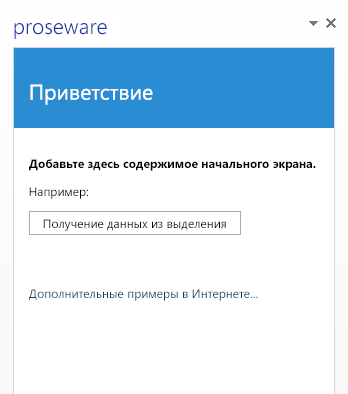

# Размещение надстройки Office в Microsoft Azure

Простейшая надстройка Office состоит из XML-файла манифеста и HTML-страницы. В XML-файле манифеста описываются характеристики надстройки, например имя, поддерживаемые клиентские приложения Office и URL-адрес HTML-страницы надстройки. HTML-страница размещается на веб-сайте надстройки Office, а пользователи могут просматривать ее и взаимодействовать с ней после установки и запуска надстройки. 

Веб-сайт надстройки Office можно разместить на многих платформах для веб-хостинга, включая Azure. Чтобы разместить надстройку Office в Azure, опубликуйте ее на веб-сайте Azure. 

В этом разделе предполагается, что у вас нет опыта работы с Azure. Изучив его, вы сможете создать простую надстройку Office с собственным веб-сайтом, размещенным в Azure. Вы узнаете, как:

- добавить доверенный каталог надстроек в Office 2013;
    
- создать веб-сайт в Azure с помощью Visual Studio 2015 или портала управления Azure;
    
- опубликовать надстройку Office и разместить ее на веб-сайте Azure.
    

**Веб-сайт надстройки Office, размещенный в службе Azure**

## Настройка компьютера разработчика с помощью пакета SDK Azure для платформы .NET, подписки Azure и Office 2013

1. Установите пакет SDK Azure для платформы .NET со [страницы загрузки пакетов Azure](http://azure.microsoft.com/en-us/downloads/). Если у вас не установлена программа Visual Studio, при установке пакета SDK устанавливается Studio Express для Web.
    
    - В разделе **Языки** выберите пункт **.NET**.
    
    - Выберите версию пакета SDK Azure для платформы .NET, совместимую с вашей версией Visual Studio, если эта программа уже установлена.
    
    - Когда вам будет предложено запустить или сохранить исполняемый файл установки, выберите команду **Запустить**.
    
    - В окне установщика веб-платформы выберите пункт **Установить**.
    
2. Если вы еще не сделали это, установите Office 2013. 
    
     >**Примечание.**  Вы можете использовать [пробную версию в течение одного месяца](http://office.microsoft.com/en-us/try/?WT%2Eintid1=ODC%5FENUS%5FFX101785584%5FXT104056786).
3. Получите учетную запись Azure.
    
     >**Примечание.**  Если вы являетесь подписчиком MSDN, [вы получите подписку на Azure в составе подписки на MSDN](http://www.windowsazure.com/en-us/pricing/member-offers/msdn-benefits/). Даже если это не так, вы все равно можете [получить бесплатную пробную подписку на Azure на веб-сайте Microsoft Azure](https://azure.microsoft.com/en-us/pricing/free-trial/). 

Чтобы рабочий процесс был простым и фокусировался на использовании Azure с надстройкой Office, следует использовать локальный файловый ресурс как доверенный каталог, в котором будет храниться XML-файл манифеста надстройки. Файл манифеста надстройки, предназначенной для одного или нескольких предприятий, можно хранить в SharePoint. Кроме того, надстройку можно опубликовать в Магазине Office. 

## Этап 1. Создание сетевого файлового ресурса для размещения файла манифеста надстройки

1. Откройте проводник (или проводник Windows, если вы используете Windows 7 или более раннюю версию Windows) на компьютере для разработки.
    
2. Щелкните диск C:\ правой кнопкой мыши и выберите команду **Создать**  >  **Папку**.
    
3. Назовите новую папку AddinManifests.
    
4. Щелкните папку AddinManifests правой кнопкой мыши и выберите команду **Отправить**  >  **Конкретные пользователи**.
    
5. В разделе **Общий доступ к файлам** щелкните стрелку раскрывающегося списка и выберите команду **Все**  >  **Добавить**  >  **Общую папку**.
    

## Этап 2. Добавление файлового ресурса в каталог доверенных надстроек, чтобы клиентские приложения Office доверяли каталогу, где устанавливаются надстройки Office

1.  Запустите Word 2013 и создайте документ. (Хотя в этом примере мы используем Word 2013, вы можете использовать любое приложение Office, поддерживающее надстройки Office, такое как Excel, Outlook, PowerPoint или Project 2013.)
    
2.  Выберите команду **Файл**  >  **Параметры**.
    
3.  В окне **Параметры Word** выберите раздел **Центр управления безопасностью** и нажмите кнопку **Параметры центра управления безопасностью**. 
    
4.  В окне **Центр управления безопасностью** выберите пункт **Доверенные каталоги надстроек**. Введите UNC-путь созданного ранее файлового ресурса в поле **URL-адрес каталога**, например \\YourMachineName\AddinManifests. После этого выберите команду **Добавить каталог**. 
    
5. Установите флажок **Показывать в меню**. Когда вы сохраните XML-файл манифеста на ресурсе, являющемся доверенным каталогом надстроек, надстройка появится в разделе **Общая папка** диалогового окна **Надстройки Office**.
    

## Этап 3. Создание веб-сайта в Azure

Пустой веб-сайт Azure можно создать несколькими способами. Если вы используете Visual Studio 2015, следуйте указаниям из раздела [Использование Visual Studio 2015](../publish/host-an-office-add-in-on-microsoft-azure.md#using-visual-studio-2015), чтобы создать веб-сайт Azure из интерфейса IDE Visual Studio. Вы также можете следовать указаниям из раздела [Использование портала управления Azure](../publish/host-an-office-add-in-on-microsoft-azure.md#using-the-azure-management-portal), чтобы создать веб-сайт Azure.

### Использование Visual Studio 2015

1. В Visual Studio откройте меню **Вид** и выберите пункт **Обозреватель серверов**. Щелкните **Azure** правой кнопкой мыши и выберите команду **Подключиться к подписке Microsoft Azure**. Следуйте указаниям по подключению к подписке Azure.
    
2. В Visual Studio в разделе **Обозреватель серверов** разверните узел **Azure**, щелкните правой кнопкой мыши элемент **Служба приложений**, а затем выберите команду **Создать новое веб-приложение**.
    
3. В диалоговом окне **Создание веб-приложения в Windows Azure** укажите нужные сведения.
    
      - Введите уникальное **имя веб-приложения** для сайта в одноименном поле. Azure проверит уникальность имени сайта на домене azurewebsites.net.
    
  - Выберите используемый **план службы приложений** в одноименном поле, чтобы авторизовать создание веб-сайта. При создании плана необходимо также указать его имя.
    
  - В одноименном поле выберите **группу ресурсов** для сайта. При создании группы необходимо также указать ее имя.
    
  - Выберите географический **регион** в одноименном поле.
    
  - В разделе **Сервер баз данных:** выберите установленный по умолчанию пункт **Без баз данных** и нажмите кнопку **Создать**.
    

    Новый веб-сайт отобразится в выбранной группе ресурсов **обозревателя решений** (подразделе **Служба приложений** раздела **Azure**).
    
4. Щелкните новый веб-сайт правой кнопкой мыши и выберите команду **Просмотреть в браузере**. Запустится ваш браузер, в котором откроется веб-страница с сообщением "Веб-сайт успешно создан".
    
5. В адресной строке браузера измените протокол в URL-адресе веб-сайта на HTTPS, а затем нажмите клавишу **ВВОД**, чтобы включить протокол HTTPS. Модель надстроек Office требует, чтобы надстройки использовали протокол HTTPS.
    
6. В Visual Studio 2015 щелкните правой кнопкой мыши новый веб-сайт в разделе **Обозреватель серверов**, выберите команду **Загрузить профиль публикации** и сохраните профиль на своем компьютере. Профиль публикации содержит ваши учетные данные и позволяет вам выполнить действия, перечисленные в разделе [Этап 5. Публикация надстройки Office на веб-сайте Azure](../publish/host-an-office-add-in-on-microsoft-azure.md#step-5-publish-your-office-add-in-to-the-azure-website).
    

### Использование портала управления Azure

1. Войдите на [портал управления Azure](https://manage.windowsazure.com/) с помощью своей учетной записи Azure.
    
2. Выполните команду **Создать**  >  **Среда выполнения приложений**  >  **Веб-приложение**  >  **Быстрое создание**. 
    
3. В поле **URL-адрес** введите уникальное имя сайта, чтобы дополнить его URL-адрес. Портал управления проверит уникальность имени сайта на домене azurewebsites.net.
    
4. В поле **Регион** выберите регион, соответствующий вашему сайту.
    
5. Выберите команду **Создать веб-приложение**. На портале управления Azure будет создан веб-сайт, после чего откроется страница **Веб-сайты**, где можно просмотреть состояние сайта.
    
    Если статус веб-сайта — **Запущен**, выберите его URL-адрес в столбце **Имя**. Откроется браузер с веб-страницей, содержащей сообщение **Веб-приложение создано**. 
    
    В адресной строке браузера измените протокол в URL-адресе веб-сайта на HTTPS, а затем нажмите клавишу **ВВОД**, чтобы включить протокол HTTPS. Модель надстроек Office требует, чтобы надстройки использовали протокол HTTPS.
    
6. На странице **Веб-приложения** выберите новый веб-сайт.
    
7. В разделе **Публикация приложения** выберите команду **Загрузить профиль публикации**, чтобы сохранить профиль публикации на своем компьютере. Запомните имя и расположение файла, так как оно понадобится вам позже.
    
    Профиль публикации содержит учетные данные и обеспечивает безопасную публикацию в Azure. 
    

## Этап 4. Создание надстройки Office в Visual Studio

1. Запустите Visual Studio от имени администратора.
    
2. Выберите команду **Файл** >  **Создать**  >  **Проект**.
    
3. В разделе **Шаблоны** разверните узел **Visual C#** (или **Visual Basic**), а затем — **Office/SharePoint**, после чего выберите элемент **Надстройки Office**.
    
4. Выберите пункт **Надстройка Office**, а затем нажмите кнопку **ОК**, чтобы принять параметры по умолчанию.
    
5. Когда откроется окно **Создание надстройки Office**, оставьте выбранным пункт "Надстройка области задач" и нажмите кнопку **Далее**.
    
6. На следующей странице снимите все флажки, кроме Word, а затем нажмите кнопку **Готово**.
    
Основная надстройка Office создана и готова к публикации в службе Azure. Так как основное внимание мы уделяем публикации в службе Azure, вы не будете вносить какие-либо изменения в пример надстройки, созданной ранее с помощью стандартного шаблона надстройки Office в Visual Studio.

## Этап 5. Публикация надстройки Office на веб-сайте Azure

1. Открыв пример надстройки в Visual Studio, разверните узел решения в **обозревателе решений**, чтобы просмотреть оба проекта, входящих в решение.
    
2. Щелкните веб-проект правой кнопкой мыши и выберите команду **Опубликовать**. 
    
    Веб-проект содержит файлы веб-сайта надстройки Office, поэтому именно его следует опубликовать в Azure.
    
3. В окне **Публикация веб-сайта** выберите пункт **Импорт**. 
    
4. В разделе **Импорт параметров публикации** нажмите кнопку **Обзор** и перейдите к папке, в которой ранее сохранили профиль публикации. Нажмите кнопку **ОК**, чтобы импортировать профиль.
    
5. В окне **Публикация веб-сайта** на вкладке **Соединение** примите параметры по умолчанию и нажмите кнопку **Далее**. 
    
    Снова нажмите кнопку **Далее**, чтобы согласиться на параметры по умолчанию.
    
6. На вкладке **Предварительный просмотр** выберите пункт **Начать предварительный просмотр**. В режиме предварительного просмотра отображаются все файлы веб-проекта, которые будут опубликованы на веб-сайте Azure.
    
7. Нажмите кнопку **Опубликовать**. Visual Studio опубликует веб-проект надстройки Office на веб-сайте Azure. 
    
8. Когда Visual Studio завершит публикацию веб-проекта, запустится браузер и откроется страница с текстом "Веб-приложение успешно создано". Эта страница устанавливается в качестве страницы сайта по умолчанию.
    
    Чтобы просмотреть веб-страницу надстройки, измените префикс URL-адреса на https: и добавьте путь к HTML-странице надстройки по умолчанию. Измененный URL-адрес должен выглядеть примерно так: https://ВашДомен.azurewebsites.net/Addin/Home/Home.html. Это подтверждает, что веб-сайт надстройки теперь размещен в Azure. Скопируйте этот URL-адрес, так как он потребуется при редактировании манифеста на следующем этапе.
    

## Этап 6. Отредактируйте файл манифеста надстройки, чтобы он указывал на надстройку Office в Azure

1. В Visual Studio откройте пример надстройки Office в **обозревателе решений** и разверните решение, чтобы отобразить оба проекта.
    
2. Разверните проект надстройки Office, например **OfficeAdd-in1**, щелкните правой кнопкой мыши папку манифестов и выберите команду **Открыть**. Откроется страница свойств манифеста надстройки.
    
3. В поле **Расположение источника:** введите URL-адрес главной HTML-страницы надстройки, который вы скопировали на предыдущем этапе после публикации надстройки, например https://YourDomain.azurewebsites.net/Addin/Home/Home.html. 
    
4. В меню **Файл** выберите пункт **Сохранить все**. Закройте страницу свойств манифеста надстройки.
    
5. В **обозревателе решений** щелкните правой кнопкой мыши папку манифестов и выберите команду **Открыть папку в проводнике**.
    
6. Скопируйте файл манифеста надстройки, например OfficeAdd-in1.xml. 
    
7. Перейдите к сетевому файловому ресурсу, созданному ранее, и вставьте файл манифеста в эту папку.
    

## Этап 7. Вставка и запуск надстройки в клиентском приложении Office

1. Запустите Word и откройте новый документ.
    
2. На ленте выберите команду **Вставка**  >  **Мои приложения**, а затем — **Показать все**.
    
3. В диалоговом окне **Приложения для Office** выберите пункт **Общая папка**. Клиентские приложения Office, совместимые с моделью надстроек Office, сканируют папку, указанную как доверенный каталог приложений, и отображают надстройки в диалоговом окне. Должен появиться значок вашего примера надстройки.
    
4. Выберите значок надстройки и нажмите кнопку **Вставить**. Надстройка будет вставлена сбоку от клиентского приложения.
    
5. Проверьте работоспособность надстройки. Для этого добавьте в документ текст, выделите этот текст и выберите пункт **Получение данных из выделения**.
    

## Дополнительные ресурсы

- [Публикация надстройки Office](../publish/publish.md)
    
- [Упаковка надстройки с помощью Napa или Visual Studio для публикации](../publish/package-your-add-in-using-napa-or-visual-studio.md)
    
