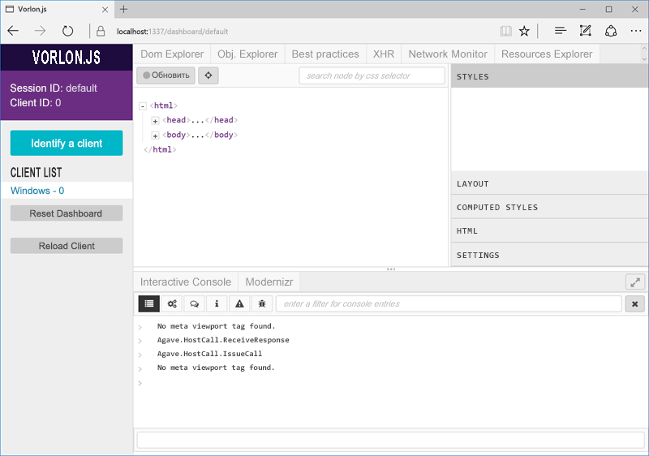

# Отладка надстроек Office на iPad и Mac

Visual Studio подходит для разработки и отладки надстроек в Windows, но с его помощью невозможно выполнять отладку надстроек на платформах iPad и Mac. Так как надстройки создаются с помощью кода HTML и Javascript, они рассчитаны на работу на многих платформах, но отрисовка HTML в разных браузерах может слегка отличаться. В этой статье описывается отладка надстроек на платформах iPad и Mac. 

## Отладка с помощью Vorlon.js 

Vorlon.js — это отладчик веб-страниц, похожий на средства, вызываемые клавишей F12. Он предназначен для удаленной работы и позволяет выполнять отладку веб-страниц на разных устройствах. Дополнительные сведения см. на [веб-сайте Vorlon](http://www.vorlonjs.com).  

Установка и настройка Vorlon: 

1.  Если вы еще не сделали это, установите [Node.js](https://nodejs.org). 

2.  Установите Vorlon с помощью npm и следующей команды: `sudo npm i -g vorlon` 

3.  Запустите сервер Vorlon с помощью команды `vorlon`. 

4.  Откройте окно браузера и перейдите по адресу [http://localhost:1337](http://localhost:1337), где находится интерфейс Vorlon.

5.  Добавьте следующий тег скрипта в раздел `<head>` файла home.html (или основного HTML-файла) своей надстройки:
```    
<script src="http://localhost:1337/vorlon.js"></script>    
```  

>**Примечание.** Чтобы использовать средство Vorlon.js для отладки надстроек, необходимо включить в нем HTTPS. Сведения о том, как это сделать, см. в статье [Подключаемый модуль VorlonJS для отладки надстроек Office](https://blogs.msdn.microsoft.com/mim/2016/02/18/vorlonjs-plugin-for-debugging-office-addin/).

Теперь при каждом запуске надстройки на устройстве она будет появляться в списке клиентов в Vorlon (в левой части интерфейса Vorlon). Вы можете удаленно выделять элементы DOM, выполнять команды и совершать многие другие действия.  



Выделенный подключаемый модуль Vorlon для надстроек Office добавляет такие возможности, как работа с API-интерфейсами Office.js. Дополнительные сведения см. в записи блога [Подключаемый модуль VorlonJS для отладки надстроек Office](https://blogs.msdn.microsoft.com/mim/2016/02/18/vorlonjs-plugin-for-debugging-office-addin/). Чтобы включить подключаемый модуль надстроек Office, сделайте следующее: 

1.  Локально продублируйте ветвь dev репозитория GitHub Vorlon.js с помощью следующих команд: 
```
git clone https://github.com/MicrosoftDX/Vorlonjs.git
git checkout dev
npm install
```

2.  Откройте файл **config.json**, расположенный в папке /Vorlon/Server/config.json. Чтобы активировать подключаемый модуль надстроек Office, задайте для свойства **enabled** значение **true**.

 
