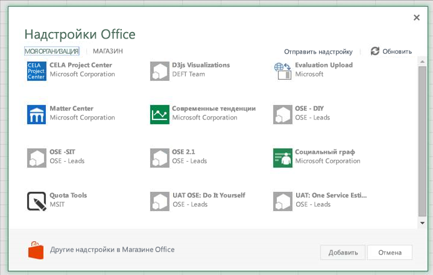
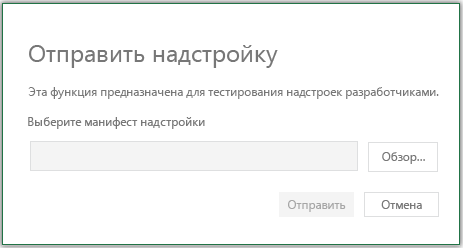
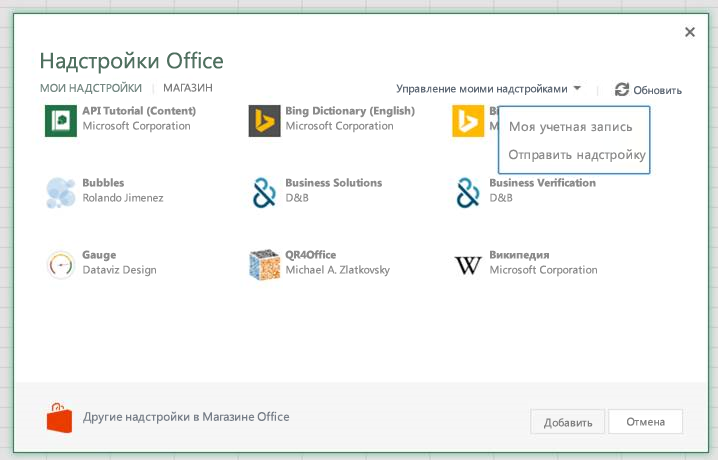

# Загрузка неопубликованных надстроек Office в Office Online для тестирования

Благодаря загрузке неопубликованных надстроек Office вы можете установить их для тестирования, не добавляя в каталог надстроек. Загрузить неопубликованную надстройку можно в Office 365 или Office Online. Процедуры загрузки для каждой из двух платформ немного отличаются. 

При загрузке неопубликованной надстройки ее манифест хранится в локальном хранилище браузера. Поэтому если очистить кэш браузера или поменять браузер, процедуру придется повторить.

 >**Примечание**  Загрузка неопубликованных надстроек, описанная в этой статье, поддерживается в Word, Excel и PowerPoint. Соответствующие действия касательно надстройки Outlook приведены в статье [Загрузка неопубликованных надстроек Outlook для тестирования](sideload-outlook-add-ins-for-testing.md).

## Загрузка неопубликованной надстройки Office в Office 365

1. Войдите в свою учетную запись Office 365.
    
2. Откройте средство запуска приложений в левой части панели инструментов и выберите **Excel**, **Word** или **PowerPoint**, а затем создайте документ.
    
3. Откройте вкладку  **Вставка** на ленте и в разделе **Надстройки** выберите **Надстройки Office**.
    
4. В диалоговом окне  **Надстройки Office** откройте вкладку **Моя организация**, а затем выберите элемент  **Отправить надстройку**.
    
    

5.  **Найдите** файл манифеста надстройки, а затем выберите **Отправить**.
    
    

6. Убедитесь, что надстройка установлена. Например, если надстройка вызывается командой, эта команда должна появиться на ленте или в контекстном меню. Если же у вас надстройка области задач, должна появиться область.
    

## Загрузка неопубликованной надстройки Office в Office Online

1. Откройте [Microsoft Office Online](https://office.live.com/).
    
2. В разделе  **Начало работы с веб-приложениями** выберите **Excel**,  **Word** или **PowerPoint** и откройте новый документ.
    
3. Откройте вкладку  **Вставка** на ленте и в разделе **Надстройки** выберите **Надстройки Office**.
    
4. В диалоговом окне  **Надстройки Office** откройте вкладку **Мои надстройки**, а затем последовательно выберите элементы  **Управление моими надстройками** и **Отправить надстройку**.
    
    

5.  **Найдите** файл манифеста надстройки, а затем выберите **Отправить**.
    
    

6. Убедитесь, что надстройка установлена. Например, если надстройка вызывается командой, эта команда должна появиться на ленте или в контекстном меню. Если же у вас надстройка области задач, должна появиться область.
    
