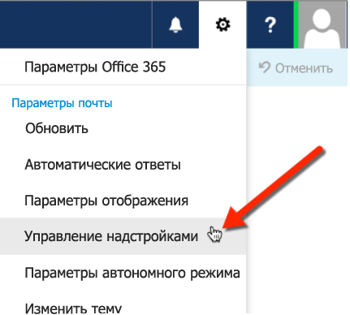
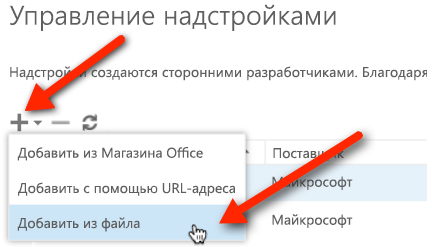

# Загрузка неопубликованных надстроек Outlook для тестирования

Вы можете использовать загрузку неопубликованных надстроек, чтобы установить надстройку Outlook для тестирования, не размещая ее в каталоге надстроек.

 >**Примечание.** Вы также можете загружать неопубликованные надстройки для других приложений набора Office. Дополнительные сведения см. в статье [Загрузка неопубликованных надстроек Office для тестирования](create-a-network-shared-folder-catalog-for-task-pane-and-content-add-ins.md).

## Загрузка неопубликованных надстроек Outlook

1. Откройте [Outlook Web App](https://outlook.office365.com).
    
2. Откройте **Outlook Web App**.
    
    

3. На странице **Управление надстройками** нажмите значок **+** и выберите команду **Добавить из файла**.
    
    

4. Найдите файл манифеста для своей надстройки и установите его, подтверждая все запросы.
    
Когда завершите, выберите существующее сообщение. Под заголовком сообщения появится горизонтальная панель с надстройкой. Затем создайте сообщение и выберите пункт меню  **Надстройки** (или **Приложения**), чтобы открыть область задач. Выберите надстройку, и она появится в области задач.

    
