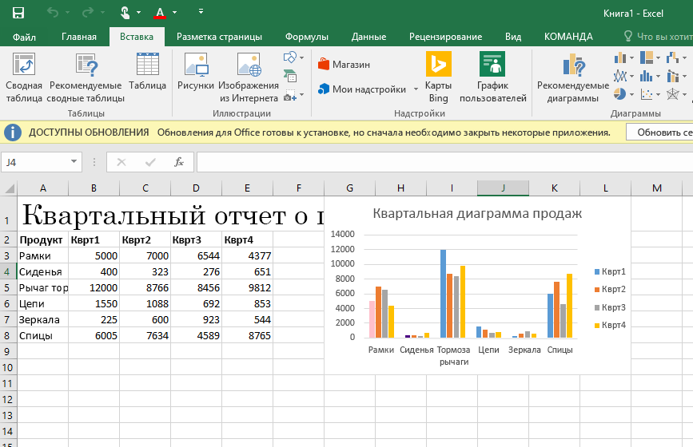
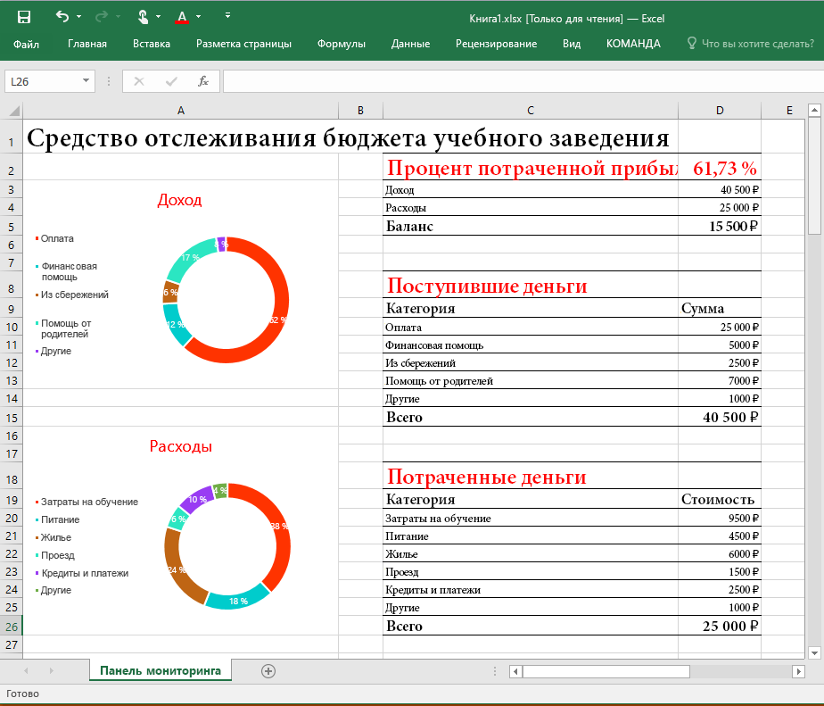
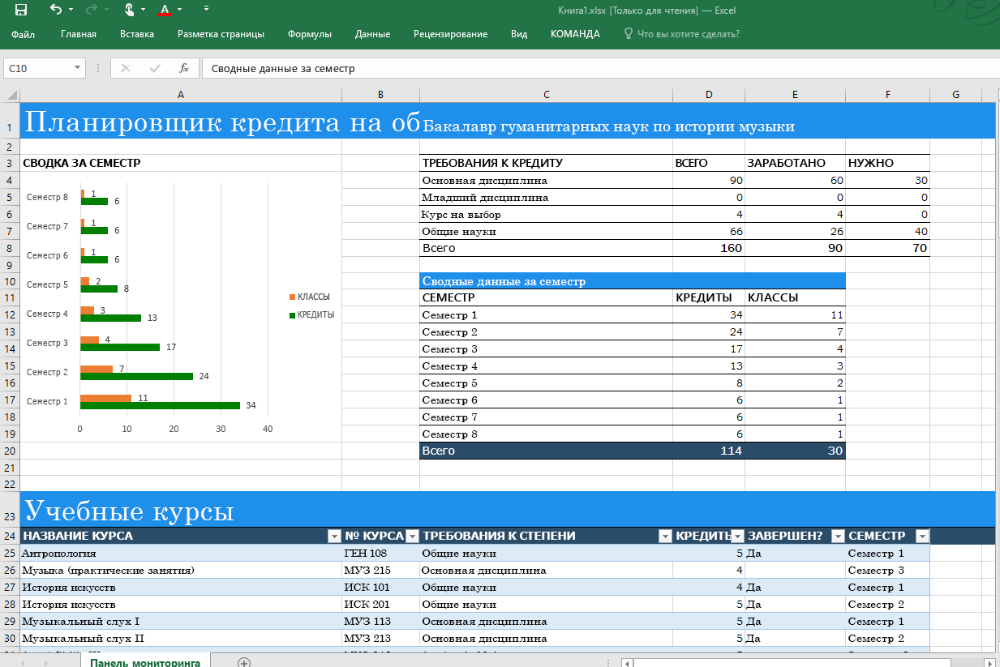
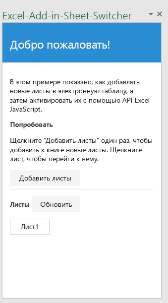
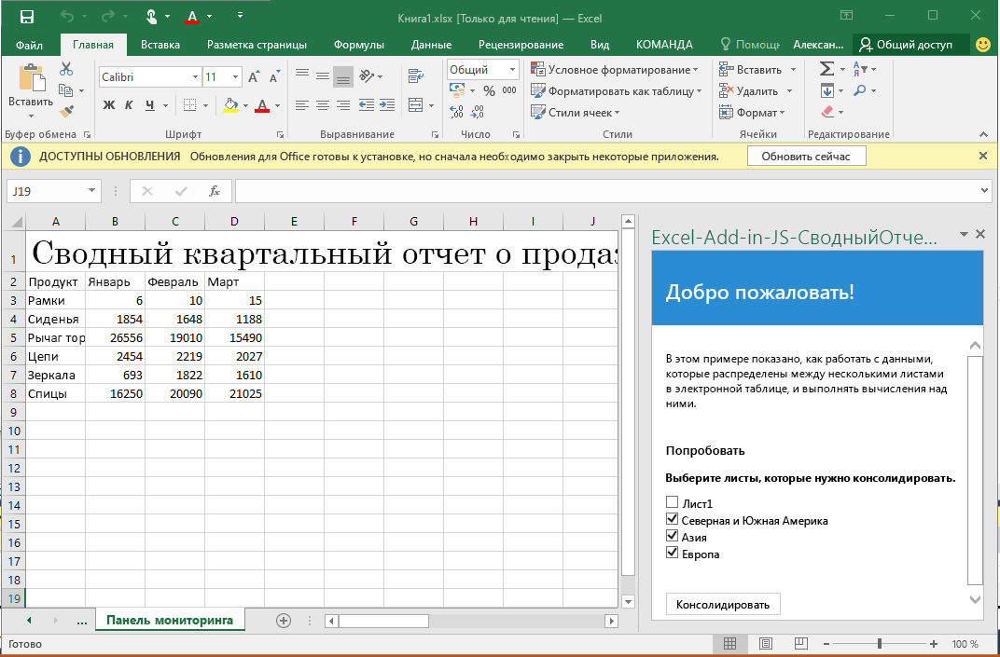
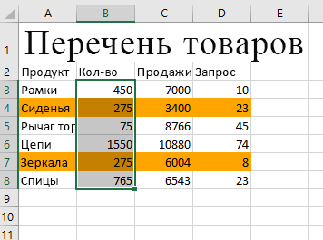

# Примеры кода надстройки Excel

Область применения: Excel 2016, Office 2016

Для краткой справки ниже приведены примеры кода надстройки, в которых используется API JavaScript в Excel 2016. 

**[Пример квартального отчета о продажах](https://github.com/OfficeDev/Excel-Add-in-JS-QuarterlySalesReport)** — простая надстройка области задач, которая загружает определенные данные на лист и создает базовую диаграмму в Excel 2016. 

**[Пример средства отслеживания бюджета учебного заведения](https://github.com/OfficeDev/Excel-Add-in-JS-CollegeBudgetTracker)** — надстройка области задач, в которой показано, как создать средство отслеживания бюджета учебного заведения с помощью интерфейсов API JavaScript в Excel 2016. 

**[Пример средства отслеживания успеваемости в учебном заведении](https://github.com/OfficeDev/Excel-Add-in-JS-CollegeCreditsTracker)** — надстройка области задач, в которой показано, как создать средство, отслеживающее успеваемость в учебном заведении, с помощью интерфейсов API JavaScript в Excel 2016. 

**[Пример средства перехода с листа на лист](https://github.com/OfficeDev/Excel-Add-in-JS-SheetSwitcher)** — надстройка области задач, позволяющая добавлять новые листы в книгу и переходить к ним в Excel 2016. 

**[Пример отчета об общем объеме продаж](https://github.com/OfficeDev/Excel-Add-in-JS-ConsolidatedSalesReport)** — надстройка области задач, в которой показано, как объединять данные из нескольких листов с помощью интерфейсов API JavaScript в Excel 2016. 

**[Пример средства выделения диапазона](https://github.com/OfficeDev/Excel-Add-in-JS-RangeHighlighter)** — надстройка области задач, в которой показано, как выполнять общие операции с помощью API диапазона в Excel 2016.

Чтобы просмотреть примеры кода для наиболее распространенных сценариев и узнать, как работают новые API, воспользуйтесь [обозревателем фрагментов кода JavaScript для Office 2016](http://officesnippetexplorer.azurewebsites.net/#/snippets/excel). 

### Дополнительные ресурсы

Интерфейсы API JavaScript в Excel предоставляют существенно расширенные возможности для разработки надстроек. Ниже указаны лишь некоторые из доступных ресурсов. 

*  [Создание первой надстройки Excel](build-your-first-excel-add-in.md)
*  [Общие сведения о программировании надстроек Excel](excel-add-ins-programming-overview.md)
*  [Справочник по API JavaScript для надстроек Excel](excel-add-ins-javascript-reference.md)
