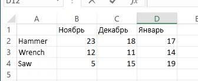

# Функции листа
Используется как контейнер для функций листа Microsoft Excel, которые можно вызывать с помощью JavaScript или REST.

## Возвращаемый тип
Функции листа возвращают объект FunctionResult. У объекта FunctionResult есть два свойства.

| Свойство       | Тип    |Описание|Заметки |
|:---------------|:--------|:----------|:-----|
|value|string|Возвращает результат применения указанной функции листа.|
|error|string|Возвращает сведения об ошибке при применении указанных функций листа.|


## Синтаксис
```js
workbook.functions.functionMethod();
```

## Примеры
Ниже приведена таблица с информацией о продажах различных инструментов в Excel. Мы объясним, как работают функции листа, на примере данных из этой таблицы.




В следующем примере к приведенной выше таблице применяется функция ВПР, которая находит количество единиц Wrench, проданных в ноябре.
```js
    Excel.run(function (ctx) {
        var range = ctx.workbook.worksheets.getItem("Sheet1").getRange("A1:D4");
        var unitSoldInNov = ctx.workbook.functions.vlookup("Wrench", range, 2, false);
        unitSoldInNov.load();
        return ctx.sync()
        .then(function () {
            console.log(unitSoldInNov.value);
        });
    })
    .catch(function(error) {
	    console.log("Error: " + error);
	    if (error instanceof OfficeExtension.Error) {
	        console.log("Debug info: " + JSON.stringify(error.debugInfo));
	    }
	});
```


В следующем примере функция ВПР используется, чтобы найти количество единиц Wrench, проданных в ноябре и декабре по отдельности. Затем примените функцию СУММ, чтобы получить общее количество единиц, проданных за два месяца. Обратите внимание: вам необходимо загрузить только конечный результат — все промежуточные результаты будут рассчитаны после применения конечной формулы.

```js
    Excel.run(function (ctx) {
        var range = ctx.workbook.worksheets.getItem("Sheet1").getRange("A1:D4");
        var sumOfTwoLookups = ctx.workbook.functions.sum(
        	ctx.workbook.functions.vlookup("Wrench", range, 2, false), 
        	ctx.workbook.functions.vlookup("Wrench", range, 3, false)
        	);
        sumOfTwoLookups.load();
        return ctx.sync()
        .then(function () {
            console.log(sumOfTwoLookups.value);
        });
    })
    .catch(function(error) {
	    console.log("Error: " + error);
	    if (error instanceof OfficeExtension.Error) {
	        console.log("Debug info: " + JSON.stringify(error.debugInfo));
	    }
	});


```

## Список поддерживаемых функций листа

| Метод           | Возвращаемый тип    |Описание|Примечания |
|:---------------|:--------|:----------|:-----|
|[Функция ABS](https://support.office.com/en-us/article/ABS-function-3420200f-5628-4e8c-99da-c99d7c87713c)| FunctionResult |Возвращает абсолютное значение числа|
|[Функция НАКОПДОХОД](https://support.office.com/en-us/article/ACCRINT-function-fe45d089-6722-4fb3-9379-e1f911d8dc74)| FunctionResult |Возвращает накопленный процент по ценной бумаге с периодической выплатой процентов|
|[Функция НАКОПДОХОДПОГАШ](https://support.office.com/en-us/article/ACCRINTM-function-f62f01f9-5754-4cc4-805b-0e70199328a7)| FunctionResult |Возвращает накопленный процент по ценной бумаге, процент по которой выплачивается в срок погашения|
|[Функция ACOS](https://support.office.com/en-us/article/ACOS-function-cb73173f-d089-4582-afa1-76e5524b5d5b)| FunctionResult |Возвращает арккосинус числа|
|[Функция ACOSH](https://support.office.com/en-us/article/ACOSH-function-e3992cc1-103f-4e72-9f04-624b9ef5ebfe)| FunctionResult |Возвращает обратный гиперболический косинус числа (ареакосинус)|
|[Функция ACOT](https://support.office.com/en-us/article/ACOT-function-dc7e5008-fe6b-402e-bdd6-2eea8383d905)| FunctionResult |Возвращает арккотангенс числа|
|[Функция ACOTH](https://support.office.com/en-us/article/ACOTH-function-cc49480f-f684-4171-9fc5-73e4e852300f)| FunctionResult |Возвращает гиперболический арккотангенс числа|
|[Функция АМОРУМ](https://support.office.com/en-us/article/AMORDEGRC-function-a14d0ca1-64a4-42eb-9b3d-b0dededf9e51)| FunctionResult |Возвращает величину амортизации для каждого учетного периода, используя коэффициент амортизации|
|[Функция АМОРУВ](https://support.office.com/en-us/article/AMORLINC-function-7d417b45-f7f5-4dba-a0a5-3451a81079a8)| FunctionResult |Возвращает величину амортизации для каждого учетного периода|
|[Функция И](https://support.office.com/en-us/article/AND-function-5f19b2e8-e1df-4408-897a-ce285a19e9d9)| FunctionResult |Возвращает значение ИСТИНА, если все аргументы имеют значение ИСТИНА|
|[Функция АРАБСКОЕ](https://support.office.com/en-us/article/ARABIC-function-9a8da418-c17b-4ef9-a657-9370a30a674f)| FunctionResult |Преобразует римское число в арабское|
|[Функция ОБЛАСТИ](https://support.office.com/en-us/article/AREAS-function-8392ba32-7a41-43b3-96b0-3695d2ec6152)| FunctionResult |Возвращает количество областей в ссылке|
|[Функция ASC](https://support.office.com/en-us/article/ASC-function-0b6abf1c-c663-4004-a964-ebc00b723266)| FunctionResult |Преобразует полноширинные (двухбайтовые) английские буквы или знаки катакана в строке символов в полуширинные (однобайтовые) символы|
|[Функция ASIN](https://support.office.com/en-us/article/ASIN-function-81fb95e5-6d6f-48c4-bc45-58f955c6d347)| FunctionResult |Возвращает арксинус числа|
|[Функция ASINH](https://support.office.com/en-us/article/ASINH-function-4e00475a-067a-43cf-926a-765b0249717c)| FunctionResult |Возвращает обратный гиперболический синус числа (ареасинус)|
|[Функция ATAN](https://support.office.com/en-us/article/ATAN-function-50746fa8-630a-406b-81d0-4a2aed395543)| FunctionResult |Возвращает арктангенс числа|
|[Функция ATAN2](https://support.office.com/en-us/article/ATAN2-function-c04592ab-b9e3-4908-b428-c96b3a565033)| FunctionResult |Возвращает арктангенс для заданных координат x и y|
|[Функция ATANH](https://support.office.com/en-us/article/ATANH-function-3cd65768-0de7-4f1d-b312-d01c8c930d90)| FunctionResult |Возвращает обратный гиперболический тангенс числа (ареатангенс)|
|[Функция СРОТКЛ](https://support.office.com/en-us/article/AVEDEV-function-58fe8d65-2a84-4dc7-8052-f3f87b5c6639)| FunctionResult |Возвращает среднее арифметическое абсолютных отклонений значений от их среднего|
|[Функция СРЗНАЧ](https://support.office.com/en-us/article/AVERAGE-function-047bac88-d466-426c-a32b-8f33eb960cf6)| FunctionResult |Возвращает среднее арифметическое аргументов|
|[Функция СРЗНАЧА](https://support.office.com/en-us/article/AVERAGEA-function-f5f84098-d453-4f4c-bbba-3d2c66356091)| FunctionResult |Возвращает среднее значение аргументов (включая числовые, текстовые и логические)|
|[Функция СРЗНАЧЕСЛИ](https://support.office.com/en-us/article/AVERAGEIF-function-faec8e2e-0dec-4308-af69-f5576d8ac642)| FunctionResult |Возвращает среднее арифметическое всех ячеек в диапазоне, соответствующих определенному условию|
|[Функция СРЗНАЧЕСЛИМН](https://support.office.com/en-us/article/AVERAGEIFS-function-48910c45-1fc0-4389-a028-f7c5c3001690)| FunctionResult |Возвращает среднее арифметическое всех ячеек, соответствующих нескольким условиям|
|[Функция БАТТЕКСТ](https://support.office.com/en-us/article/BAHTTEXT-function-5ba4d0b4-abd3-4325-8d22-7a92d59aab9c)| FunctionResult |Преобразует число в текст, используя денежный формат ß (бат)|
|[Функция ОСНОВАНИЕ](https://support.office.com/en-us/article/BASE-function-2ef61411-aee9-4f29-a811-1c42456c6342)| FunctionResult |Преобразует число в текстовое представление с указанным основанием системы счисления|
|[Функция БЕССЕЛЬ.I](https://support.office.com/en-us/article/BESSELI-function-8d33855c-9a8d-444b-98e0-852267b1c0df)| FunctionResult |Возвращает модифицированную функцию Бесселя In(x)|
|[Функция БЕССЕЛЬ.J](https://support.office.com/en-us/article/BESSELJ-function-839cb181-48de-408b-9d80-bd02982d94f7)| FunctionResult |Возвращает функцию Бесселя Jn(x)|
|[Функция БЕССЕЛЬ.K](https://support.office.com/en-us/article/BESSELK-function-606d11bc-06d3-4d53-9ecb-2803e2b90b70)| FunctionResult |Возвращает модифицированную функцию Бесселя Kn(x)|
|[Функция БЕССЕЛЬ.Y](https://support.office.com/en-us/article/BESSELY-function-f3a356b3-da89-42c3-8974-2da54d6353a2)| FunctionResult |Возвращает функцию Бесселя Yn(x)|
|[Функция БЕТА.РАСП](https://support.office.com/en-us/article/BETADIST-function-11188c9c-780a-42c7-ba43-9ecb5a878d31)| FunctionResult |Возвращает функцию интегрального бета-распределения|
|[Функция БЕТА.ОБР](https://support.office.com/en-us/article/BETAINV-function-e84cb8aa-8df0-4cf6-9892-83a341d252eb)| FunctionResult |Возвращает обратную функцию к интегральной функции указанного бета-распределения|
|[Функция ДВ.В.ДЕС](https://support.office.com/en-us/article/BIN2DEC-function-63905b57-b3a0-453d-99f4-647bb519cd6c)| FunctionResult |Преобразует двоичное число в десятичное|
|[Функция ДВ.В.ШЕСТН](https://support.office.com/en-us/article/BIN2HEX-function-0375e507-f5e5-4077-9af8-28d84f9f41cc)| FunctionResult |Преобразует двоичное число в шестнадцатеричное|
|[Функция ДВ.В.ВОСЬМ](https://support.office.com/en-us/article/BIN2OCT-function-0a4e01ba-ac8d-4158-9b29-16c25c4c23fd)| FunctionResult |Преобразует двоичное число в восьмеричное|
|[Функция БИНОМ.РАСП](https://support.office.com/en-us/article/BINOMDIST-function-c5ae37b6-f39c-4be2-94c2-509a1480770c)| FunctionResult |Возвращает вероятность биномиального распределения отдельного условия|
|[Функция БИНОМ.РАСП.ДИАП](https://support.office.com/en-us/article/BINOMDISTRANGE-function-17331329-74c7-4053-bb4c-6653a7421595)| FunctionResult |Возвращает вероятность получения определенного результата испытания с помощью биномиального распределения|
|[Функция БИНОМ.ОБР](https://support.office.com/en-us/article/BINOMINV-function-80a0370c-ada6-49b4-83e7-05a91ba77ac9)| FunctionResult |Возвращает наименьшее значение, при котором интегральное биномиальное распределение будет меньше заданного критерия или равно ему|
|[Функция БИТ.И](https://support.office.com/en-us/article/BITAND-function-8a2be3d7-91c3-4b48-9517-64548008563a)| FunctionResult |Возвращает результат операции поразрядного И для двух чисел|
|[Функция БИТ.СДВИГЛ](https://support.office.com/en-us/article/BITLSHIFT-function-c55bb27e-cacd-4c7c-b258-d80861a03c9c)| FunctionResult |Возвращает число со сдвигом влево на указанное число бит|
|[Функция БИТ.ИЛИ](https://support.office.com/en-us/article/BITOR-function-f6ead5c8-5b98-4c9e-9053-8ad5234919b2)| FunctionResult |Возвращает результат операции поразрядного ИЛИ для двух чисел|
|[Функция БИТ.СДВИГП](https://support.office.com/en-us/article/BITRSHIFT-function-274d6996-f42c-4743-abdb-4ff95351222c)| FunctionResult |Возвращает число со сдвигом вправо на указанное число бит|
|[Функция БИТ.ИСКЛИЛИ](https://support.office.com/en-us/article/BITXOR-function-c81306a1-03f9-4e89-85ac-b86c3cba10e4)| FunctionResult |Возвращает результат операции поразрядного исключающего ИЛИ для двух чисел|
|[Функция ОКРВВЕРХ.МАТ](https://support.office.com/en-us/article/CEILINGMATH-function-80f95d2f-b499-4eee-9f16-f795a8e306c8)| FunctionResult |Округляет число к большему до ближайшего целого или до ближайшего кратного значения с указанной точностью|
|[Функция ОКРВВЕРХ.ТОЧН](https://support.office.com/en-us/article/CEILINGPRECISE-function-f366a774-527a-4c92-ba49-af0a196e66cb)| FunctionResult |Округляет число до ближайшего целого или до ближайшего кратного значения с указанной точностью. Число округляется до большего значения вне зависимости от его знака.|
|[Функция СИМВОЛ](https://support.office.com/en-us/article/CHAR-function-bbd249c8-b36e-4a91-8017-1c133f9b837a)| FunctionResult |Возвращает символ с указанным кодом|
|[Функция ХИ2.РАСП](https://support.office.com/en-us/article/CHISQDIST-function-8486b05e-5c05-4942-a9ea-f6b341518732)| FunctionResult |Возвращает интегральную функцию плотности бета-распределения|
|[Функция ХИ2.РАСП.ПХ](https://support.office.com/en-us/article/CHISQDISTRT-function-dc4832e8-ed2b-49ae-8d7c-b28d5804c0f2)| FunctionResult |Возвращает одностороннюю вероятность распределения хи-квадрат|
|[Функция ХИ2.ОБР](https://support.office.com/en-us/article/CHISQINV-function-400db556-62b3-472d-80b3-254723e7092f)| FunctionResult |Возвращает интегральную функцию плотности бета-распределения|
|[Функция ХИ2.ОБР.ПХ](https://support.office.com/en-us/article/CHISQINVRT-function-435b5ed8-98d5-4da6-823f-293e2cbc94fe)| FunctionResult |Возвращает значение, обратное односторонней вероятности распределения хи-квадрат|
|[Функция ВЫБОР](https://support.office.com/en-us/article/CHOOSE-function-fc5c184f-cb62-4ec7-a46e-38653b98f5bc)| FunctionResult |Выбирает значение из списка значений|
|[Функция ПЕЧСИМВ](https://support.office.com/en-us/article/CLEAN-function-26f3d7c5-475f-4a9c-90e5-4b8ba987ba41)| FunctionResult |Удаляет из текста все непечатаемые символы|
|[Функция КОДСИМВ](https://support.office.com/en-us/article/CODE-function-c32b692b-2ed0-4a04-bdd9-75640144b928)| FunctionResult |Возвращает числовой код первого символа в текстовой строке|
|[Функция ЧИСЛСТОЛБ](https://support.office.com/en-us/article/COLUMNS-function-4e8e7b4e-e603-43e8-b177-956088fa48ca)| FunctionResult |Возвращает количество столбцов в ссылке|
|[Функция ЧИСЛКОМБ](https://support.office.com/en-us/article/COMBIN-function-12a3f276-0a21-423a-8de6-06990aaf638a)| FunctionResult |Возвращает количество комбинаций, которые можно составить из заданного числа объектов|
|[Функция ЧИСЛКОМБА](https://support.office.com/en-us/article/COMBINA-function-efb49eaa-4f4c-4cd2-8179-0ddfcf9d035d)| FunctionResult |Возвращает количество комбинаций, которые можно составить из заданного числа элементов, с повторами|
|[Функция КОМПЛЕКСН](https://support.office.com/en-us/article/COMPLEX-function-f0b8f3a9-51cc-4d6d-86fb-3a9362fa4128)| FunctionResult |Преобразует коэффициенты при вещественной и мнимой частях комплексного числа в комплексное число|
|[Функция СЦЕПИТЬ](https://support.office.com/en-us/article/CONCATENATE-function-8f8ae884-2ca8-4f7a-b093-75d702bea31d)| FunctionResult |Объединяет несколько текстовых элементов в один|
|[Функция ДОВЕРИТ.НОРМ](https://support.office.com/en-us/article/CONFIDENCENORM-function-7cec58a6-85bb-488d-91c3-63828d4fbfd4)| FunctionResult |Возвращает доверительный интервал для среднего генеральной совокупности|
|[Функция ДОВЕРИТ.СТЬЮДЕНТ](https://support.office.com/en-us/article/CONFIDENCET-function-e8eca395-6c3a-4ba9-9003-79ccc61d3c53)| FunctionResult |Возвращает доверительный интервал для среднего генеральной совокупности, используя распределение Стьюдента|
|[Функция ПРЕОБР](https://support.office.com/en-us/article/CONVERT-function-d785bef1-808e-4aac-bdcd-666c810f9af2)| FunctionResult |Преобразует значение из одной системы измерения в другую|
|[Функция COS](https://support.office.com/en-us/article/COS-function-0fb808a5-95d6-4553-8148-22aebdce5f05)| FunctionResult |Возвращает косинус числа|
|[Функция COSH](https://support.office.com/en-us/article/COSH-function-e460d426-c471-43e8-9540-a57ff3b70555)| FunctionResult |Возвращает гиперболический косинус числа|
|[Функция COT](https://support.office.com/en-us/article/COT-function-c446f34d-6fe4-40dc-84f8-cf59e5f5e31a)| FunctionResult |Возвращает котангенс угла|
|[Функция COTH](https://support.office.com/en-us/article/COTH-function-2e0b4cb6-0ba0-403e-aed4-deaa71b49df5)| FunctionResult |Возвращает гиперболический котангенс числа|
|[Функция СЧЁТ](https://support.office.com/en-us/article/COUNT-function-a59cd7fc-b623-4d93-87a4-d23bf411294c)| FunctionResult |Подсчитывает количество чисел в списке аргументов|
|[Функция СЧЁТЗ](https://support.office.com/en-us/article/COUNTA-function-7dc98875-d5c1-46f1-9a82-53f3219e2509)| FunctionResult |Подсчитывает количество значений в списке аргументов|
|[Функция СЧИТАТЬПУСТОТЫ](https://support.office.com/en-us/article/COUNTBLANK-function-6a92d772-675c-4bee-b346-24af6bd3ac22)| FunctionResult |Подсчитывает количество пустых ячеек в диапазоне|
|[Функция СЧЁТЕСЛИ](https://support.office.com/en-us/article/COUNTIF-function-e0de10c6-f885-4e71-abb4-1f464816df34)| FunctionResult |Подсчитывает количество ячеек в диапазоне, соответствующих определенному условию|
|[Функция СЧЁТЕСЛИМН](https://support.office.com/en-us/article/COUNTIFS-function-dda3dc6e-f74e-4aee-88bc-aa8c2a866842)| FunctionResult |Подсчитывает количество ячеек в диапазоне, соответствующих нескольким условиям|
|[Функция ДНЕЙКУПОНДО](https://support.office.com/en-us/article/COUPDAYBS-function-eb9a8dfb-2fb2-4c61-8e5d-690b320cf872)| FunctionResult |Возвращает количество дней с начала купонного периода до даты расчета|
|[Функция ДНЕЙКУПОН](https://support.office.com/en-us/article/COUPDAYS-function-cc64380b-315b-4e7b-950c-b30b0a76f671)| FunctionResult |Возвращает количество дней расчета в купонном периоде|
|[Функция ДНЕЙКУПОНПОСЛЕ](https://support.office.com/en-us/article/COUPDAYSNC-function-5ab3f0b2-029f-4a8b-bb65-47d525eea547)| FunctionResult |Возвращает количество дней между датой расчета и следующей датой выплаты процентов|
|[Функция ДАТАКУПОНПОСЛЕ](https://support.office.com/en-us/article/COUPNCD-function-fd962fef-506b-4d9d-8590-16df5393691f)| FunctionResult |Возвращает дату выплаты процентов, следующую после даты расчета|
|[Функция ЧИСЛКУПОН](https://support.office.com/en-us/article/COUPNUM-function-a90af57b-de53-4969-9c99-dd6139db2522)| FunctionResult |Возвращает количество процентных выплат между датой расчета и датой погашения|
|[Функция ДАТАКУПОНДО](https://support.office.com/en-us/article/COUPPCD-function-2eb50473-6ee9-4052-a206-77a9a385d5b3)| FunctionResult |Возвращает дату выплаты процентов, которая предшествует дате расчета|
|[Функция CSC](https://support.office.com/en-us/article/CSC-function-07379361-219a-4398-8675-07ddc4f135c1)| FunctionResult |Возвращает косеканс угла|
|[Функция CSCH](https://support.office.com/en-us/article/CSCH-function-f58f2c22-eb75-4dd6-84f4-a503527f8eeb)| FunctionResult |Возвращает гиперболический косеканс угла|
|[Функция ОБЩПЛАТ](https://support.office.com/en-us/article/CUMIPMT-function-61067bb0-9016-427d-b95b-1a752af0e606)| FunctionResult |Возвращает кумулятивную сумму процентов, выплачиваемую между двумя периодами|
|[Функция ОБЩДОХОД](https://support.office.com/en-us/article/CUMPRINC-function-94a4516d-bd65-41a1-bc16-053a6af4c04d)| FunctionResult |Возвращает кумулятивную сумму, выплачиваемую для погашения займа между двумя периодами|
|[Функция ДАТА](https://support.office.com/en-us/article/DATE-function-e36c0c8c-4104-49da-ab83-82328b832349)| FunctionResult |Возвращает порядковый номер определенной даты|
|[Функция ДАТАЗНАЧ](https://support.office.com/en-us/article/DATEVALUE-function-df8b07d4-7761-4a93-bc33-b7471bbff252)| FunctionResult |Преобразует дату из текстового формата в числовой|
|[Функция ДСРЗНАЧ](https://support.office.com/en-us/article/DAVERAGE-function-a6a2d5ac-4b4b-48cd-a1d8-7b37834e5aee)| FunctionResult |Возвращает среднее значение выбранных записей базы данных|
|[Функция ДЕНЬ](https://support.office.com/en-us/article/DAY-function-8a7d1cbb-6c7d-4ba1-8aea-25c134d03101)| FunctionResult |Преобразует порядковый номер в день месяца|
|[Функция ДНИ](https://support.office.com/en-us/article/DAYS-function-57740535-d549-4395-8728-0f07bff0b9df)| FunctionResult |Возвращает количество дней между двумя датами|
|[Функция ДНЕЙ360](https://support.office.com/en-us/article/DAYS360-function-b9a509fd-49ef-407e-94df-0cbda5718c2a)| FunctionResult |Вычисляет количество дней между двумя датами на основании 360-дневного года|
|[Функция ФУО](https://support.office.com/en-us/article/DB-function-354e7d28-5f93-4ff1-8a52-eb4ee549d9d7)| FunctionResult |Возвращает сумму амортизации актива за определенный период, начисляемую по методу фиксированного убывающего остатка|
|[Функция DBCS](https://support.office.com/en-us/article/DBCS-function-a4025e73-63d2-4958-9423-21a24794c9e5)| FunctionResult |Преобразует полуширинные (однобайтовые) английские буквы или знаки катакана в пределах строки символов в полноширинные (двухбайтовые) символы|
|[Функция БСЧЁТ](https://support.office.com/en-us/article/DCOUNT-function-c1fc7b93-fb0d-4d8d-97db-8d5f076eaeb1)| FunctionResult |Подсчитывает количество ячеек в базе данных, содержащих числа|
|[Функция БСЧЁТА](https://support.office.com/en-us/article/DCOUNTA-function-00232a6d-5a66-4a01-a25b-c1653fda1244)| FunctionResult |Подсчитывает количество непустых ячеек в базе данных|
|[Функция ДДОБ](https://support.office.com/en-us/article/DDB-function-519a7a37-8772-4c96-85c0-ed2c209717a5)| FunctionResult |Возвращает сумму амортизации актива за определенный период, начисляемую методом двойного убывающего остатка или иным указанным методом|
|[Функция ДЕС.В.ДВ](https://support.office.com/en-us/article/DEC2BIN-function-0f63dd0e-5d1a-42d8-b511-5bf5c6d43838)| FunctionResult |Преобразует десятичное число в двоичное|
|[Функция ДЕС.В.ШЕСТН](https://support.office.com/en-us/article/DEC2HEX-function-6344ee8b-b6b5-4c6a-a672-f64666704619)| FunctionResult |Преобразует десятичное число в шестнадцатеричное|
|[Функция ДЕС.В.ВОСЬМ](https://support.office.com/en-us/article/DEC2OCT-function-c9d835ca-20b7-40c4-8a9e-d3be351ce00f)| FunctionResult |Преобразует десятичное число в восьмеричное|
|[Функция ДЕС](https://support.office.com/en-us/article/DECIMAL-function-ee554665-6176-46ef-82de-0a283658da2e)| FunctionResult |Преобразует текстовое представление числа c указанным основанием в десятичное|
|[Функция ГРАДУСЫ](https://support.office.com/en-us/article/DEGREES-function-4d6ec4db-e694-4b94-ace0-1cc3f61f9ba1)| FunctionResult |Преобразует радианы в градусы|
|[Функция ДЕЛЬТА](https://support.office.com/en-us/article/DELTA-function-2f763672-c959-4e07-ac33-fe03220ba432)| FunctionResult |Проверяет равенство двух значений|
|[Функция КВАДРОТКЛ](https://support.office.com/en-us/article/DEVSQ-function-8b739616-8376-4df5-8bd0-cfe0a6caf444)| FunctionResult |Возвращает сумму квадратов отклонений|
|[Функция БИЗВЛЕЧЬ](https://support.office.com/en-us/article/DGET-function-455568bf-4eef-45f7-90f0-ec250d00892e)| FunctionResult |Извлекает из базы данных одну запись, соответствующую заданному условию|
|[Функция СКИДКА](https://support.office.com/en-us/article/DISC-function-71fce9f3-3f05-4acf-a5a3-eac6ef4daa53)| FunctionResult |Возвращает ставку дисконтирования ценной бумаги|
|[Функция ДМАКС](https://support.office.com/en-us/article/DMAX-function-f4e8209d-8958-4c3d-a1ee-6351665d41c2)| FunctionResult |Возвращает наибольшее значение из выбранных записей базы данных|
|[Функция ДМИН](https://support.office.com/en-us/article/DMIN-function-4ae6f1d9-1f26-40f1-a783-6dc3680192a3)| FunctionResult |Возвращает наименьшее значение из выбранных записей базы данных|
|[Функция РУБЛЬ](https://support.office.com/en-us/article/DOLLAR-function-a6cd05d9-9740-4ad3-a469-8109d18ff611)| FunctionResult |Преобразует число в текст, используя денежный формат|
|[Функция РУБЛЬ.ДЕС](https://support.office.com/en-us/article/DOLLARDE-function-db85aab0-1677-428a-9dfd-a38476693427)| FunctionResult |Преобразует цену в рублях, представленную в виде десятичной дроби, в десятичное число|
|[Функция РУБЛЬ.ДРОБЬ](https://support.office.com/en-us/article/DOLLARFR-function-0835d163-3023-4a33-9824-3042c5d4f495)| FunctionResult |Преобразует цену в рублях, представленную в виде десятичного числа, в десятичную дробь|
|[Функция БДПРОИЗВЕД](https://support.office.com/en-us/article/DPRODUCT-function-4f96b13e-d49c-47a7-b769-22f6d017cb31)| FunctionResult |Перемножает значения определенного поля записей, соответствующих условию, в базе данных|
|[Функция ДСТАНДОТКЛ](https://support.office.com/en-us/article/DSTDEV-function-026b8c73-616d-4b5e-b072-241871c4ab96)| FunctionResult |Оценивает стандартное отклонение для выборки записей базы данных|
|[Функция ДСТАНДОТКЛП](https://support.office.com/en-us/article/DSTDEVP-function-04b78995-da03-4813-bbd9-d74fd0f5d94b)| FunctionResult |Вычисляет стандартное отклонение для генеральной совокупности выбранных записей базы данных|
|[Функция БДСУММ](https://support.office.com/en-us/article/DSUM-function-53181285-0c4b-4f5a-aaa3-529a322be41b)| FunctionResult |Суммирует числа в поле (столбце) записей базы данных, соответствующих условию|
|[Функция ДЛИТ](https://support.office.com/en-us/article/DURATION-function-b254ea57-eadc-4602-a86a-c8e369334038)| FunctionResult |Возвращает дюрацию ценной бумаги с периодической выплатой процентов в годовом исчислении|
|[Функция БДДИСП](https://support.office.com/en-us/article/DVAR-function-d6747ca9-99c7-48bb-996e-9d7af00f3ed1)| FunctionResult |Оценивает дисперсию для выборки записей базы данных|
|[Функция БДДИСПП](https://support.office.com/en-us/article/DVARP-function-eb0ba387-9cb7-45c8-81e9-0394912502fc)| FunctionResult |Вычисляет дисперсию для генеральной совокупности выбранных записей базы данных|
|[Функция ДАТАМЕС](https://support.office.com/en-us/article/EDATE-function-3c920eb2-6e66-44e7-a1f5-753ae47ee4f5)| FunctionResult |Возвращает порядковый номер даты, отстоящей на заданное количество месяцев вперед или назад от начальной даты|
|[Функция ЭФФЕКТ](https://support.office.com/en-us/article/EFFECT-function-910d4e4c-79e2-4009-95e6-507e04f11bc4)| FunctionResult |Возвращает эффективную годовую процентную ставку|
|[Функция КОНМЕСЯЦА](https://support.office.com/en-us/article/EOMONTH-function-7314ffa1-2bc9-4005-9d66-f49db127d628)| FunctionResult |Возвращает порядковый номер последнего дня месяца, отстоящего на заданное число месяцев вперед или назад от начальной даты|
|[Функция ФОШ](https://support.office.com/en-us/article/ERF-function-c53c7e7b-5482-4b6c-883e-56df3c9af349)| FunctionResult |Возвращает функцию ошибок|
|[Функция ФОШ.ТОЧН](https://support.office.com/en-us/article/ERFPRECISE-function-9a349593-705c-4278-9a98-e4122831a8e0)| FunctionResult |Возвращает функцию ошибок|
|[Функция ДФОШ](https://support.office.com/en-us/article/ERFC-function-736e0318-70ba-4e8b-8d08-461fe68b71b3)| FunctionResult |Возвращает дополнительную функцию ошибок|
|[Функция ДФОШ.ТОЧН](https://support.office.com/en-us/article/ERFCPRECISE-function-e90e6bab-f45e-45df-b2ac-cd2eb4d4a273)| FunctionResult |Возвращает дополнительную функцию ошибок, проинтегрированную от x до бесконечности|
|[Функция ТИП.ОШИБКИ](https://support.office.com/en-us/article/ERRORTYPE-function-10958677-7c8d-44f7-ae77-b9a9ee6eefaa)| FunctionResult |Возвращает номер, соответствующий типу ошибки|
|[Функция ЧЁТН](https://support.office.com/en-us/article/EVEN-function-197b5f06-c795-4c1e-8696-3c3b8a646cf9)| FunctionResult |Округляет число к большему до ближайшего четного целого|
|[Функция СОВПАД](https://support.office.com/en-us/article/EXACT-function-d3087698-fc15-4a15-9631-12575cf29926)| FunctionResult |Проверяет идентичность двух текстовых значений|
|[Функция EXP](https://support.office.com/en-us/article/EXP-function-c578f034-2c45-4c37-bc8c-329660a63abe)| FunctionResult |Возвращает число e, возведенное в указанную степень|
|[Функция ЭКСП.РАСП](https://support.office.com/en-us/article/EXPONDIST-function-4c12ae24-e563-4155-bf3e-8b78b6ae140e)| FunctionResult |Возвращает экспоненциальное распределение|
|[Функция F.РАСП](https://support.office.com/en-us/article/FDIST-function-a887efdc-7c8e-46cb-a74a-f884cd29b25d)| FunctionResult |Возвращает F-распределение вероятности|
|[Функция F.РАСП.ПХ](https://support.office.com/en-us/article/FDISTRT-function-d74cbb00-6017-4ac9-b7d7-6049badc0520)| FunctionResult |Возвращает F-распределение вероятности|
|[Функция F.ОБР](https://support.office.com/en-us/article/FINV-function-0dda0cf9-4ea0-42fd-8c3c-417a1ff30dbe)| FunctionResult |Возвращает обратное F-распределение вероятности|
|[Функция F.ОБР.ПХ](https://support.office.com/en-us/article/FINVRT-function-d371aa8f-b0b1-40ef-9cc2-496f0693ac00)| FunctionResult |Возвращает обратное F-распределение вероятности|
|[Функция ФАКТР](https://support.office.com/en-us/article/FACT-function-ca8588c2-15f2-41c0-8e8c-c11bd471a4f3)| FunctionResult |Возвращает факториал числа|
|[Функция ДВФАКТР](https://support.office.com/en-us/article/FACTDOUBLE-function-e67697ac-d214-48eb-b7b7-cce2589ecac8)| FunctionResult |Возвращает двойной факториал числа|
|[Функция ЛОЖЬ](https://support.office.com/en-us/article/FALSE-function-2d58dfa5-9c03-4259-bf8f-f0ae14346904)| FunctionResult |Возвращает логическое значение ЛОЖЬ|
|[Функции НАЙТИ, НАЙТИБ](https://support.office.com/en-us/article/FIND-FINDB-functions-c7912941-af2a-4bdf-a553-d0d89b0a0628)| FunctionResult |Находит одно текстовое значение в другом (с учетом регистра)|
|[Функция ФИШЕР](https://support.office.com/en-us/article/FISHER-function-d656523c-5076-4f95-b87b-7741bf236c69)| FunctionResult |Возвращает преобразование Фишера|
|[Функция ФИШЕРОБР](https://support.office.com/en-us/article/FISHERINV-function-62504b39-415a-4284-a285-19c8e82f86bb)| FunctionResult |Возвращает обратное преобразование Фишера|
|[Функция ФИКСИРОВАННЫЙ](https://support.office.com/en-us/article/FIXED-function-ffd5723c-324c-45e9-8b96-e41be2a8274a)| FunctionResult |Форматирует число, отображая определенное количество знаков после запятой|
|[Функция ОКРВНИЗ](https://support.office.com/en-us/article/FLOOR-function-14bb497c-24f2-4e04-b327-b0b4de5a8886)| FunctionResult |Округляет число к меньшему до ближайшего по модулю|
|[Функция ОКРВНИЗ.МАТ](https://support.office.com/en-us/article/FLOORMATH-function-c302b599-fbdb-4177-ba19-2c2b1249a2f5)| FunctionResult |Округляет число к меньшему до ближайшего целого или до ближайшего кратного с указанной точностью|
|[Функция ОКРВНИЗ.ТОЧН](https://support.office.com/en-us/article/FLOORPRECISE-function-f769b468-1452-4617-8dc3-02f842a0702e)| FunctionResult |Округляет число к меньшему до ближайшего целого или до ближайшего кратного с указанной точностью. Число округляется до меньшего значения вне зависимости от его знака.|
|[Функция ПРЕДСКАЗ](https://support.office.com/en-us/article/FORECAST-function-50ca49c9-7b40-4892-94e4-7ad38bbeda99)| FunctionResult |Возвращает значение линейного тренда|
|[Функция ПРЕДСКАЗ.ETS](https://support.office.com/en-us/article/FORECASTETS-function-897a2fe9-6595-4680-a0b0-93e0308d5f6e)| FunctionResult |Возвращает будущее значение на основе существующих (ретроспективных) значений, используя версию ААА алгоритма экспоненциального сглаживания (ETS)|
|[Функция ПРЕДСКАЗ.ЕTS.ДОВИНТЕРВАЛ](https://support.office.com/en-us/article/FORECASTETSCONFINT-function-897a2fe9-6595-4680-a0b0-93e0308d5f6e)| FunctionResult |Возвращает доверительный интервал для прогнозной величины на указанную дату|
|[Функция ПРЕДСКАЗ.ETS.СЕЗОННОСТЬ](https://support.office.com/en-us/article/FORECASTETSSEASONALITY-function-897a2fe9-6595-4680-a0b0-93e0308d5f6e)| FunctionResult |Возвращает длину повторяющегося фрагмента, обнаруженного программой Excel в заданном временном ряду|
|[Функция ПРЕДСКАЗ.ETS.СТАТ](https://support.office.com/en-us/article/FORECASTETSSTAT-function-897a2fe9-6595-4680-a0b0-93e0308d5f6e)| FunctionResult |Возвращает статистическое значение, являющееся результатом прогнозирования временного ряда|
|[Функция ПРЕДСКАЗ.ЛИНЕЙН](https://support.office.com/en-us/article/FORECASTLINEAR-function-897a2fe9-6595-4680-a0b0-93e0308d5f6e)| FunctionResult |Возвращает будущее значение на основе существующих значений|
|[Функция БС](https://support.office.com/en-us/article/FV-function-2eef9f44-a084-4c61-bdd8-4fe4bb1b71b3)| FunctionResult |Возвращает будущую стоимость инвестиций|
|[Функция БЗРАСПИС](https://support.office.com/en-us/article/FVSCHEDULE-function-bec29522-bd87-4082-bab9-a241f3fb251d)| FunctionResult |Возвращает будущую стоимость первоначальной основной суммы после применения ряда ставок сложных процентов|
|[Функция ГАММА](https://support.office.com/en-us/article/GAMMA-function-ce1702b1-cf55-471d-8307-f83be0fc5297)| FunctionResult |Возвращает значение гамма-функции|
|[Функция ГАММА.РАСП](https://support.office.com/en-us/article/GAMMADIST-function-9b6f1538-d11c-4d5f-8966-21f6a2201def)| FunctionResult |Возвращает гамма-распределение|
|[Функция ГАММА.ОБР](https://support.office.com/en-us/article/GAMMAINV-function-74991443-c2b0-4be5-aaab-1aa4d71fbb18)| FunctionResult |Возвращает обратное интегральное гамма-распределение|
|[Функция ГАММАНЛОГ](https://support.office.com/en-us/article/GAMMALN-function-b838c48b-c65f-484f-9e1d-141c55470eb9)| FunctionResult |Возвращает натуральный логарифм гамма-функции — Γ(x)|
|[Функция ГАММАНЛОГ.ТОЧН](https://support.office.com/en-us/article/GAMMALNPRECISE-function-5cdfe601-4e1e-4189-9d74-241ef1caa599)| FunctionResult |Возвращает натуральный логарифм гамма-функции — Γ(x)|
|[Функция ГАУСС](https://support.office.com/en-us/article/GAUSS-function-069f1b4e-7dee-4d6a-a71f-4b69044a6b33)| FunctionResult |Возвращает значение на 0,5 меньше стандартного нормального интегрального распределения|
|[Функция НОД](https://support.office.com/en-us/article/GCD-function-d5107a51-69e3-461f-8e4c-ddfc21b5073a)| FunctionResult |Возвращает наибольший общий делитель|
|[Функция СРГЕОМ](https://support.office.com/en-us/article/GEOMEAN-function-db1ac48d-25a5-40a0-ab83-0b38980e40d5)| FunctionResult |Возвращает среднее геометрическое значение|
|[Функция ПОРОГ](https://support.office.com/en-us/article/GESTEP-function-f37e7d2a-41da-4129-be95-640883fca9df)| FunctionResult |Проверяет, превышает ли число пороговое значение|
|[Функция СРГАРМ](https://support.office.com/en-us/article/HARMEAN-function-5efd9184-fab5-42f9-b1d3-57883a1d3bc6)| FunctionResult |Возвращает среднее гармоническое значение|
|[Функция ШЕСТН.В.ДВ](https://support.office.com/en-us/article/HEX2BIN-function-a13aafaa-5737-4920-8424-643e581828c1)| FunctionResult |Преобразует шестнадцатеричное число в двоичное|
|[Функция ШЕСТН.В.ДЕС](https://support.office.com/en-us/article/HEX2DEC-function-8c8c3155-9f37-45a5-a3ee-ee5379ef106e)| FunctionResult |Преобразует шестнадцатеричное число в десятичное|
|[Функция ШЕСТН.В.ВОСЬМ](https://support.office.com/en-us/article/HEX2OCT-function-54d52808-5d19-4bd0-8a63-1096a5d11912)| FunctionResult |Преобразует шестнадцатеричное число в восьмеричное|
|[Функция ГПР](https://support.office.com/en-us/article/HLOOKUP-function-a3034eec-b719-4ba3-bb65-e1ad662ed95f)| FunctionResult |Выполняет поиск в первой строке массива и возвращает значение указанной ячейки|
|[Функция ЧАС](https://support.office.com/en-us/article/HOUR-function-a3afa879-86cb-4339-b1b5-2dd2d7310ac7)| FunctionResult |Преобразует порядковый номер в час|
|[Функция ГИПЕРССЫЛКА](https://support.office.com/en-us/article/HYPERLINK-function-333c7ce6-c5ae-4164-9c47-7de9b76f577f)| FunctionResult |Создает гиперссылку на документ, расположенный на сетевом сервере, в интрасети или Интернете|
|[Функция ГИПЕРГЕОМ.РАСП](https://support.office.com/en-us/article/HYPGEOMDIST-function-6dbd547f-1d12-4b1f-8ae5-b0d9e3d22fbf)| FunctionResult |Возвращает гипергеометрическое распределение|
|[Функция ЕСЛИ](https://support.office.com/en-us/article/IF-function-69aed7c9-4e8a-4755-a9bc-aa8bbff73be2)| FunctionResult |Выполняет указанную логическую проверку|
|[Функция МНИМ.ABS](https://support.office.com/en-us/article/IMABS-function-b31e73c6-d90c-4062-90bc-8eb351d765a1)| FunctionResult |Возвращает абсолютную величину (модуль) комплексного числа|
|[Функция МНИМ.ЧАСТЬ](https://support.office.com/en-us/article/IMAGINARY-function-dd5952fd-473d-44d9-95a1-9a17b23e428a)| FunctionResult |Возвращает коэффициент при мнимой части комплексного числа|
|[Функция МНИМ.АРГУМЕНТ](https://support.office.com/en-us/article/IMARGUMENT-function-eed37ec1-23b3-4f59-b9f3-d340358a034a)| FunctionResult |Возвращает аргумент тета — угол, выраженный в радианах|
|[Функция МНИМ.СОПРЯЖ](https://support.office.com/en-us/article/IMCONJUGATE-function-2e2fc1ea-f32b-4f9b-9de6-233853bafd42)| FunctionResult |Возвращает комплексно-сопряженное число для комплексного числа|
|[Функция МНИМ.COS](https://support.office.com/en-us/article/IMCOS-function-dad75277-f592-4a6b-ad6c-be93a808a53c)| FunctionResult |Возвращает косинус комплексного числа|
|[Функция МНИМ.COSH](https://support.office.com/en-us/article/IMCOSH-function-053e4ddb-4122-458b-be9a-457c405e90ff)| FunctionResult |Возвращает гиперболический косинус комплексного числа|
|[Функция МНИМ.COT](https://support.office.com/en-us/article/IMCOT-function-dc6a3607-d26a-4d06-8b41-8931da36442c)| FunctionResult |Возвращает котангенс комплексного числа|
|[Функция МНИМ.CSC](https://support.office.com/en-us/article/IMCSC-function-9e158d8f-2ddf-46cd-9b1d-98e29904a323)| FunctionResult |Возвращает косеканс комплексного числа|
|[Функция МНИМ.CSCH](https://support.office.com/en-us/article/IMCSCH-function-c0ae4f54-5f09-4fef-8da0-dc33ea2c5ca9)| FunctionResult |Возвращает гиперболический косеканс комплексного числа|
|[Функция МНИМ.ДЕЛ](https://support.office.com/en-us/article/IMDIV-function-a505aff7-af8a-4451-8142-77ec3d74d83f)| FunctionResult |Возвращает частное от деления двух комплексных чисел|
|[Функция МНИМ.EXP](https://support.office.com/en-us/article/IMEXP-function-c6f8da1f-e024-4c0c-b802-a60e7147a95f)| FunctionResult |Возвращает экспоненту комплексного числа|
|[Функция МНИМ.LN](https://support.office.com/en-us/article/IMLN-function-32b98bcf-8b81-437c-a636-6fb3aad509d8)| FunctionResult |Возвращает натуральный логарифм комплексного числа|
|[Функция МНИМ.LOG10](https://support.office.com/en-us/article/IMLOG10-function-58200fca-e2a2-4271-8a98-ccd4360213a5)| FunctionResult |Возвращает десятичный логарифм комплексного числа|
|[Функция МНИМ.LOG2](https://support.office.com/en-us/article/IMLOG2-function-152e13b4-bc79-486c-a243-e6a676878c51)| FunctionResult |Возвращает двоичный логарифм комплексного числа|
|[Функция МНИМ.СТЕПЕНЬ](https://support.office.com/en-us/article/IMPOWER-function-210fd2f5-f8ff-4c6a-9d60-30e34fbdef39)| FunctionResult |Возвращает комплексное число, возведенное в степень с целочисленным показателем|
|[Функция МНИМ.ПРОИЗВЕД](https://support.office.com/en-us/article/IMPRODUCT-function-2fb8651a-a4f2-444f-975e-8ba7aab3a5ba)| FunctionResult |Возвращает произведение от 2 до 255 комплексных чисел|
|[Функция МНИМ.ВЕЩ](https://support.office.com/en-us/article/IMREAL-function-d12bc4c0-25d0-4bb3-a25f-ece1938bf366)| FunctionResult |Возвращает коэффициент при вещественной части комплексного числа|
|[Функция МНИМ.SEC](https://support.office.com/en-us/article/IMSEC-function-6df11132-4411-4df4-a3dc-1f17372459e0)| FunctionResult |Возвращает секанс комплексного числа|
|[Функция МНИМ.SECH](https://support.office.com/en-us/article/IMSECH-function-f250304f-788b-4505-954e-eb01fa50903b)| FunctionResult |Возвращает гиперболический секанс комплексного числа|
|[Функция МНИМ.SIN](https://support.office.com/en-us/article/IMSIN-function-1ab02a39-a721-48de-82ef-f52bf37859f6)| FunctionResult |Возвращает синус комплексного числа|
|[Функция МНИМ.SINH](https://support.office.com/en-us/article/IMSINH-function-dfb9ec9e-8783-4985-8c42-b028e9e8da3d)| FunctionResult |Возвращает гиперболический синус комплексного числа|
|[Функция МНИМ.КОРЕНЬ](https://support.office.com/en-us/article/IMSQRT-function-e1753f80-ba11-4664-a10e-e17368396b70)| FunctionResult |Возвращает значение квадратного корня из комплексного числа|
|[Функция МНИМ.РАЗН](https://support.office.com/en-us/article/IMSUB-function-2e404b4d-4935-4e85-9f52-cb08b9a45054)| FunctionResult |Возвращает разность двух комплексных чисел|
|[Функция МНИМ.СУММ](https://support.office.com/en-us/article/IMSUM-function-81542999-5f1c-4da6-9ffe-f1d7aaa9457f)| FunctionResult |Возвращает сумму комплексных чисел|
|[Функция МНИМ.TAN](https://support.office.com/en-us/article/IMTAN-function-8478f45d-610a-43cf-8544-9fc0b553a132)| FunctionResult |Возвращает тангенс комплексного числа|
|[Функция ЦЕЛОЕ](https://support.office.com/en-us/article/INT-function-a6c4af9e-356d-4369-ab6a-cb1fd9d343ef)| FunctionResult |Округляет число к меньшему до ближайшего целого|
|[Функция ИНОРМА](https://support.office.com/en-us/article/INTRATE-function-5cb34dde-a221-4cb6-b3eb-0b9e55e1316f)| FunctionResult |Возвращает процентную ставку для полностью инвестированной ценной бумаги|
|[Функция ПРПЛТ](https://support.office.com/en-us/article/IPMT-function-5cce0ad6-8402-4a41-8d29-61a0b054cb6f)| FunctionResult |Возвращает сумму процентных выплат по инвестиции за определенный период|
|[Функция ВСД](https://support.office.com/en-us/article/IRR-function-64925eaa-9988-495b-b290-3ad0c163c1bc)| FunctionResult |Возвращает внутреннюю норму доходности на основании ряда денежных потоков.|
|[Функция ЕОШ](https://support.office.com/en-us/article/ISERR-function-0f2d7971-6019-40a0-a171-f2d869135665)| FunctionResult |Возвращает значение ИСТИНА, если ячейка содержит ошибку (кроме #Н/Д)|
|[Функция ЕОШИБКА](https://support.office.com/en-us/article/ISERROR-function-0f2d7971-6019-40a0-a171-f2d869135665)| FunctionResult |Возвращает значение ИСТИНА, если ячейка содержит ошибку|
|[Функция ЕЧЁТН](https://support.office.com/en-us/article/ISEVEN-function-aa15929a-d77b-4fbb-92f4-2f479af55356)| FunctionResult |Возвращает значение ИСТИНА, если ячейка содержит четное число|
|[Функция ЕФОРМУЛА](https://support.office.com/en-us/article/ISFORMULA-function-e4d1355f-7121-4ef2-801e-3839bfd6b1e5)| FunctionResult |Возвращает значение ИСТИНА, если ячейка содержит формулу|
|[Функция ЕЛОГИЧ](https://support.office.com/en-us/article/ISLOGICAL-function-0f2d7971-6019-40a0-a171-f2d869135665)| FunctionResult |Возвращает значение ИСТИНА, если ячейка содержит логическое значение|
|[Функция ЕНД](https://support.office.com/en-us/article/ISNA-function-0f2d7971-6019-40a0-a171-f2d869135665)| FunctionResult |Возвращает значение ИСТИНА, если ячейка содержит ошибку #Н/Д|
|[Функция ЕНЕТЕКСТ](https://support.office.com/en-us/article/ISNONTEXT-function-0f2d7971-6019-40a0-a171-f2d869135665)| FunctionResult |Возвращает значение ИСТИНА, если ячейка содержит любое значение, кроме текстового|
|[Функция ЕЧИСЛО](https://support.office.com/en-us/article/ISNUMBER-function-0f2d7971-6019-40a0-a171-f2d869135665)| FunctionResult |Возвращает значение ИСТИНА, если ячейка содержит числовое значение|
|[Функция ISO.ОКРВВЕРХ](https://support.office.com/en-us/article/ISOCEILING-function-e587bb73-6cc2-4113-b664-ff5b09859a83)| FunctionResult |Возвращает число, округленное к большему до ближайшего целого или до ближайшего кратного с указанной точностью|
|[Функция ЕНЕЧЁТ](https://support.office.com/en-us/article/ISODD-function-0f2d7971-6019-40a0-a171-f2d869135665)| FunctionResult |Возвращает значение ИСТИНА, если ячейка содержит нечетное число|
|[Функция НОМНЕДЕЛИ.ISO](https://support.office.com/en-us/article/ISOWEEKNUM-function-1c2d0afe-d25b-4ab1-8894-8d0520e90e0e)| FunctionResult |Возвращает номер недели в году для определенной даты в соответствии со стандартами ISO|
|[Функция ПРОЦПЛАТ](https://support.office.com/en-us/article/ISPMT-function-fa58adb6-9d39-4ce0-8f43-75399cea56cc)| FunctionResult |Вычисляет сумму процентов, выплачиваемую в течение определенного инвестиционного периода|
|[Функция ЕССЫЛКА](https://support.office.com/en-us/article/ISREF-function-0f2d7971-6019-40a0-a171-f2d869135665)| FunctionResult |Возвращает значение ИСТИНА, если ячейка содержит ссылку|
|[Функция ЕТЕКСТ](https://support.office.com/en-us/article/ISTEXT-function-0f2d7971-6019-40a0-a171-f2d869135665)| FunctionResult |Возвращает значение ИСТИНА, если ячейка содержит текст|
|[Функция ЭКСЦЕСС](https://support.office.com/en-us/article/KURT-function-bc3a265c-5da4-4dcb-b7fd-c237789095ab)| FunctionResult |Возвращает эксцесс множества данных|
|[Функция НАИБОЛЬШИЙ](https://support.office.com/en-us/article/LARGE-function-3af0af19-1190-42bb-bb8b-01672ec00a64)| FunctionResult |Возвращает k-е наибольшее значение в наборе данных|
|[Функция НОК](https://support.office.com/en-us/article/LCM-function-7152b67a-8bb5-4075-ae5c-06ede5563c94)| FunctionResult |Возвращает наименьшее общее кратное|
|[Функции ЛЕВСИМВ, ЛЕВБ](https://support.office.com/en-us/article/LEFT-LEFTB-functions-9203d2d2-7960-479b-84c6-1ea52b99640c)| FunctionResult |Возвращают первые символы в текстовой строке|
|[Функции ДЛСТР, ДЛИНБ](https://support.office.com/en-us/article/LEN-LENB-functions-29236f94-cedc-429d-affd-b5e33d2c67cb)| FunctionResult |Возвращает количество символов в текстовой строке|
|[Функция LN](https://support.office.com/en-us/article/LN-function-81fe1ed7-dac9-4acd-ba1d-07a142c6118f)| FunctionResult |Возвращает натуральный логарифм числа|
|[Функция LOG](https://support.office.com/en-us/article/LOG-function-4e82f196-1ca9-4747-8fb0-6c4a3abb3280)| FunctionResult |Возвращает логарифм числа по заданному основанию|
|[Функция LOG10](https://support.office.com/en-us/article/LOG10-function-c75b881b-49dd-44fb-b6f4-37e3486a0211)| FunctionResult |Возвращает десятичный логарифм числа|
|[Функция ЛОГНОРМ.РАСП](https://support.office.com/en-us/article/LOGNORMDIST-function-eb60d00b-48a9-4217-be2b-6074aee6b070)| FunctionResult |Возвращает интегральное логнормальное распределение|
|[Функция ЛОГНОРМ.ОБР](https://support.office.com/en-us/article/LOGNORMINV-function-fe79751a-f1f2-4af8-a0a1-e151b2d4f600)| FunctionResult |Возвращает обратное интегральное логнормальное распределение|
|[Функция ПРОСМОТР](https://support.office.com/en-us/article/LOOKUP-function-446d94af-663b-451d-8251-369d5e3864cb)| FunctionResult |Ищет значения в строке, столбце или массиве|
|[Функция СТРОЧН](https://support.office.com/en-us/article/LOWER-function-3f21df02-a80c-44b2-afaf-81358f9fdeb4)| FunctionResult |Преобразует текст в нижний регистр|
|[Функция ПОИСКПОЗ](https://support.office.com/en-us/article/MATCH-function-e8dffd45-c762-47d6-bf89-533f4a37673a)| FunctionResult |Ищет значения в ссылке или массиве|
|[Функция МАКС](https://support.office.com/en-us/article/MAX-function-e0012414-9ac8-4b34-9a47-73e662c08098)| FunctionResult |Возвращает максимальное значение в списке аргументов|
|[Функция МАКСА](https://support.office.com/en-us/article/MAXA-function-814bda1e-3840-4bff-9365-2f59ac2ee62d)| FunctionResult |Возвращает максимальное значение в списке аргументов (включая числовые, текстовые и логические)|
|[Функция МДЛИТ](https://support.office.com/en-us/article/MDURATION-function-b3786a69-4f20-469a-94ad-33e5b90a763c)| FunctionResult |Возвращает модифицированную дюрацию Маколея для ценной бумаги с предполагаемой номинальной стоимостью 100 р.|
|[Функция МЕДИАНА](https://support.office.com/en-us/article/MEDIAN-function-d0916313-4753-414c-8537-ce85bdd967d2)| FunctionResult |Возвращает медиану заданных чисел|
|[Функции ПСТР, ПСТРБ](https://support.office.com/en-us/article/MID-MIDB-functions-d5f9e25c-d7d6-472e-b568-4ecb12433028)| FunctionResult |Возвращают определенное количество знаков из текстовой строки, начиная с указанной позиции|
|[Функция МИН](https://support.office.com/en-us/article/MIN-function-61635d12-920f-4ce2-a70f-96f202dcc152)| FunctionResult |Возвращает минимальное значение в списке аргументов|
|[Функция МИНА](https://support.office.com/en-us/article/MINA-function-245a6f46-7ca5-4dc7-ab49-805341bc31d3)| FunctionResult |Возвращает минимальное значение в списке аргументов, (включая числовые, текстовые и логические)|
|[Функция МИНУТЫ](https://support.office.com/en-us/article/MINUTE-function-af728df0-05c4-4b07-9eed-a84801a60589)| FunctionResult |Преобразует порядковый номер в минуты|
|[Функция МВСД](https://support.office.com/en-us/article/MIRR-function-b020f038-7492-4fb4-93c1-35c345b53524)| FunctionResult |Возвращает внутреннюю норму доходности с учетом разных ставок финансирования для положительного и отрицательного денежных потоков|
|[Функция ОСТАТ](https://support.office.com/en-us/article/MOD-function-9b6cd169-b6ee-406a-a97b-edf2a9dc24f3)| FunctionResult |Возвращает остаток от деления|
|[Функция МЕСЯЦ](https://support.office.com/en-us/article/MONTH-function-579a2881-199b-48b2-ab90-ddba0eba86e8)| FunctionResult |Преобразует порядковый номер в месяц|
|[Функция ОКРУГЛТ](https://support.office.com/en-us/article/MROUND-function-c299c3b0-15a5-426d-aa4b-d2d5b3baf427)| FunctionResult |Возвращает число, округленное с заданной точностью|
|[Функция МУЛЬТИНОМ](https://support.office.com/en-us/article/MULTINOMIAL-function-6fa6373c-6533-41a2-a45e-a56db1db1bf6)| FunctionResult |Возвращает полиномиальный коэффициент набора чисел|
|[Функция Ч](https://support.office.com/en-us/article/N-function-a624cad1-3635-4208-b54a-29733d1278c9)| FunctionResult |Возвращает значение, преобразованное в число|
|[Функция НД](https://support.office.com/en-us/article/NA-function-5469c2d1-a90c-4fb5-9bbc-64bd9bb6b47c)| FunctionResult |Возвращает ошибку #Н/Д|
|[Функция ОТРБИНОМ.РАСП](https://support.office.com/en-us/article/NEGBINOMDIST-function-c8239f89-c2d0-45bd-b6af-172e570f8599)| FunctionResult |Возвращает отрицательное биномиальное распределение|
|[Функция ЧИСТРАБДНИ](https://support.office.com/en-us/article/NETWORKDAYS-function-48e717bf-a7a3-495f-969e-5005e3eb18e7)| FunctionResult |Возвращает количество полных рабочих дней между двумя датами|
|[Функция ЧИСТРАБДНИ.МЕЖД](https://support.office.com/en-us/article/NETWORKDAYSINTL-function-a9b26239-4f20-46a1-9ab8-4e925bfd5e28)| FunctionResult |Возвращает количество полных рабочих дней между двумя датами с использованием параметров, определяющих, сколько в неделе выходных и какие дни являются выходными|
|[Функция НОМИНАЛ](https://support.office.com/en-us/article/NOMINAL-function-7f1ae29b-6b92-435e-b950-ad8b190ddd2b)| FunctionResult |Возвращает номинальную годовую процентную ставку|
|[Функция НОРМ.РАСП](https://support.office.com/en-us/article/NORMDIST-function-edb1cc14-a21c-4e53-839d-8082074c9f8d)| FunctionResult |Возвращает нормальное распределение|
|[Функция НОРМ.ОБР](https://support.office.com/en-us/article/NORMINV-function-54b30935-fee7-493c-bedb-2278a9db7e13)| FunctionResult |Возвращает обратное нормальное распределение|
|[Функция НОРМ.СТ.РАСП](https://support.office.com/en-us/article/NORMSDIST-function-1e787282-3832-4520-a9ae-bd2a8d99ba88)| FunctionResult |Возвращает стандартное нормальное распределение|
|[Функция НОРМ.СТ.ОБР](https://support.office.com/en-us/article/NORMSINV-function-d6d556b4-ab7f-49cd-b526-5a20918452b1)| FunctionResult |Возвращает обратное стандартное нормальное распределение|
|[Функция НЕ](https://support.office.com/en-us/article/NOT-function-9cfc6011-a054-40c7-a140-cd4ba2d87d77)| FunctionResult |Меняет значение аргумента на противоположное|
|[Функция ТДАТА](https://support.office.com/en-us/article/NOW-function-3337fd29-145a-4347-b2e6-20c904739c46)| FunctionResult |Возвращает порядковый номер текущей даты и времени|
|[Функция КПЕР](https://support.office.com/en-us/article/NPER-function-240535b5-6653-4d2d-bfcf-b6a38151d815)| FunctionResult |Возвращает количество периодов для инвестиций|
|[Функция ЧПС](https://support.office.com/en-us/article/NPV-function-8672cb67-2576-4d07-b67b-ac28acf2a568)| FunctionResult |Возвращает чистую приведенную стоимость инвестиций. Вычисления основываются на ряде периодических денежных потоков и ставки дисконтирования|
|[Функция ЧЗНАЧ](https://support.office.com/en-us/article/NUMBERVALUE-function-1b05c8cf-2bfa-4437-af70-596c7ea7d879)| FunctionResult |Преобразует текст в число без учета языкового стандарта|
|[Функция ВОСЬМ.В.ДВ](https://support.office.com/en-us/article/OCT2BIN-function-55383471-3c56-4d27-9522-1a8ec646c589)| FunctionResult |Преобразует восьмеричное число в двоичное|
|[Функция ВОСЬМ.В.ДЕС](https://support.office.com/en-us/article/OCT2DEC-function-87606014-cb98-44b2-8dbb-e48f8ced1554)| FunctionResult |Преобразует восьмеричное число в десятичное|
|[Функция ВОСЬМ.В.ШЕСТН](https://support.office.com/en-us/article/OCT2HEX-function-912175b4-d497-41b4-a029-221f051b858f)| FunctionResult |Преобразует восьмеричное число в шестнадцатеричное|
|[Функция НЕЧЁТ](https://support.office.com/en-us/article/ODD-function-deae64eb-e08a-4c88-8b40-6d0b42575c98)| FunctionResult |Округляет число к большему до ближайшего нечетного целого|
|[Функция ЦЕНАПЕРВНЕРЕГ](https://support.office.com/en-us/article/ODDFPRICE-function-d7d664a8-34df-4233-8d2b-922bcf6a69e1)| FunctionResult |Возвращает стоимость ценной бумаги номиналом 100 рублей с нерегулярным первым периодом|
|[Функция ДОХОДПЕРВНЕРЕГ](https://support.office.com/en-us/article/ODDFYIELD-function-66bc8b7b-6501-4c93-9ce3-2fd16220fe37)| FunctionResult |Возвращает доходность ценной бумаги с нерегулярным первым периодом|
|[Функция ЦЕНАПОСЛНЕРЕГ](https://support.office.com/en-us/article/ODDLPRICE-function-fb657749-d200-4902-afaf-ed5445027fc4)| FunctionResult |Возвращает стоимость ценной бумаги номиналом 100 рублей с нерегулярным последним периодом|
|[Функция ДОХОДПОСЛНЕРЕГ](https://support.office.com/en-us/article/ODDLYIELD-function-c873d088-cf40-435f-8d41-c8232fee9238)| FunctionResult |Возвращает доходность ценной бумаги с нерегулярным последним периодом|
|[Функция ИЛИ](https://support.office.com/en-us/article/OR-function-7d17ad14-8700-4281-b308-00b131e22af0)| FunctionResult |Возвращает значение ИСТИНА, если по крайней мере один аргумент имеет значение ИСТИНА|
|[Функция ПДЛИТ](https://support.office.com/en-us/article/PDURATION-function-44f33460-5be5-4c90-b857-22308892adaf)| FunctionResult |Возвращает количество периодов, необходимых инвестициям для достижения определенной стоимости|
|[Функция ПРОЦЕНТИЛЬ.ИСКЛ](https://support.office.com/en-us/article/PERCENTILEEXC-function-bbaa7204-e9e1-4010-85bf-c31dc5dce4ba)| FunctionResult |Возвращает k-ю процентиль для значений диапазона, где k — число от 0 до 1 (исключительно)|
|[Функция ПРОЦЕНТИЛЬ.ВКЛ](https://support.office.com/en-us/article/PERCENTILEINC-function-680f9539-45eb-410b-9a5e-c1355e5fe2ed)| FunctionResult |Возвращает k-ю процентиль для значений диапазона|
|[Функция ПРОЦЕНТРАНГ.ИСКЛ](https://support.office.com/en-us/article/PERCENTRANKEXC-function-d8afee96-b7e2-4a2f-8c01-8fcdedaa6314)| FunctionResult |Возвращает процентный ранг значения в наборе данных (от 0 до 1 исключительно)|
|[Функция ПРОЦЕНТРАНГ.ВКЛ](https://support.office.com/en-us/article/PERCENTRANKINC-function-149592c9-00c0-49ba-86c1-c1f45b80463a)| FunctionResult |Возвращает процентный ранг значения в наборе данных|
|[Функция ПЕРЕСТ](https://support.office.com/en-us/article/PERMUT-function-3bd1cb9a-2880-41ab-a197-f246a7a602d3)| FunctionResult |Возвращает число перестановок для заданного количества объектов|
|[Функция ПЕРЕСТА](https://support.office.com/en-us/article/PERMUTATIONA-function-6c7d7fdc-d657-44e6-aa19-2857b25cae4e)| FunctionResult |Возвращает число перестановок для заданного количества объектов (с повторами), которые можно выбрать из общего количества объектов|
|[Функция ФИ](https://support.office.com/en-us/article/PHI-function-23e49bc6-a8e8-402d-98d3-9ded87f6295c)| FunctionResult |Возвращает значение функции плотности для стандартного нормального распределения|
|[Функция ПИ](https://support.office.com/en-us/article/PI-function-264199d0-a3ba-46b8-975a-c4a04608989b)| FunctionResult |Возвращает значение числа "пи"|
|[Функция ПЛТ](https://support.office.com/en-us/article/PMT-function-0214da64-9a63-4996-bc20-214433fa6441)| FunctionResult |Возвращает сумму периодического платежа для аннуитета|
|[Функция ПУАССОН.РАСП](https://support.office.com/en-us/article/POISSONDIST-function-8fe148ff-39a2-46cb-abf3-7772695d9636)| FunctionResult |Возвращает распределение Пуассона|
|[Функция СТЕПЕНЬ](https://support.office.com/en-us/article/POWER-function-d3f2908b-56f4-4c3f-895a-07fb519c362a)| FunctionResult |Возвращает число, возведенное в степень|
|[Функция ОСПЛТ](https://support.office.com/en-us/article/PPMT-function-c370d9e3-7749-4ca4-beea-b06c6ac95e1b)| FunctionResult |Возвращает размер платежа для погашения основной суммы инвестиции за определенный период|
|[Функция ЦЕНА](https://support.office.com/en-us/article/PRICE-function-3ea9deac-8dfa-436f-a7c8-17ea02c21b0a)| FunctionResult |Возвращает стоимость ценной бумаги номиналом 100 рублей с периодической выплатой процентов|
|[Функция ЦЕНАСКИДКА](https://support.office.com/en-us/article/PRICEDISC-function-d06ad7c1-380e-4be7-9fd9-75e3079acfd3)| FunctionResult |Возвращает стоимость дисконтной ценной бумаги номиналом 100 рублей|
|[Функция ЦЕНАПОГАШ](https://support.office.com/en-us/article/PRICEMAT-function-52c3b4da-bc7e-476a-989f-a95f675cae77)| FunctionResult |Возвращает стоимость ценной бумаги номиналом 100 рублей с выплатой процентов в срок погашения|
|[Функция ВЕРОЯТНОСТЬ](https://support.office.com/en-us/article/PROB-function-9ac30561-c81c-4259-8253-34f0a238fc49)| FunctionResult |Возвращает вероятность того, что значения в диапазоне будут находиться внутри заданных пределов|
|[Функция ПРОИЗВЕД](https://support.office.com/en-us/article/PRODUCT-function-8e6b5b24-90ee-4650-aeec-80982a0512ce)| FunctionResult |Возвращает произведение аргументов|
|[Функция ПРОПНАЧ](https://support.office.com/en-us/article/PROPER-function-52a5a283-e8b2-49be-8506-b2887b889f94)| FunctionResult |Преобразует первые буквы всех слов в заглавные|
|[Функция ПС](https://support.office.com/en-us/article/PV-function-23879d31-0e02-4321-be01-da16e8168cbd)| FunctionResult |Возвращает текущую стоимость инвестиций|
|[Функция КВАРТИЛЬ.ИСКЛ](https://support.office.com/en-us/article/QUARTILEEXC-function-5a355b7a-840b-4a01-b0f1-f538c2864cad)| FunctionResult |Возвращает квартиль набора данных на основании значений процентили от 0 до 1 (исключительно)|
|[Функция КВАРТИЛЬ.ВКЛ](https://support.office.com/en-us/article/QUARTILEINC-function-1bbacc80-5075-42f1-aed6-47d735c4819d)| FunctionResult |Возвращает квартиль набора данных|
|[Функция ЧАСТНОЕ](https://support.office.com/en-us/article/QUOTIENT-function-9f7bf099-2a18-4282-8fa4-65290cc99dee)| FunctionResult |Возвращает целую часть от деления|
|[Функция РАДИАНЫ](https://support.office.com/en-us/article/RADIANS-function-ac409508-3d48-45f5-ac02-1497c92de5bf)| FunctionResult |Преобразует градусы в радианы|
|[Функция СЛЧИС](https://support.office.com/en-us/article/RAND-function-4cbfa695-8869-4788-8d90-021ea9f5be73)| FunctionResult |Возвращает случайное число от 0 до 1|
|[Функция СЛУЧМЕЖДУ](https://support.office.com/en-us/article/RANDBETWEEN-function-4cc7f0d1-87dc-4eb7-987f-a469ab381685)| FunctionResult |Возвращает случайное число между двумя заданными числами|
|[Функция РАНГ.СР](https://support.office.com/en-us/article/RANKAVG-function-bd406a6f-eb38-4d73-aa8e-6d1c3c72e83a)| FunctionResult |Возвращает ранг числа в списке чисел|
|[Функция РАНГ.РВ](https://support.office.com/en-us/article/RANKEQ-function-284858ce-8ef6-450e-b662-26245be04a40)| FunctionResult |Возвращает ранг числа в списке чисел|
|[Функция СТАВКА](https://support.office.com/en-us/article/RATE-function-9f665657-4a7e-4bb7-a030-83fc59e748ce)| FunctionResult |Возвращает процентную ставку по аннуитету за один период|
|[Функция ПОЛУЧЕНО](https://support.office.com/en-us/article/RECEIVED-function-7a3f8b93-6611-4f81-8576-828312c9b5e5)| FunctionResult |Возвращает сумму, полученную в конце срока погашения по полностью инвестированной ценной бумаге|
|[Функции ЗАМЕНИТЬ, ЗАМЕНИТЬБ](https://support.office.com/en-us/article/REPLACE-REPLACEB-functions-8d799074-2425-4a8a-84bc-82472868878a)| FunctionResult |Заменяют знаки в тексте|
|[Функция ПОВТОР](https://support.office.com/en-us/article/REPT-function-04c4d778-e712-43b4-9c15-d656582bb061)| FunctionResult |Повторяет текст заданное число раз|
|[Функции ПРАВСИМВ, ПРАВБ](https://support.office.com/en-us/article/RIGHT-RIGHTB-functions-240267ee-9afa-4639-a02b-f19e1786cf2f)| FunctionResult |Возвращают последние символы в текстовой строке|
|[Функция РИМСКОЕ](https://support.office.com/en-us/article/ROMAN-function-d6b0b99e-de46-4704-a518-b45a0f8b56f5)| FunctionResult |Преобразует арабское число в римское в текстовом формате|
|[Функция ОКРУГЛ](https://support.office.com/en-us/article/ROUND-function-c018c5d8-40fb-4053-90b1-b3e7f61a213c)| FunctionResult |Округляет число до указанного количества цифр|
|[Функция ОКРУГЛВНИЗ](https://support.office.com/en-us/article/ROUNDDOWN-function-2ec94c73-241f-4b01-8c6f-17e6d7968f53)| FunctionResult |Округляет число к меньшему до ближайшего по модулю|
|[Функция ОКРУГЛВВЕРХ](https://support.office.com/en-us/article/ROUNDUP-function-f8bc9b23-e795-47db-8703-db171d0c42a7)| FunctionResult |Округляет число к большему по модулю|
|[Функция ЧСТРОК](https://support.office.com/en-us/article/ROWS-function-b592593e-3fc2-47f2-bec1-bda493811597)| FunctionResult |Возвращает количество строк в ссылке|
|[Функция ЭКВ.СТАВКА](https://support.office.com/en-us/article/RRI-function-6f5822d8-7ef1-4233-944c-79e8172930f4)| FunctionResult |Возвращает эквивалентную процентную ставку для роста инвестиций|
|[Функция ДРВ](https://support.office.com/en-us/article/RTD-function-e0cc001a-56f0-470a-9b19-9455dc0eb593)| FunctionResult |В реальном времени получает данные из программы, которая поддерживает автоматизацию COM|
|[Функция SEC](https://support.office.com/en-us/article/SEC-function-ff224717-9c87-4170-9b58-d069ced6d5f7)| FunctionResult |Возвращает секанс угла|
|[Функция SECH](https://support.office.com/en-us/article/SECH-function-e05a789f-5ff7-4d7f-984a-5edb9b09556f)| FunctionResult |Возвращает гиперболический секанс угла|
|[Функция СЕКУНДЫ](https://support.office.com/en-us/article/SECOND-function-740d1cfc-553c-4099-b668-80eaa24e8af1)| FunctionResult |Преобразует порядковый номер в секунды|
|[Функция РЯД.СУММ](https://support.office.com/en-us/article/SERIESSUM-function-a3ab25b5-1093-4f5b-b084-96c49087f637)| FunctionResult |Возвращает сумму степенного ряда, вычисленную по формуле|
|[Функция ЛИСТ](https://support.office.com/en-us/article/SHEET-function-44718b6f-8b87-47a1-a9d6-b701c06cff24)| FunctionResult |Возвращает номер указанного листа|
|[Функция ЛИСТЫ](https://support.office.com/en-us/article/SHEETS-function-770515eb-e1e8-45ce-8066-b557e5e4b80b)| FunctionResult |Возвращает количество листов в ссылке|
|[Функция ЗНАК](https://support.office.com/en-us/article/SIGN-function-109c932d-fcdc-4023-91f1-2dd0e916a1d8)| FunctionResult |Возвращает знак числа|
|[Функция SIN](https://support.office.com/en-us/article/SIN-function-cf0e3432-8b9e-483c-bc55-a76651c95602)| FunctionResult |Возвращает синус заданного угла|
|[Функция SINH](https://support.office.com/en-us/article/SINH-function-1e4e8b9f-2b65-43fc-ab8a-0a37f4081fa7)| FunctionResult |Возвращает гиперболический синус числа|
|[Функция СКОС](https://support.office.com/en-us/article/SKEW-function-bdf49d86-b1ef-4804-a046-28eaea69c9fa)| FunctionResult |Возвращает асимметрию распределения|
|[Функция СКОС.Г](https://support.office.com/en-us/article/SKEWP-function-76530a5c-99b9-48a1-8392-26632d542fcb)| FunctionResult |Возвращает асимметрию распределения на основании совокупности: характеристика степени асимметрии распределения относительно среднего значения|
|[Функция АПЛ](https://support.office.com/en-us/article/SLN-function-cdb666e5-c1c6-40a7-806a-e695edc2f1c8)| FunctionResult |Возвращает сумму амортизации актива за один период, рассчитанную линейным методом|
|[Функция НАИМЕНЬШИЙ](https://support.office.com/en-us/article/SMALL-function-17da8222-7c82-42b2-961b-14c45384df07)| FunctionResult |Возвращает k-е наименьшее значение в наборе данных|
|[Функция КОРЕНЬ](https://support.office.com/en-us/article/SQRT-function-654975c2-05c4-4831-9a24-2c65e4040fdf)| FunctionResult |Возвращает положительный квадратный корень|
|[Функция КОРЕНЬПИ](https://support.office.com/en-us/article/SQRTPI-function-1fb4e63f-9b51-46d6-ad68-b3e7a8b519b4)| FunctionResult |Возвращает квадратный корень произведения "пи" и числа)|
|[Функция НОРМАЛИЗАЦИЯ](https://support.office.com/en-us/article/STANDARDIZE-function-81d66554-2d54-40ec-ba83-6437108ee775)| FunctionResult |Возвращает нормализованное значение|
|[Функция СТАНДОТКЛОН.Г](https://support.office.com/en-us/article/STDEVP-function-6e917c05-31a0-496f-ade7-4f4e7462f285)| FunctionResult |Вычисляет стандартное отклонение для генеральной совокупности|
|[Функция СТАНДОТКЛОН.В](https://support.office.com/en-us/article/STDEVS-function-7d69cf97-0c1f-4acf-be27-f3e83904cc23)| FunctionResult |Оценивает стандартное отклонение для выборки|
|[Функция СТАНДОТКЛОНА](https://support.office.com/en-us/article/STDEVA-function-5ff38888-7ea5-48de-9a6d-11ed73b29e9d)| FunctionResult |Оценивает стандартное отклонение для выборки, включая числовые, текстовые и логические значения|
|[Функция СТАНДОТКЛОНПА](https://support.office.com/en-us/article/STDEVPA-function-5578d4d6-455a-4308-9991-d405afe2c28c)| FunctionResult |Вычисляет стандартное отклонение по генеральной совокупности, включая числовые, текстовые и логические значения|
|[Функция ПОДСТАВИТЬ](https://support.office.com/en-us/article/SUBSTITUTE-function-6434944e-a904-4336-a9b0-1e58df3bc332)| FunctionResult |Заменяет один текст на другой|
|[Функция ПРОМЕЖУТОЧНЫЕ.ИТОГИ](https://support.office.com/en-us/article/SUBTOTAL-function-7b027003-f060-4ade-9040-e478765b9939)| FunctionResult |Возвращает промежуточный итог в список или базу данных|
|[Функция СУММ](https://support.office.com/en-us/article/SUM-function-043e1c7d-7726-4e80-8f32-07b23e057f89)| FunctionResult |Суммирует аргументы|
|[Функция СУММЕСЛИ](https://support.office.com/en-us/article/SUMIF-function-169b8c99-c05c-4483-a712-1697a653039b)| FunctionResult |Суммирует ячейки, соответствующие определенному условию|
|[Функция СУММЕСЛИМН](https://support.office.com/en-us/article/SUMIFS-function-c9e748f5-7ea7-455d-9406-611cebce642b)| FunctionResult |Суммирует ячейки в диапазоне, соответствующие нескольким условиям|
|[Функция СУММКВ](https://support.office.com/en-us/article/SUMSQ-function-e3313c02-51cc-4963-aae6-31442d9ec307)| FunctionResult |Возвращает сумму квадратов аргументов|
|[Функция АСЧ](https://support.office.com/en-us/article/SYD-function-069f8106-b60b-4ca2-98e0-2a0f206bdb27)| FunctionResult |Возвращает сумму амортизации актива за указанный период, рассчитанную методом суммы годовых цифр|
|[Функция Т](https://support.office.com/en-us/article/T-function-fb83aeec-45e7-4924-af95-53e073541228)| FunctionResult |Преобразует аргументы в текст|
|[Функция СТЬЮДЕНТ.РАСП](https://support.office.com/en-us/article/TDIST-function-4329459f-ae91-48c2-bba8-1ead1c6c21b2)| FunctionResult |Возвращает процентные точки (вероятность) для t-распределения Стьюдента|
|[Функция СТЬЮДЕНТ.РАСП.2Х](https://support.office.com/en-us/article/TDIST2T-function-198e9340-e360-4230-bd21-f52f22ff5c28)| FunctionResult |Возвращает процентные точки (вероятность) для t-распределения Стьюдента|
|[Функция СТЬЮДЕНТ.РАСП.ПХ](https://support.office.com/en-us/article/TDISTRT-function-20a30020-86f9-4b35-af1f-7ef6ae683eda)| FunctionResult |Возвращает t-распределение Стьюдента|
|[Функция СТЬЮДЕНТ.ОБР](https://support.office.com/en-us/article/TINV-function-2908272b-4e61-4942-9df9-a25fec9b0e2e)| FunctionResult |Возвращает значение t для t-распределения Стьюдента как функцию вероятности и степеней свободы|
|[Функция СТЬЮДЕНТ.ОБР.2Х](https://support.office.com/en-us/article/TINV2T-function-ce72ea19-ec6c-4be7-bed2-b9baf2264f17)| FunctionResult |Возвращает обратное t-распределение Стьюдента|
|[Функция TAN](https://support.office.com/en-us/article/TAN-function-08851a40-179f-4052-b789-d7f699447401)| FunctionResult |Возвращает тангенс числа|
|[Функция TANH](https://support.office.com/en-us/article/TANH-function-017222f0-a0c3-4f69-9787-b3202295dc6c)| FunctionResult |Возвращает гиперболический тангенс числа|
|[Функция РАВНОКЧЕК](https://support.office.com/en-us/article/TBILLEQ-function-2ab72d90-9b4d-4efe-9fc2-0f81f2c19c8c)| FunctionResult |Возвращает облигационно-эквивалентную доходность для Казначейского векселя|
|[Функция ЦЕНАКЧЕК](https://support.office.com/en-us/article/TBILLPRICE-function-eacca992-c29d-425a-9eb8-0513fe6035a2)| FunctionResult |Возвращает цену Казначейского векселя номиналом 100 рублей|
|[Функция ДОХОДКЧЕК](https://support.office.com/en-us/article/TBILLYIELD-function-6d381232-f4b0-4cd5-8e97-45b9c03468ba)| FunctionResult |Возвращает доходность Казначейского векселя|
|[Функция ТЕКСТ](https://support.office.com/en-us/article/TEXT-function-20d5ac4d-7b94-49fd-bb38-93d29371225c)| FunctionResult |Преобразует число в текст заданного формата|
|[Функция ВРЕМЯ](https://support.office.com/en-us/article/TIME-function-9a5aff99-8f7d-4611-845e-747d0b8d5457)| FunctionResult |Возвращает порядковый номер определенного времени|
|[Функция ВРЕМЗНАЧ](https://support.office.com/en-us/article/TIMEVALUE-function-0b615c12-33d8-4431-bf3d-f3eb6d186645)| FunctionResult |Преобразует время из текстового формата в порядковый номер|
|[Функция СЕГОДНЯ](https://support.office.com/en-us/article/TODAY-function-5eb3078d-a82c-4736-8930-2f51a028fdd9)| FunctionResult |Возвращает порядковый номер текущей даты|
|[Функция СЖПРОБЕЛЫ](https://support.office.com/en-us/article/TRIM-function-410388fa-c5df-49c6-b16c-9e5630b479f9)| FunctionResult |Удаляет из текста пробелы|
|[Функция УРЕЗСРЕДНЕЕ](https://support.office.com/en-us/article/TRIMMEAN-function-d90c9878-a119-4746-88fa-63d988f511d3)| FunctionResult |Возвращает среднее арифметическое внутренних значений набора данных|
|[Функция ИСТИНА](https://support.office.com/en-us/article/TRUE-function-7652c6e3-8987-48d0-97cd-ef223246b3fb)| FunctionResult |Возвращает логическое значение ИСТИНА|
|[Функция ОТБР](https://support.office.com/en-us/article/TRUNC-function-8b86a64c-3127-43db-ba14-aa5ceb292721)| FunctionResult |Усекает число до целого|
|[Функция ТИП](https://support.office.com/en-us/article/TYPE-function-45b4e688-4bc3-48b3-a105-ffa892995899)| FunctionResult |Возвращает число, обозначающее тип данных значения|
|[Функция ЮНИСИМВ](https://support.office.com/en-us/article/UNICHAR-function-ffeb64f5-f131-44c6-b332-5cd72f0659b8)| FunctionResult |Возвращает символ Юникод, который соответствует указанному числовому значению|
|[Функция UNICODE](https://support.office.com/en-us/article/UNICODE-function-adb74aaa-a2a5-4dde-aff6-966e4e81f16f)| FunctionResult |Возвращает числовой код, который соответствует первому символу в текстовой строке|
|[Функция ПРОПИСН](https://support.office.com/en-us/article/UPPER-function-c11f29b3-d1a3-4537-8df6-04d0049963d6)| FunctionResult |Преобразует текст в верхний регистр|
|[Функция ЗНАЧЕН](https://support.office.com/en-us/article/VALUE-function-257d0108-07dc-437d-ae1c-bc2d3953d8c2)| FunctionResult |Преобразует текстовый аргумент в число|
|[Функция ДИСП.Г](https://support.office.com/en-us/article/VARP-function-73d1285c-108c-4843-ba5d-a51f90656f3a)| FunctionResult |Вычисляет дисперсию для генеральной совокупности|
|[Функция ДИСП.В](https://support.office.com/en-us/article/VARS-function-913633de-136b-449d-813e-65a00b2b990b)| FunctionResult |Оценивает дисперсию для выборки|
|[Функция ДИСПА](https://support.office.com/en-us/article/VARA-function-3de77469-fa3a-47b4-85fd-81758a1e1d07)| FunctionResult |Оценивает дисперсию для выборки, включая числовые, текстовые и логические значения|
|[Функция ДИСПРА](https://support.office.com/en-us/article/VARPA-function-59a62635-4e89-4fad-88ac-ce4dc0513b96)| FunctionResult |Вычисляет дисперсию для генеральной совокупности, включая числовые, текстовые и логические значения|
|[Функция ПУО](https://support.office.com/en-us/article/VDB-function-dde4e207-f3fa-488d-91d2-66d55e861d73)| FunctionResult |Возвращает сумму амортизации актива за указанный или неполный период, начисляемую по методу убывающего остатка|
|[Функция ВПР](https://support.office.com/en-us/article/VLOOKUP-function-0bbc8083-26fe-4963-8ab8-93a18ad188a1)| FunctionResult |Возвращает значение ячейки первого столбца и соответствующей строки массива|
|[Функция ДЕНЬНЕД](https://support.office.com/en-us/article/WEEKDAY-function-60e44483-2ed1-439f-8bd0-e404c190949a)| FunctionResult |Преобразует порядковый номер в день недели|
|[Функция НОМНЕДЕЛИ](https://support.office.com/en-us/article/WEEKNUM-function-e5c43a03-b4ab-426c-b411-b18c13c75340)| FunctionResult |Преобразует порядковый номер в число, обозначающее номер недели в году|
|[Функция ВЕЙБУЛЛ.РАСП](https://support.office.com/en-us/article/WEIBULLDIST-function-4e783c39-9325-49be-bbc9-a83ef82b45db)| FunctionResult |Возвращает распределение Вейбулла|
|[Функция РАБДЕНЬ](https://support.office.com/en-us/article/WORKDAY-function-f764a5b7-05fc-4494-9486-60d494efbf33)| FunctionResult |Возвращает дату, отстоящую на указанное количество рабочих дней от начальной даты|
|[Функция РАБДЕНЬ.МЕЖД](https://support.office.com/en-us/article/WORKDAYINTL-function-a378391c-9ba7-4678-8a39-39611a9bf81d)| FunctionResult |Возвращает дату, отстоящую на указанное количество рабочих дней от начальной даты, с использованием параметров, определяющих, сколько в неделе выходных дней и какие дни являются выходными|
|[Функция ЧИСТВНДОХ](https://support.office.com/en-us/article/XIRR-function-de1242ec-6477-445b-b11b-a303ad9adc9d)| FunctionResult |Возвращает внутреннюю норму доходности на основании ряда нерегулярных выплат|
|[Функция ЧИСТНЗ](https://support.office.com/en-us/article/XNPV-function-1b42bbf6-370f-4532-a0eb-d67c16b664b7)| FunctionResult |Возвращает чистую приведенную стоимость на основании ряда нерегулярных выплат|
|[Функция ИСКЛИЛИ](https://support.office.com/en-us/article/XOR-function-1548d4c2-5e47-4f77-9a92-0533bba14f37)| FunctionResult |Возвращает логическое исключающее ИЛИ всех аргументов|
|[Функция ГОД](https://support.office.com/en-us/article/YEAR-function-c64f017a-1354-490d-981f-578e8ec8d3b9)| FunctionResult |Преобразует порядковый номер в год|
|[Функция ДОЛЯГОДА](https://support.office.com/en-us/article/YEARFRAC-function-3844141e-c76d-4143-82b6-208454ddc6a8)| FunctionResult |Возвращает количество лет, в том числе неполных, между начальной и конечной датами.|
|[Функция ДОХОД](https://support.office.com/en-us/article/YIELD-function-f5f5ca43-c4bd-434f-8bd2-ed3c9727a4fe)| FunctionResult |Возвращает доходность ценной бумаги с периодическими выплатами процентов|
|[Функция ДОХОДСКИДКА](https://support.office.com/en-us/article/YIELDDISC-function-a9dbdbae-7dae-46de-b995-615faffaaed7)| FunctionResult |Возвращает годовую доходность дисконтной ценной бумаги, например Казначейского векселя|
|[Функция ДОХОДПОГАШ](https://support.office.com/en-us/article/YIELDMAT-function-ba7d1809-0d33-4bcb-96c7-6c56ec62ef6f)| FunctionResult |Возвращает годовую доходность ценной бумаги с выплатой процентов в срок погашения|
|[Функция Z.ТЕСТ](https://support.office.com/en-us/article/ZTEST-function-d633d5a3-2031-4614-a016-92180ad82bee)| FunctionResult |Возвращает одностороннее вероятностное значение z-теста|

