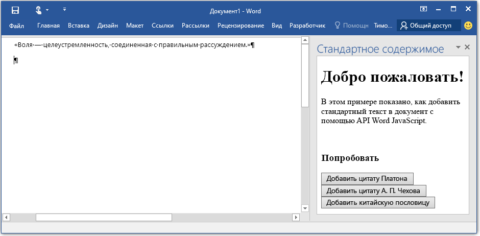

# Надстройки Word

_Область применения: Word 2016, Word для iPad, Word для Mac_

Предлагаем вашему вниманию документацию по API JavaScript для надстроек Word. API JavaScript для Word входит в состав модели программирования надстроек Office и расширяет функционал приложений Microsoft Office. Модель программирования надстроек использует веб-приложения, чтобы размещать расширения для Word. Вы можете расширить Word с помощью любой веб-платформы или предпочитаемого языка. 

## Обзор API

Прежде чем переходить к особенностям API JavaScript для Word, важно понимать, что новая объектная модель надстроек Word отличается от соответствующей модели в Office 2013. Модель надстроек в Office 2013 не была типизированной и предоставляла универсальный API для расширения клиентов Office. Хотя предыдущая модель применима к Word 2016, мы рекомендуем использовать новую объектную модель Word. Рекомендуем прочитать [обзор](https://msdn.microsoft.com/EN-US/library/office/jj220082.aspx), если вы не знакомы с платформой надстроек. 

Новые API JavaScript для Word меняют способ взаимодействия с объектами, например документами и абзацами. Вместо набора отдельных асинхронных API для извлечения и обновления каждого из этих объектов, новые API предоставляют прокси-объекты JavaScript, которые соответствуют реальным объектам, выполняемым в Word. Вы можете непосредственно взаимодействовать с этими прокси-объектами, синхронно считывая и записывая их свойства, а также вызывая синхронные методы для операций над ними.  Эти взаимодействия с прокси-объектами не сразу реализуются в выполняющихся сценариях, поэтому мы предоставляем метод для работы с контекстом с именем **sync()**. Метод context.sync синхронизирует состояние запущенного JavaScript и реальных объектов в Office, выполняя поставленные в очередь инструкции и получая свойства загруженных объектов Word для их использования в сценарии.  

## Создание первой надстройки Word

Надстройки Word запускаются внутри программы и могут взаимодействовать с содержанием документа при помощи новых API JavaScript, доступных в Word 2016. Изначально есть две части для создания надстроек: 1) веб-приложение, которое можно разместить где вам удобно и 2) [манифест надстроек](https://msdn.microsoft.com/EN-US/library/office/fp161044.aspx), который Word использует для обнаружения веб-приложения (функциональные возможности манифеста этим не ограничиваются, подробнее см. в статье [Общие сведения о программировании](word-add-ins-programming-guide.md)).

&gt;**Надстройка Word = manifest.xml + веб-приложение**

### Настройка
В этом разделе вы создадите простое веб-приложение и манифест к нему. Веб-приложение позволит вам добавить стандартный текст в документ Word. 

1. Создайте папку на локальном диске с именем BoilerplateAddin (например, C:\\BoilerplateAddin). Сохраняйте все файлы, создаваемые в следующих пунктах, в этой папке.

2. Создайте файл с именем home.html для представления надстройки. В надстройке будут три кнопки, которые после нажатия добавляют стандартный текст. Вставьте следующий код в файл home.html.

```html
    <!DOCTYPE html>
    <html>
      <head>
        <meta charset="UTF-8" />
        <meta http-equiv="X-UA-Compatible" content="IE=Edge" />
        <title>Boilerplate text app</title>    
        <script src="https://ajax.aspnetcdn.com/ajax/jQuery/jquery-2.1.4.min.js"></script>
        <script src="https://appsforoffice.microsoft.com/lib/1/hosted/office.js" type="text/javascript"></script>
        <script src="home.js" type="text/javascript"></script>
        </head>
        <body>
            <div>
                    <h1>Welcome</h1>
            </div>
            <div>
                    <p>This sample shows how to add boilerplate text to a document by using the Word JavaScript API.</p>
                    <br />
                    <h3>Try it out</h3>
                    <button id="emerson">Add quote from Ralph Waldo Emerson</button>
                    <button id="checkhov">Add quote from Anton Chekhov</button>
                    <button id="proverb">Add Chinese proverb</button>
            </div>
            <h3><div id="supportedVersion"/></h3>
        </body>
    </html>
```

3. Создайте файл с именем home.js и вставьте в него следующий код. Здесь содержится как код инициализации, так и весь код нашей надстройки для внесения изменений в документ Word. Этот код вставляет текст в зависимости от положения курсора или выделения в документе Word. 

```javascript
    (function () {
        "use strict";

        // The initialize function is run each time the page is loaded.
        Office.initialize = function (reason) {
            $(document).ready(function () {
                
                // Use this to check whether the API is supported in the Word client.
                if (Office.context.requirements.isSetSupported('WordApi', 1.1)) {
                    // Do something that is only available via the new APIs
                    $('#emerson').click(insertEmersonQuoteAtSelection);
                    $('#checkhov').click(insertChekhovQuoteAtTheBeginning);
                    $('#proverb').click(insertChineseProverbAtTheEnd);
                    $('#supportedVersion').html('This code is using Word 2016 or greater.');
                }
                else {
                    // Just letting you know that this code will not work with your version of Word.
                    $('#supportedVersion').html('This code requires Word 2016 or greater.');
                }    
            });
        };

        function insertEmersonQuoteAtSelection() {
            Word.run(function (context) {

                // Create a proxy object for the document.
                var thisDocument = context.document;

                // Queue a command to get the current selection. 
                // Create a proxy range object for the selection.
                var range = thisDocument.getSelection();

                // Queue a command to replace the selected text.
                range.insertText('"Hitch your wagon to a star."\n', Word.InsertLocation.replace);

                // Synchronize the document state by executing the queued commands, 
                // and return a promise to indicate task completion.
                return context.sync().then(function () {
                    console.log('Added a quote from Ralph Waldo Emerson.');
                });  
            })
            .catch(function (error) {
                console.log('Error: ' + JSON.stringify(error));
                if (error instanceof OfficeExtension.Error) {
                    console.log('Debug info: ' + JSON.stringify(error.debugInfo));
                }
            });
        }

        function insertChekhovQuoteAtTheBeginning() {
            Word.run(function (context) {

                // Create a proxy object for the document body.
                var body = context.document.body;

                // Queue a command to insert text at the start of the document body.
                body.insertText('"Knowledge is of no value unless you put it into practice."\n', Word.InsertLocation.start);

                // Synchronize the document state by executing the queued commands, 
                // and return a promise to indicate task completion.
                return context.sync().then(function () {
                    console.log('Added a quote from Anton Chekhov.');
                });  
            })
            .catch(function (error) {
                console.log('Error: ' + JSON.stringify(error));
                if (error instanceof OfficeExtension.Error) {
                    console.log('Debug info: ' + JSON.stringify(error.debugInfo));
                }
            });
        }    

        function insertChineseProverbAtTheEnd() {
            Word.run(function (context) {

                // Create a proxy object for the document body.
                var body = context.document.body;

                // Queue a command to insert text at the end of the document body.
                body.insertText('"To know the road ahead, ask those coming back."\n', Word.InsertLocation.end);

                // Synchronize the document state by executing the queued commands, 
                // and return a promise to indicate task completion.
                return context.sync().then(function () {
                    console.log('Added a quote from a Chinese proverb.');
                });  
            })
            .catch(function (error) {
                console.log('Error: ' + JSON.stringify(error));
                if (error instanceof OfficeExtension.Error) {
                    console.log('Debug info: ' + JSON.stringify(error.debugInfo));
                }
            });
        }    
    })();
```

4. Создайте XML-файл с именем BoilerplateManifest.xml и вставьте в него следующий код. Это файл манифеста, который Word использует для обнаружения сведений о надстройке, таких как ее расположение или отображаемое имя.
```xml
<?xml version="1.0" encoding="UTF-8"?>
    <OfficeApp xmlns="http://schemas.microsoft.com/office/appforoffice/1.1" 
               xmlns:xsi="http://www.w3.org/2001/XMLSchema-instance" 
               xsi:type="TaskPaneApp">
        <Id>2b88100c-656e-4bab-9f1e-f6731d86e464</Id>
        <Version>1.0.0.0</Version>
        <ProviderName>Microsoft</ProviderName>
        <DefaultLocale>en-US</DefaultLocale>
        <DisplayName DefaultValue="Boilerplate content" />
        <Description DefaultValue="Insert boilerplate content into a Word document." />
        <Hosts>
            <Host Name="Document"/>
        </Hosts>
        <DefaultSettings>
            <SourceLocation DefaultValue="\\MyShare\boilerplate\home.html" />
        </DefaultSettings>
        <Permissions>ReadWriteDocument</Permissions>
    </OfficeApp>
```

5. Создайте GUID и замените значение в элементе <code>OfficeApp/Id</code> своим GUID.

6. Сохраните все файлы. Вы только что написали свою первую надстройку Word. 

7. Создайте сетевую папку (например, \\\MyShare\boilerplate) или [предоставьте общий доступ к папке в сети](https://technet.microsoft.com/ru-ru/library/cc770880.aspx) и скопируйте в нее файлы home.js, home.html и BoilerplateManifest.xml.

8. Отредактируйте элемент <code>SourceLocation</code> в файле BoilerplateManifest.xml, чтобы он указывал на расположение файла home.html. 

Вы только что развернули свою первую надстройку. Теперь необходимо сообщить Word, где находится эта надстройка.

1. Запустите Word и откройте документ.
2. Перейдите на вкладку **Файл**, а затем выберите **Параметры**.
3. Выберите **Центр управления безопасностью**, а затем нажмите кнопку **Параметры центра управления безопасностью**.
4. Выберите пункт **Доверенные каталоги приложений**.
5. В поле **URL-адрес каталога** введите путь к папке с общим доступом, содержащей файл BoilerplateManifest.xml, а затем нажмите кнопку **Добавить каталог**.
6. Установите флажок **Показать в меню** и нажмите кнопку **ОК**.
7. Появится сообщение, информирующее о том, что параметры будут применены при следующем запуске Office. Закройте и перезапустите Word. 

### Попробуйте

Теперь можно запустить созданную надстройку. Выполните следующие инструкции, чтобы посмотреть на нее в действии.

1. Откройте документ Word. 
2. На вкладке **Вставка** в Word 2016 выберите **Мои приложения**. 
3. Перейдите на вкладку **Общая папка**.
4. Щелкните **Стандартное содержимое**, а затем нажмите **Вставка**.
5. Надстройка загрузится в области задач. См. рисунок 1, чтобы увидеть, как будет выглядеть надстройка после загрузки.
6. Нажмите кнопки, чтобы добавить стандартный текст в документ Word.


**Рисунок 1. Надстройка стандартного содержимого, загруженная в Word**


## Подробнее

Дополнительные сведения о расширении Word можно найти в статье [Руководство по программированию надстроек Word](word-add-ins-programming-guide.md). Прочитайте [Справочник по JavaScript надстроек Word](word-add-ins-javascript-reference.md), чтобы получить дополнительные сведения об объектах, к которым вы можете получить доступ.

## Оставьте свой отзыв

Ваши отзывы важны для нас. 

* Ознакомьтесь с документами и сообщите нам о любых возникших вопросах и проблемах, с которыми вы столкнулись, [отправив сообщение](https://github.com/OfficeDev/office-js-docs/issues) в этом репозитории.
* Поделитесь своими впечатлениями о работе средств, расскажите, что вы бы хотели видеть в последующих версиях, какие примеры кода вас интересуют и т. д. Вы можете внести свои предложения и поделиться идеями на [этом сайте](http://officespdev.uservoice.com/).

## Дополнительные ресурсы

* [Надстройки Office](https://msdn.microsoft.com/en-us/library/office/jj220060.aspx)
* [Начало работы с надстройками Office](http://dev.office.com/getting-started/addins)
* &lt;a herf="https://github.com/OfficeDev?utf8=%E2%9C%93&amp;query=Word"&gt;Надстройки Word на веб-сайте GitHub&lt;/a&gt;
